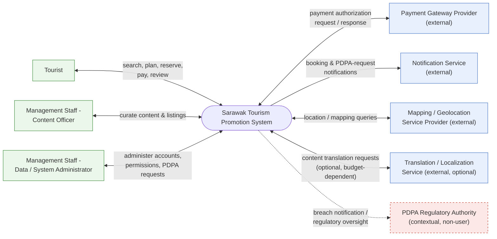

# Software Requirements Specification
## Sarawak Tourism Promotion System

---

## Front Matter

### 0.1 Title Page

| Field | Detail |
|---|---|
| Document title | Software Requirements Specification — Sarawak Tourism Promotion System |
| System name / short form | Sarawak Tourism Promotion System (STPS) |
| Client | Management team of a local tourism association ("the Association") |
| Preparing agency | Swinsoft Consulting |
| Prepared for | Sarawak Tourism Association — Management Team |
| Prepared by | Jarren Tan, Requirements Analyst / Technical Documenter, Swinsoft Consulting (jarrentannn@gmail.com) |
| Document type | Software Requirements Specification (Tasks & Support approach; Goal-Design Scale requirement placement) |
| Version | 1.1 — Draft for precision-QA pass (readability revision) |
| Date | 11 September 2026 |
| Confidentiality notice | Confidential. Prepared exclusively for the Sarawak Tourism Association and the Swinsoft Consulting project team. Not for distribution outside these parties without written consent of both the Association and Swinsoft Consulting. |

### 0.2 Revision History

**Table FM-1 — Revision history**

| Version | Date | Author | Summary of change | Trigger |
|---|---|---|---|---|
| 0.1 | 2026-07-30 | Swinsoft Consulting — Requirements Architect | Initial structural blueprint issued: front matter plan, ID legend, goals/objectives/incentives/pain points, assumptions, system context and actors, 11-entity domain model, 11 major tasks, workflow outline, 4 NFR categories, design/product/PDPA requirement stubs, appendix skeletons | Elicitation synthesis from `project_brief.yaml` and stakeholder notes |
| 0.5 | 2026-08-15 | Swinsoft Consulting — Technical Documenter | First full-prose expansion of Sections 1–6 | Blueprint hand-off (`02_blueprint.md`) |
| 0.8 | 2026-09-01 | Swinsoft Consulting — Technical Documenter | Full-prose expansion of Sections 7–12 and Appendices A–F; validation evidence drafted | Continuation of documentation pipeline |
| 0.9 | 2026-09-08 | Swinsoft Consulting — Technical Documenter | Domain model redesigned and rendered as a Mermaid diagram; traceability and CRUD matrices completed in full; cross-checked against blueprint hard constraints | Internal design review of Section 5 |
| 1.0 | 2026-09-11 | Swinsoft Consulting — Technical Documenter | Consolidated draft assembled for hand-off to the precision-QA / verifiability pass | Completion of blueprint expansion |
| 1.1 | 2026-09-11 | Swinsoft Consulting — Technical Documenter | Readability revision: every identifier throughout the document is now presented as a descriptive name with its code as a secondary tag, instead of the code standing alone | Reader feedback that bare codes (e.g. a bare `DM-ENT-001` or `TASK-004` with no attached name) were hard to follow without constantly checking the legend |

### 0.3 Table of Contents

1. [Introduction](#1-introduction)
2. [Project Goals, Objectives, Incentives & Pain Points](#2-project-goals-objectives-incentives--pain-points)
3. [Assumptions](#3-assumptions)
4. [System Context & Actors](#4-system-context--actors)
5. [Domain Model](#5-domain-model)
6. [User Tasks (Tasks & Support Approach)](#6-user-tasks-tasks--support-approach)
7. [Workflows](#7-workflows)
8. [Non-Functional Requirements](#8-non-functional-requirements)
9. [Other Design & Product-Level Requirements](#9-other-design--product-level-requirements)
10. [PDPA & Regulatory Compliance](#10-pdpa--regulatory-compliance)
11. [Validation Summary](#11-validation-summary)
12. [Conclusion & Recommendations](#12-conclusion--recommendations)
Appendix A — Stakeholder Validation Evidence
Appendix B — Requirements Traceability Matrix
Appendix C — CRUD Matrix
Appendix D — Verifiability Self-Check (IEEE 830 Quality Audit)
Appendix E — Domain Vocabulary / Glossary
Appendix F — Iteration / Revision Evidence Log

### 0.4 Requirement / Artifact ID Legend and Naming Convention

Every item in this document that carries a tracking code is written as **a plain descriptive name, followed by its tracking code in backticks in parentheses** — for example, *"the Tourist entity (`DM-ENT-001`)"* or *"the Search & Reserve Accommodation task (`TASK-003`)"*. The reader should never need to hold a bare code in their head; the code is there only so that a specific item can be found again unambiguously in a table, a cross-reference, the traceability matrix (Appendix B), or the CRUD matrix (Appendix C). The prefixes and what each family of codes tracks are listed below purely for reference:

| Prefix | Meaning |
|---|---|
| `GOAL-xxx` | A **Goal** — a broad direction for the project. |
| `OBJ-xxx` | An **Objective** — a specific, measurable outcome that proves a Goal is being met. |
| `INC-xxx` | An **Incentive** — the business value / return on investment behind doing this project. |
| `PP-xxx` | A **Pain Point** — a specific problem with the Association's existing process today. |
| `ASSUMP-xxx` | An **Assumption** — a fact taken as given, with its rationale/source stated. |
| `ACT-xxx` | An **Actor** — a person, role, or external system that interacts with the platform. |
| `DM-ENT-xxx` | A **Domain Entity** — a core business concept in the conceptual domain model (e.g. Tourist, Booking). |
| `DM-REL-xxx` | A **Domain Relationship** — how two domain entities relate, with cardinality. |
| `TASK-xxx` | A **Major User Task** — something a Tourist or Management Staff member does, described independently of any specific solution ("Tasks & Support" approach). |
| `ST-x.y` | A **Subtask** of the numbered Task. |
| `REQ-FUN-xxx` | A **Functional Requirement** derived from a subtask. |
| `REQ-NFR-xxx` | A **Non-Functional Requirement** (exactly 4 categories exist). |
| `REQ-DES-xxx` | A **Design-Level Requirement**. |
| `REQ-PROD-xxx` | A **Product-Level Requirement**. |
| `REQ-PDPA-xxx` | A **PDPA / Regulatory Compliance Requirement**. |
| `WF-xxx` | A **Workflow** (`WF-000` is the single overarching, end-to-end workflow; `WF-001`…`WF-011` are the one-per-task workflows). |
| `VAL-xxx` | A piece of **Validation Evidence** (a stakeholder session, test, or review that shaped this document). |

### 0.5 Intended Audience Statement

This SRS is written for four audiences, each of whom uses it differently. **(a) Tourism Association management and decision-makers** use it to confirm that the goals, objectives, incentives, and pain points in Section 2 correctly represent the business problem, to approve the non-functional targets in Section 8, and to sign off the PDPA compliance posture in Section 10 before funding development. **(b) The Swinsoft Consulting development team** uses it as the authoritative basis for solution design, technical architecture, and iteration planning; every task in Section 6 and workflow in Section 7 is written to be solution-agnostic precisely so the development team retains freedom to choose an appropriate technical realization. **(c) QA and test engineers** use the functional requirements (Section 6), non-functional requirements (Section 8), and the verifiability self-check (Appendix D) as the direct source of test cases and acceptance criteria. **(d) Any PDPA compliance auditor** reviewing the system prior to launch uses Section 10, the PDPA-related rows embedded throughout the traceability matrix (Appendix B), and the Malaysian PDPA Jurisdiction Scope assumption (`ASSUMP-005`) as the record of how the system's data-handling practices were reasoned about and validated (Appendix A).

### 0.6 Project Type Statement

The Sarawak Tourism Promotion System is a **greenfield, purpose-built software system**. It is not a replacement for a single existing legacy IT system; rather, it is a deliberate **consolidation** of the Association's currently fragmented manual, print, and social-media tourism-promotion channels (see the Pain Points in Section 2.4) into one association-operated digital platform. No prior system of record is being migrated off; the primary engineering risk is therefore not data migration but requirements completeness — ensuring every promotional and operational function currently performed informally is captured, and captured correctly, in the new platform. This framing governs the assumptions in Section 3, in particular the Infrastructure Already Provisioned assumption (`ASSUMP-001`) and the Tourist Device & Connectivity Assumption (`ASSUMP-003`), which establish that hardware, network, and data-repository platforms are already provisioned and that only the software itself is being specified.

---

## 1. Introduction

### 1.1 Purpose of the Document

This Software Requirements Specification (SRS) defines, at a level of detail sufficient for design, build, test, and formal acceptance, the software requirements for the Sarawak Tourism Promotion System (STPS). The STPS is commissioned by the management team of a local tourism association and will be developed by Swinsoft Consulting. This document exists to give every stakeholder identified in Section 0.5 a single, unambiguous, and verifiable reference for what the software must do, expressed using the Tasks & Support elicitation approach and organized according to the Goal-Design Scale. Every normative statement in this document is phrased as "the system shall…" and is written to be objectively testable by inspection, demonstration, or measurement; no requirement is expressed only as an aspiration.

### 1.2 Scope

The scope of this SRS is **software only**. Hardware, physical servers, network provisioning, end-user devices, and the data-repository and deployment platforms are assumed already acquired by the client — the Infrastructure Already Provisioned assumption (`ASSUMP-001`) — and are explicitly out of scope for specification here; they are treated as pre-existing infrastructure onto which the STPS software is deployed. Within that software scope, this SRS covers: the tourist-facing modules that support discovery, planning, reservation, payment initiation, and feedback (Section 6.3, the tasks named Register & Manage Tourist Account through Submit Review & Feedback); the management-facing modules that support content curation, booking and availability administration, and PDPA-related privacy administration (Section 6.3, the tasks named Manage Promotional Content & Listings through Manage Tourist Data Privacy Requests); the business logic that connects these modules to the conceptual domain model (Section 5); and the integration logic that governs the system's interaction with external services such as the Payment Gateway Provider and Notification Service (Section 4.2). The internal implementation of those external, third-party services is explicitly out of scope; they are treated as black boxes accessed only through their documented interaction contract.

### 1.3 Intended Audience

See Section 0.5 for the full statement. In summary, this document is written for: (a) Tourism Association management and decision-makers; (b) the Swinsoft development team; (c) QA/test engineers; and (d) any PDPA compliance auditor reviewing the system prior to launch.

### 1.4 Project Type

See Section 0.6 for the full statement. In summary, the STPS is a greenfield, purpose-built system consolidating fragmented manual/print/social-media promotion channels into one association-operated platform; it does not replace a single existing legacy IT system.

### 1.5 Domain Vocabulary / Definitions

All domain terms, actor names, and abbreviations used in this document are defined once, consistently, in the Domain Vocabulary / Glossary (Appendix E), and that definition is used identically in every section, table, and diagram of this document. In particular, the canonical term for the primary worldwide end user is **Tourist** — this document never substitutes "Visitor," "Traveler," "Customer," or any other synonym for this actor.

### 1.6 Document Conventions

This document uses the naming convention defined in Section 0.4 without exception: every tracked item is presented as a descriptive name with its tracking code attached in parentheses, never as a bare code. Every requirement statement — whether a functional, non-functional, design-level, product-level, or PDPA/regulatory requirement — is written using the fixed sentence pattern "The system shall…" so that requirement statements are syntactically distinguishable from narrative, rationale, or illustrative text at a glance. Any illustrative or example solution text appearing under a "Solution-Agnosticism Check" or "Example Solution" heading is explicitly and visually marked *Non-Normative* and carries no requirement weight; such text exists only to demonstrate that a task can be realized by more than one kind of solution, per the brief's solution-agnosticism ground rule, and must never be read as narrowing the requirement itself.

---

## 2. Project Goals, Objectives, Incentives & Pain Points

Goals, Objectives, Incentives, and Pain Points are kept as four separately labelled subsections below; they are never collapsed into a single undifferentiated "Goals" list, because each category answers a different question (Goals: broad direction; Objectives: how we will know we got there; Incentives: why it is worth doing; Pain Points: what is broken today) and each plays a distinct role in the traceability matrix (Appendix B).

### 2.1 Goals

| Name | Code | Goal statement |
|---|---|---|
| Single Authoritative Promotion Channel | `GOAL-001` | Promote Sarawak destinations, accommodation, transportation, and food to worldwide tourists through one authoritative digital channel. |
| Association Content & Data Control | `GOAL-002` | Enable the tourism association's management team to control and maintain promotional content and operational data. |
| Trustworthy Current Local Information | `GOAL-003` | Provide trustworthy, current local information that improves visitor experience and safety. |
| PDPA Compliance | `GOAL-004` | Operate the platform in demonstrable compliance with the Malaysian PDPA for both tourist and management data. |

### 2.2 Objectives

Each objective is specific, measurable, and traced to exactly one parent goal. Bracketed target figures below were proposed during drafting and were subsequently confirmed with Association management during the Combined Management Walkthrough validation session (`VAL-005`; see Appendix A and Appendix F for the before/after record of how these targets were tightened).

| Name | Code | Objective | Traces to Goal | Target |
|---|---|---|---|---|
| Consolidated Catalog at Launch | `OBJ-001` | Consolidate accommodation, transportation, food, and local-info listings currently spread across independent channels into one searchable catalog before launch. | Single Authoritative Promotion Channel (`GOAL-001`) | 100% of the four listing categories (Accommodation, Vehicle, Food Establishment, Local Information) populated and searchable at go-live. |
| Same-Business-Day Content Publishing | `OBJ-002` | Reduce the content-update cycle for a new/changed listing from the current manual, multi-day process. | Association Content & Data Control (`GOAL-002`) | Median elapsed time from "submitted by staff" to "live on the platform" ≤ 1 business day. |
| End-to-End In-Platform Trip Completion | `OBJ-003` | Enable a tourist to research, assemble, and pay for a multi-component trip package within the platform without leaving it. | Single Authoritative Promotion Channel (`GOAL-001`) | ≥ 55% of Tourists who start building a travel package complete it through to a Confirmed Booking, measured over the first 6 months post-launch. |
| PDPA Compliance Checklist Pass | `OBJ-004` | Pass a documented PDPA compliance checklist review (Section 10 / Appendix A) prior to go-live. | PDPA Compliance (`GOAL-004`) | 100% of the checklist items in Appendix A's compliance review, and 100% of the PDPA & Regulatory Compliance requirements (Section 10), verified with zero open findings before go-live sign-off. |

### 2.3 Incentives

| Name | Code | Incentive |
|---|---|---|
| Increased Provider Bookings & Revenue | `INC-001` | Increased bookings/revenue channelled to association-endorsed accommodation, transport, and food providers, by concentrating tourist demand on one trusted, bookable catalog rather than fragmented informal listings. |
| Reduced Manual Coordination Effort | `INC-002` | Reduced association staff hours spent on manual/paper-based content coordination and provider liaison, freeing staff capacity for higher-value promotional and quality-assurance work. |
| Strengthened Association Brand Trust | `INC-003` | Strengthened association brand trust from centralized, verified, moderated information (vs. fragmented/unofficial sources), supported directly by the quality/review loop of the Submit Review & Feedback task. |
| Data-Informed Management Decisions | `INC-004` | Data-informed decision-making for the association — knowing which destinations and providers actually drive tourist engagement and bookings — enabled by the structured booking and review data captured through the platform's transaction tasks. |

### 2.4 Pain Points

Each pain point maps forward to at least one Goal or Objective and forward again into the traceability matrix (Appendix B); none is permitted to remain an orphaned complaint with no corresponding requirement addressing it.

| Name | Code | Pain point | Maps to |
|---|---|---|---|
| Scattered, Unverifiable Tourist Information | `PP-001` | Tourist information is scattered across informal/unofficial sites and social media, inconsistent and unverifiable. | Consolidated Catalog at Launch (`OBJ-001`) |
| No Combined Discovery-and-Booking Channel | `PP-002` | No single channel lets a tourist discover and book accommodation, transport, and food together. | End-to-End In-Platform Trip Completion (`OBJ-003`) |
| Manual, Error-Prone Content Updates | `PP-003` | Management currently updates tourism content via manual/offline means (spreadsheets, printed brochures), causing delay and error. | Same-Business-Day Content Publishing (`OBJ-002`) |
| Language & Currency Barriers | `PP-004` | Language and currency barriers hinder worldwide tourists using fragmented local-only sites. | Single Authoritative Promotion Channel / Trustworthy Current Local Information (`GOAL-001`/`GOAL-003`) |
| No Structured Feedback Channel | `PP-005` | No structured feedback channel exists for the association to assess visitor satisfaction or provider quality. | Strengthened Association Brand Trust (`INC-003`) / Submit Review & Feedback task |
| Ungoverned Personal Data Handling | `PP-006` | Absence of a governed data-handling process exposes tourist and management personal data to PDPA compliance risk. | PDPA Compliance (`GOAL-004`) |

---

## 3. Assumptions

Every assumption below is given a descriptive name, a code, and an explicit rationale/source. Assumptions flagged "requires stakeholder confirmation" have since been put to the Association during validation; the outcome is recorded in Appendix A and referenced inline below.

| Name | Code | Assumption | Rationale / Source |
|---|---|---|---|
| Infrastructure Already Provisioned | `ASSUMP-001` | Hardware, servers, network, and the data-repository platform are already acquired/provisioned by the client. | Source: `project_brief.yaml` → `strict_ground_rules.hardware_assumption`. Load-bearing for the scope statement in Section 1.2 and for the Availability & Reliability requirement category, which is written in terms of the software's behaviour on top of already-provisioned infrastructure rather than infrastructure procurement itself. |
| Association-Only Content Ownership | `ASSUMP-002` | The tourism association is the sole authoritative content owner; individual accommodation/vehicle/food providers do not receive direct system login — they supply information to association staff off-system. | Source: `project_brief.yaml` → `core_functions.management_facing` wording ("enable content and database management"), read as staff-only. **Confirmed** with Association operations management during the Bookings & Operations Manager Walkthrough (`VAL-002`, Appendix A); this is why the Manage Promotional Content & Listings and Manage Bookings, Availability & Provider Coordination tasks list only Management Staff as actors, never a Tourism Provider actor. |
| Tourist Device & Connectivity Assumption | `ASSUMP-003` | Worldwide tourists are assumed to have access to a modern web browser or smartphone with adequate internet connectivity. | Source: `project_brief.yaml` → `target_audience`. Bounds the low-connectivity handling required of the Performance & Scalability requirement category — the system is designed to perform well on constrained connections, not to function fully offline for users with no connectivity at all. |
| Delegated Payment Processing | `ASSUMP-004` | Payment processing is delegated to a third-party, PCI-DSS-compliant payment gateway; the system does not store raw payment-card data. | Source: software-only scope ground rule plus standard industry practice; reflected directly in the Tokenized Payment Gateway Integration requirement and in the Complete Payment for a Booking task's designation of the Payment Gateway Provider as an external actor. |
| Malaysian PDPA Jurisdiction Scope | `ASSUMP-005` | The association operates under Malaysian jurisdiction; PDPA is the governing privacy framework even though end users are worldwide; foreign frameworks (e.g., GDPR) are explicitly out of scope unless the client states otherwise. | Source: `project_brief.yaml` → `compliance.privacy_framework`. **Flagged as a residual risk requiring client sign-off** (carried forward to Section 12); reviewed with an external PDPA/compliance advisor during the IT & Compliance Review Workshop (`VAL-003`, Appendix A), which confirmed the PDPA-only scope for v1.0 but recommended the Cross-Border Transfer Safeguard requirement now in Section 10. |
| Single Shared Platform Instance | `ASSUMP-006` | One shared platform instance serves all association-endorsed listings; no separate deployment per district. | Source: inferred from the single-system framing of `project_brief.yaml`. Cross-checked against the Performance & Scalability requirement's scalability target (≥500 concurrent users against a single up-to-10,000-listing catalog) to confirm no contradiction. |
| English & Bahasa Malaysia Baseline Languages | `ASSUMP-007` | English and Bahasa Malaysia are the baseline supported languages; additional languages are budget-dependent stretch scope. | Source: target audience plus typical practice for a Malaysian state-tourism platform. **Confirmed** with Association management during the Combined Management Walkthrough (`VAL-005`, Appendix A): English and Bahasa Malaysia are contractual minimums for go-live; Mandarin was discussed as a desirable stretch addition dependent on translation budget and is recorded as a non-normative future consideration only. |

**Cross-check performed.** Sections 8–10 were re-scanned during drafting to confirm that no non-functional or design requirement silently contradicts an assumption above. No conflicts were found: the Performance & Scalability target is consistent with the Single Shared Platform Instance assumption; the Security & Data Privacy controls are consistent with the Delegated Payment Processing assumption; and the Usability & Accessibility language target is bounded to the two baseline languages of the English & Bahasa Malaysia Baseline Languages assumption (with Mandarin explicitly marked non-normative/stretch rather than silently assumed).

---

## 4. System Context & Actors

### 4.1 System Boundary Statement

**In scope** (inside the STPS software boundary): the tourist-facing modules (destination/accommodation/vehicle/food discovery, itinerary/package building, reservation and payment initiation, review submission); the management-facing modules (content and listing curation, booking and availability administration, PDPA privacy-request administration); the business logic that enforces the rules described in Section 6; and the integration logic — request/response handling, retries, and failure handling — for each external interaction named in Section 4.2.

**Out of scope** (outside the STPS software boundary): the physical servers, network, and hosting infrastructure on which the software runs; the end-user devices tourists and staff use to access it; and the internal implementation of every third-party service listed in Section 4.2 as an external actor — each is treated strictly as a black box accessed only through its documented request/response contract. This boundary is a direct consequence of the Infrastructure Already Provisioned assumption (`ASSUMP-001`).

### 4.2 Actors

| Actor name | Code | Description |
|---|---|---|
| Tourist | `ACT-001` | The primary worldwide end user of the platform. May browse as an anonymous Guest or hold a Registered profile. This exact term — **Tourist** — is used everywhere in this document and is never replaced by "Visitor," "Traveler," or "Customer." |
| Management Staff — Content Officer | `ACT-002` | Tourism association staff responsible for curating listings and promotional/local-information content. Generalizes, with the Data/System Administrator role, under the superclass "Management Staff." |
| Management Staff — Data/System Administrator | `ACT-003` | Tourism association staff responsible for account/permission administration and PDPA data-subject request handling. Generalizes with the Content Officer role under "Management Staff." |
| Payment Gateway Provider (external) | `ACT-004` | A third-party, PCI-DSS-compliant payment processor that authorizes and settles Tourist payments; accessed only via a tokenized request/response interface. |
| Notification Service (external) | `ACT-005` | A third-party email/SMS gateway used to deliver booking confirmations, PDPA-request acknowledgements, and related notifications. |
| Mapping/Geolocation Service Provider (external) | `ACT-006` | A third-party service that supplies location, map, and geolocation data used to enrich Destination/Accommodation/Vehicle presentation. |
| Translation/Localization Service (external) | `ACT-007` | An optional third-party translation/localization service that may support expansion of supported languages beyond the baseline. Its use is conditional on future budget approval and is not required for the English/Bahasa Malaysia baseline. |
| PDPA Regulatory Authority (contextual, non-user) | `ACT-008` | The Malaysian data-protection regulatory authority. This actor never logs in to or operates the system; it appears in the system context only as the recipient of breach notifications. |

**Terminology rule.** The actor names above are canonical and are used identically throughout every section, table, task, and diagram in this document; no synonym or alternate phrasing is introduced elsewhere.

### 4.3 System Context Diagram

**Diagram description.** The system context is centred on a single node, "Sarawak Tourism Promotion System," surrounded by all eight actors named in Section 4.2. Every edge to the Tourist, the two Management Staff roles, and the four named external services is a **solid** edge representing a direct, bidirectional system interaction (e.g., the edge to the Payment Gateway Provider is labelled "payment authorization request / payment outcome response"). The single edge to the PDPA Regulatory Authority is **dashed**, representing a compliance/regulatory relationship rather than a direct system interaction — the STPS never receives operational input from, nor grants system access to, the PDPA Regulatory Authority; it only sends breach notifications to it when the Breach Detection & Notification requirement is triggered.



**Legend.** Solid edge = direct system interaction. Dashed edge = compliance/regulatory relationship (PDPA Regulatory Authority only, non-operational).

---

## 5. Domain Model

### 5.1 Modelling Rule

The domain model below is strictly conceptual. It contains entities, one-line descriptions, and named relationships with cardinalities only. It contains **no attributes, no primary/foreign keys, and no normalized sub-entities** — for example, the Vehicle entity is kept as a single entity and is never split into "Vehicle Details"/"Vehicle Availability." Every entity below appears in at least one task in Section 6 and in the CRUD matrix in Appendix C; there are no orphan entities.

### 5.2 Entity List

| Entity name | Code | One-line description |
|---|---|---|
| Tourist | `DM-ENT-001` | A worldwide visitor who discovers, plans, and books Sarawak travel experiences via the platform; may act as guest or registered profile. |
| Management Staff | `DM-ENT-002` | Tourism association personnel who curate content, moderate reviews, and administer bookings/data. |
| Destination | `DM-ENT-003` | A promoted place of interest (cultural site, park, festival, landmark). |
| Accommodation | `DM-ENT-004` | A lodging listing (hotel, homestay, resort) available for reservation. |
| Vehicle | `DM-ENT-005` | A transportation option (car, van, boat, bus, etc.) offered/listed for tourist transport or touring. Kept as a single conceptual entity. |
| Food Establishment | `DM-ENT-006` | A dining venue listing promoted/reservable through the platform. |
| Local Information Article | `DM-ENT-007` | General-interest content (culture, safety, weather, events, etiquette) authored by staff. |
| Package (Itinerary) | `DM-ENT-008` | A curated bundle combining Destinations, Accommodation, Vehicle, and/or Food Establishment selections into one bookable trip plan. |
| Option | `DM-ENT-009` | A selectable add-on/configuration attached to a Booking or Package (e.g., guided-tour add-on, meal preference, insurance, child seat). |
| Booking | `DM-ENT-010` | A Tourist's pending or confirmed reservation against an Accommodation, Vehicle, Food Establishment, or Package. |
| Review | `DM-ENT-011` | A Tourist-submitted rating/comment evaluating an Accommodation, Vehicle, Food Establishment, Destination, or Package. |

### 5.3 Relationships

Each relationship is read "A (cardinality) — verb → B (cardinality)." Two relationships — Booking Targets One Offering and Review Evaluates One Reviewable Entity — are XOR fan-outs to a conceptual generalization ("Offering" and "Reviewable" respectively) that is described here in prose only and is **not** a stored entity in Section 5.2; this is a deliberate design decision, confirmed during the domain-model design review, to avoid introducing a database-style superclass into a strictly conceptual model.

| Relationship name | Code | Relationship | Cardinality |
|---|---|---|---|
| Tourist Creates Booking | `DM-REL-001` | Tourist creates Booking | 1 : 0..* |
| Booking Targets One Offering | `DM-REL-002` | Booking targets exactly one of {Accommodation \| Vehicle \| Food Establishment \| Package} (conceptual generalization "Offering," XOR — described in prose only, not a stored entity) | 1 : 1 |
| Booking Includes Option | `DM-REL-003` | Booking includes Option | 0..* : 0..* (many-to-many) |
| Package Bundles Components | `DM-REL-004` | Package bundles Destination, Accommodation, Vehicle, Food Establishment | 0..* : 1..* (Destination), 0..* (Accommodation), 0..* (Vehicle), 0..* (Food Establishment) — aggregation, many-to-many |
| Destination Is Near Accommodation/Food | `DM-REL-005` | Destination is near Accommodation / Food Establishment | 0..* : 0..* (informational/spatial, optional) |
| Tourist Writes Review | `DM-REL-006` | Tourist writes Review | 1 : 0..* |
| Review Evaluates One Reviewable Entity | `DM-REL-007` | Review evaluates exactly one of {Accommodation \| Vehicle \| Food Establishment \| Destination \| Package} (conceptual generalization "Reviewable," XOR — described in prose only, not a stored entity) | 0..* : 1 |
| Management Staff Publishes Local Information | `DM-REL-008` | Management Staff publishes/maintains Local Information Article | 1..* : 0..* |
| Management Staff Curates Catalog Entities | `DM-REL-009` | Management Staff curates (CRUD) Destination, Accommodation, Vehicle, Food Establishment, Package, Option | 1..* : 0..* (each) |
| Management Staff Processes Booking | `DM-REL-010` | Management Staff processes (approve/adjust/cancel) Booking | 1 : 0..* |

### 5.4 Domain Model Diagram

The diagram groups entities into three layout clusters purely for visual clarity — *People*, *Catalog & Content*, and *Tourist Transactions* — with no implication that these clusters are themselves stored entities. Every edge is labelled with its relationship name plus the verb and cardinality from Section 5.3, so the diagram and the relationship table reconcile 1:1. The two dashed note boxes record the XOR constraints on the Booking Targets One Offering and Review Evaluates One Reviewable Entity relationships without introducing "Offering" or "Reviewable" as entities.

```mermaid
flowchart TD

    %% ===== PEOPLE =====
    subgraph People["People"]
        Tourist["<b>Tourist</b><br/><i>Worldwide visitor; guest or registered</i>"]
        MgmtStaff["<b>Management Staff</b><br/><i>Association personnel curating content &amp; bookings</i>"]
    end

    %% ===== CATALOG & CONTENT =====
    subgraph Catalog["Catalog &amp; Content"]
        Destination["<b>Destination</b><br/><i>Promoted place of interest</i>"]
        Accommodation["<b>Accommodation</b><br/><i>Lodging listing</i>"]
        Vehicle["<b>Vehicle</b><br/><i>Transportation option</i>"]
        FoodEstablishment["<b>Food Establishment</b><br/><i>Dining venue listing</i>"]
        LocalInfoArticle["<b>Local Information Article</b><br/><i>Culture/safety/weather/event content</i>"]
        Package["<b>Package (Itinerary)</b><br/><i>Curated multi-component trip bundle</i>"]
        Option["<b>Option</b><br/><i>Selectable add-on for a Booking/Package</i>"]
    end

    %% ===== TRANSACTIONS =====
    subgraph Transactions["Tourist Transactions"]
        Booking["<b>Booking</b><br/><i>Pending/confirmed reservation</i>"]
        Review["<b>Review</b><br/><i>Tourist rating/comment</i>"]
    end

    %% ===== NOTES (conceptual generalizations, not stored entities) =====
    NoteOffering["Note: 'Offering' is a conceptual grouping only,\nnot a stored entity. A Booking targets exactly\none of the four linked entities.\n(Booking Targets One Offering)"]
    NoteReviewable["Note: 'Reviewable' is a conceptual grouping only,\nnot a stored entity. A Review evaluates exactly\none of the five linked entities.\n(Review Evaluates One Reviewable Entity)"]

    %% ===== Tourist Creates Booking =====
    Tourist -->|"creates (1 : 0..*)"| Booking

    %% ===== Booking Targets One Offering (XOR fan-out) =====
    Booking -->|"targets [XOR] (1 : 1)"| Accommodation
    Booking -->|"targets [XOR] (1 : 1)"| Vehicle
    Booking -->|"targets [XOR] (1 : 1)"| FoodEstablishment
    Booking -->|"targets [XOR] (1 : 1)"| Package
    Booking -.- NoteOffering

    %% ===== Booking Includes Option =====
    Booking -->|"includes (0..* : 0..*)"| Option

    %% ===== Package Bundles Components =====
    Package -->|"bundles (0..* : 1..*)"| Destination
    Package -->|"bundles (0..* : 0..*)"| Accommodation
    Package -->|"bundles (0..* : 0..*)"| Vehicle
    Package -->|"bundles (0..* : 0..*)"| FoodEstablishment

    %% ===== Destination Is Near Accommodation/Food (dashed = informational/optional) =====
    Destination -.->|"near (0..* : 0..*)"| Accommodation
    Destination -.->|"near (0..* : 0..*)"| FoodEstablishment

    %% ===== Tourist Writes Review =====
    Tourist -->|"writes (1 : 0..*)"| Review

    %% ===== Review Evaluates One Reviewable Entity (XOR fan-out) =====
    Review -->|"evaluates [XOR] (0..* : 1)"| Accommodation
    Review -->|"evaluates [XOR] (0..* : 1)"| Vehicle
    Review -->|"evaluates [XOR] (0..* : 1)"| FoodEstablishment
    Review -->|"evaluates [XOR] (0..* : 1)"| Destination
    Review -->|"evaluates [XOR] (0..* : 1)"| Package
    Review -.- NoteReviewable

    %% ===== Management Staff Publishes Local Information =====
    MgmtStaff -->|"publishes/maintains (1..* : 0..*)"| LocalInfoArticle

    %% ===== Management Staff Curates Catalog Entities (six curates edges) =====
    MgmtStaff -->|"curates CRUD (1..* : 0..*)"| Destination
    MgmtStaff -->|"curates CRUD (1..* : 0..*)"| Accommodation
    MgmtStaff -->|"curates CRUD (1..* : 0..*)"| Vehicle
    MgmtStaff -->|"curates CRUD (1..* : 0..*)"| FoodEstablishment
    MgmtStaff -->|"curates CRUD (1..* : 0..*)"| Package
    MgmtStaff -->|"curates CRUD (1..* : 0..*)"| Option

    %% ===== Management Staff Processes Booking =====
    MgmtStaff -->|"processes approve/adjust/cancel (1 : 0..*)"| Booking

    classDef note fill:#FFF9C4,stroke:#999,stroke-dasharray: 4 4,color:#333,text-align:left;
    class NoteOffering,NoteReviewable note;
```



**Diagram instruction confirmation.** Entity boxes above contain only the entity name and one-line description (rendered as bold name / italic description) — no attribute compartments appear anywhere in the diagram, satisfying the Section 5 hard rule. Reference codes (`DM-ENT-xxx`, `DM-REL-xxx`) are intentionally omitted from the diagram nodes themselves and are resolved instead through the tables in Sections 5.2–5.3, keeping the picture readable.

---

## 6. User Tasks (Tasks & Support Approach)

### 6.1 Standard Task Template

Every task in Section 6.3 uses the identical field order below; no task deviates from this order or omits a field. Every task is identified primarily by its descriptive name; the code is shown alongside for cross-referencing into the workflows (Section 7), the traceability matrix (Appendix B), and the CRUD matrix (Appendix C).

| Field | Meaning |
|---|---|
| Task Name & Code | Header reads "Task: `<Name>` (`TASK-xxx`)". |
| Actors | Which actor(s) perform or receive the task. |
| Trigger | What starts the task. |
| Precondition | What must already hold for the task to begin. |
| Postcondition | The resulting system/domain state once the task completes. |
| Frequency | Expected rate of occurrence. |
| Priority / Exception-Criticality | A mandatory priority rating with a note on why. |
| Work Area | The module/functional area the task belongs to. |
| Solution-Agnosticism Check | At least 3 different realizable solutions/channels for this task. |
| Subtasks | Each subtask states (a) the normal-flow step and (b) at least one realistic Problem/Exception case with the system's handling. |
| Variants | Alternative paths through the task. |
| Derived Functional Requirements | The functional requirements derived from this task's subtasks, named and coded. |

### 6.2 Task Hierarchy / Goal Tree

```
System Goal: Promote Sarawak Tourism & Enable Association Management
├── Tourist Goal: Plan & Experience a Sarawak Trip
│    ├── Register & Manage Tourist Account (TASK-001)
│    ├── Discover Local Tourism Information (TASK-002)
│    ├── Search & Reserve Accommodation (TASK-003)
│    ├── Search & Reserve Transportation / Vehicle (TASK-004)
│    ├── Search & Reserve Food & Dining (TASK-005)
│    ├── Build & Book a Travel Package with Options (TASK-006)
│    ├── Complete Payment for a Booking (TASK-007)
│    └── Submit Review & Feedback (TASK-008)
└── Management Goal: Maintain an Authoritative, Compliant Tourism Platform
     ├── Manage Promotional Content & Listings (TASK-009)
     ├── Manage Bookings, Availability & Provider Coordination (TASK-010)
     └── Manage Tourist Data Privacy Requests / PDPA (TASK-011)
```

Eleven major tasks are specified below (exceeding the 8-task minimum) to demonstrate elicitation depth across both the tourist and management goal branches.

### 6.3 Major Tasks

#### Task: Register & Manage Tourist Account (`TASK-001`)

- **Actors:** Tourist
- **Trigger:** The Tourist wants to create or update a profile before or during platform use.
- **Precondition:** The platform is accessible in guest mode and the PDPA notice has been presented.
- **Postcondition:** An account is created or updated with a timestamped consent record; guest browsing remains available if consent is declined.
- **Frequency:** Low (one-time registration plus occasional updates).
- **Priority / Exception-Criticality:** High — this task gates personalization and PDPA consent capture; a failure here blocks lawful data collection platform-wide.
- **Work Area:** Tourist account/profile module.
- **Solution-Agnosticism Check** *(Non-Normative — illustrative only)*: (a) a self-service web registration form; (b) a native mobile onboarding flow; (c) staff-assisted counter/kiosk registration at a physical Association touchpoint.
- **Subtasks:**
  - **Subtask 1.1 — View & accept/decline the Terms of Use and Privacy Policy.** *Problem/Exception:* if consent is declined, the system restricts personalization features but still allows guest browsing rather than blocking the Tourist entirely. → *Present & Record Terms/Privacy Consent* (`REQ-FUN-001`), *Restrict Personalization on Declined Consent* (`REQ-FUN-002`)
  - **Subtask 1.2 — Provide profile details** (contact, nationality, preferred language/currency). *Problem/Exception:* if invalid or duplicate contact information is submitted, the system flags it for correction before saving rather than silently discarding or overwriting existing data. → *Validate Contact Details at Registration* (`REQ-FUN-003`)
  - **Subtask 1.3 — Update profile/preferences, or request deletion of them.** *Problem/Exception:* if the Tourist requests full data deletion, the system routes the request into the Manage Tourist Data Privacy Requests task (`TASK-011`) rather than attempting an ad hoc deletion within the profile module. → *Update Profile / Route Deletion Request* (`REQ-FUN-004`)
- **Variants:** Guest checkout without full registration; social-login-assisted registration (where enabled).
- **Derived Functional Requirements:** Present & Record Terms/Privacy Consent (`REQ-FUN-001`); Restrict Personalization on Declined Consent (`REQ-FUN-002`); Validate Contact Details at Registration (`REQ-FUN-003`); Update Profile / Route Deletion Request (`REQ-FUN-004`)

> **Present & Record Terms/Privacy Consent** (`REQ-FUN-001`): The system shall present the Terms of Use and PDPA-aligned Privacy Policy to every Tourist before any personal data is collected, and shall record the Tourist's accept-or-decline choice together with a timestamp.
> **Restrict Personalization on Declined Consent** (`REQ-FUN-002`): Where the Tourist declines consent, the system shall restrict all personalization and data-collection features while continuing to allow guest browsing of publicly available tourist-facing content.
> **Validate Contact Details at Registration** (`REQ-FUN-003`): The system shall validate submitted contact details (e.g., email format, duplicate email/phone against existing accounts) at the point of submission and shall reject the submission with a specific correction message rather than saving invalid or duplicate data.
> **Update Profile / Route Deletion Request** (`REQ-FUN-004`): The system shall allow a registered Tourist to update their own profile/preference fields at any time, and shall route any deletion request submitted through the profile module into the Manage Tourist Data Privacy Requests task (`TASK-011`) within the same session.

---

#### Task: Discover Local Tourism Information (`TASK-002`)

- **Actors:** Tourist
- **Trigger:** The Tourist wants destination, culture, safety, weather, or event information.
- **Precondition:** The platform is accessible in either guest or registered mode.
- **Postcondition:** The Tourist has viewed or saved relevant local-information content.
- **Frequency:** High.
- **Priority / Exception-Criticality:** Medium-High — this is a core promotional function directly serving the Single Authoritative Promotion Channel and Trustworthy Current Local Information goals.
- **Work Area:** Local information/content module.
- **Solution-Agnosticism Check** *(Non-Normative)*: (a) a searchable web content hub; (b) a mobile app content feed; (c) a QR-linked kiosk/brochure backed by the same content repository.
- **Subtasks:**
  - **Subtask 2.1 — Search/filter information by category** (culture, safety, weather, events). *Problem/Exception:* if there are no matching results, the system suggests related or alternative categories instead of returning an empty page. → *Search & Suggest Alternative Info Categories* (`REQ-FUN-005`)
  - **Subtask 2.2 — View a Local Information Article in detail.** *Problem/Exception:* if the article is outdated or unpublished, the system automatically hides expired content from all tourist-facing views. → *Auto-Hide Expired Local Information Articles* (`REQ-FUN-006`)
  - **Subtask 2.3 — Bookmark an article for later** (registered Tourist only). *Problem/Exception:* if a Guest attempts to bookmark, the system prompts registration (→ Register & Manage Tourist Account task) without discarding the Tourist's current browsing context. → *Restrict Bookmarking to Registered Tourists* (`REQ-FUN-007`)
- **Variants:** Location-based auto-suggested information (where geolocation is permitted); offline-saved information for low-connectivity areas.
- **Derived Functional Requirements:** Search & Suggest Alternative Info Categories (`REQ-FUN-005`); Auto-Hide Expired Local Information Articles (`REQ-FUN-006`); Restrict Bookmarking to Registered Tourists (`REQ-FUN-007`)

> **Search & Suggest Alternative Info Categories** (`REQ-FUN-005`): The system shall let a Tourist search or filter Local Information Article content by at least the categories culture, safety, weather, and events, and where zero results match the selected filter combination, shall present at least one suggested related or alternative category instead of an empty result page.
> **Auto-Hide Expired Local Information Articles** (`REQ-FUN-006`): The system shall automatically remove an unpublished or expired Local Information Article from all tourist-facing search, browse, and detail views at or before its configured expiry timestamp.
> **Restrict Bookmarking to Registered Tourists** (`REQ-FUN-007`): The system shall allow only an authenticated, registered Tourist to bookmark a Local Information Article; when a Guest attempts to bookmark, the system shall present a registration/sign-in prompt (Register & Manage Tourist Account task) without discarding the Tourist's current browsing context.

---

#### Task: Search & Reserve Accommodation (`TASK-003`)

- **Actors:** Tourist
- **Trigger:** The Tourist needs lodging for planned travel dates.
- **Precondition:** Accommodation listings are published with availability.
- **Postcondition:** A Booking is created in Pending or Confirmed state against an Accommodation.
- **Frequency:** High.
- **Priority / Exception-Criticality:** High — core revenue-and-trust-critical function.
- **Work Area:** Accommodation search & reservation module.
- **Solution-Agnosticism Check** *(Non-Normative)*: (a) a web filter-and-reservation form; (b) a mobile booking flow; (c) staff-assisted phone/counter booking recorded into the same system.
- **Subtasks:**
  - **Subtask 3.1 — Search/filter Accommodation by location, date, price, and type.** *Problem/Exception:* if the filter combination returns zero results, the system suggests relaxed filters or nearby dates rather than an empty page. → *Filter Accommodation & Suggest Relaxed Filters* (`REQ-FUN-008`)
  - **Subtask 3.2 — View Accommodation detail and Reviews.** *Problem/Exception:* if no reviews exist yet, the system shows an explicit "no reviews yet" state rather than a blank section. → *Display Reviews or "No Reviews Yet" State* (`REQ-FUN-009`)
  - **Subtask 3.3 — Select an Accommodation and submit a reservation.** *Problem/Exception:* if dates become unavailable mid-transaction, the system re-validates availability before confirming and notifies the Tourist if the reservation is lost. → *Re-Validate Availability Before Confirming Booking* (`REQ-FUN-010`)
- **Variants:** Reservation with Option add-ons; group/multi-room booking.
- **Derived Functional Requirements:** Filter Accommodation & Suggest Relaxed Filters (`REQ-FUN-008`); Display Reviews or "No Reviews Yet" State (`REQ-FUN-009`); Re-Validate Availability Before Confirming Booking (`REQ-FUN-010`)

> **Filter Accommodation & Suggest Relaxed Filters** (`REQ-FUN-008`): The system shall let a Tourist filter Accommodation listings by at least location, date range, price range, and accommodation type, and where the applied combination returns zero results, shall present at least one relaxed-filter or nearby-date suggestion.
> **Display Reviews or "No Reviews Yet" State** (`REQ-FUN-009`): The system shall display all published Reviews associated with an Accommodation on its detail view, and shall display an explicit "No reviews yet" state (rather than a blank section) when no Review exists.
> **Re-Validate Availability Before Confirming Booking** (`REQ-FUN-010`): The system shall re-validate Accommodation availability for the requested dates immediately before confirming a reservation; where availability was lost between search and confirmation, the system shall reject the reservation attempt, notify the Tourist of the specific conflict, and offer alternative available dates or listings.

---

#### Task: Search & Reserve Transportation / Vehicle (`TASK-004`)

- **Actors:** Tourist
- **Trigger:** The Tourist needs transport (car/van/boat/bus) for touring or transfer.
- **Precondition:** Vehicle listings are published with an availability calendar.
- **Postcondition:** A Booking is created in Pending or Confirmed state against a Vehicle.
- **Frequency:** High.
- **Priority / Exception-Criticality:** High — core function with an explicit Vehicle-entity focus.
- **Work Area:** Transportation search & reservation module.
- **Solution-Agnosticism Check** *(Non-Normative)*: (a) a web listing page; (b) a mobile app with map-based search; (c) staff-assisted back-office allocation for walk-in tourists.
- **Subtasks:**
  - **Subtask 4.1 — Search/filter Vehicle by type, capacity, date, and pickup location.** *Problem/Exception:* if no Vehicle matches the requested capacity, the system suggests a combination of smaller vehicles or the nearest available alternative capacity. → *Filter Vehicles & Suggest Capacity Alternatives* (`REQ-FUN-011`)
  - **Subtask 4.2 — View Vehicle detail** (capacity, coverage area, provider). *Problem/Exception:* if a Vehicle is temporarily suspended (e.g., for maintenance), the system excludes it from search results. → *Exclude Suspended Vehicles from Search* (`REQ-FUN-012`)
  - **Subtask 4.3 — Reserve a Vehicle with optional add-ons** (driver, child seat, via Option). *Problem/Exception:* if a selected Option is incompatible with the chosen Vehicle, the system blocks the combination and explains the conflict. → *Block Incompatible Vehicle-Option Combinations* (`REQ-FUN-013`)
- **Variants:** Self-drive rental vs. chauffeured tour vehicle; shared shuttle vs. private vehicle.
- **Derived Functional Requirements:** Filter Vehicles & Suggest Capacity Alternatives (`REQ-FUN-011`); Exclude Suspended Vehicles from Search (`REQ-FUN-012`); Block Incompatible Vehicle-Option Combinations (`REQ-FUN-013`)

> **Filter Vehicles & Suggest Capacity Alternatives** (`REQ-FUN-011`): The system shall let a Tourist filter Vehicle listings by at least type, passenger capacity, date, and pickup location, and where no single Vehicle satisfies the requested capacity, shall suggest a combination of smaller vehicles or the nearest available alternative capacity.
> **Exclude Suspended Vehicles from Search** (`REQ-FUN-012`): The system shall exclude a Vehicle flagged as temporarily suspended (e.g., under maintenance) from all tourist-facing Vehicle search results for the duration of the suspension.
> **Block Incompatible Vehicle-Option Combinations** (`REQ-FUN-013`): The system shall validate the compatibility of a selected Option against the selected Vehicle before allowing checkout to proceed, and shall block and explain any incompatible Vehicle–Option combination rather than allowing it to be added to the Booking.

---

#### Task: Search & Reserve Food & Dining (`TASK-005`)

- **Actors:** Tourist
- **Trigger:** The Tourist wants to find or reserve a dining venue.
- **Precondition:** Food Establishment listings are published.
- **Postcondition:** A reservation is created, or an informational view is logged for walk-in-only venues.
- **Frequency:** High.
- **Priority / Exception-Criticality:** Medium — core function, though the consequence of failure is lower than for accommodation or transport.
- **Work Area:** Food & dining discovery/reservation module.
- **Solution-Agnosticism Check** *(Non-Normative)*: (a) a web listing with an optional reservation form; (b) a mobile cuisine-based search; (c) a staff-curated recommendation counter drawing on the same backend listings.
- **Subtasks:**
  - **Subtask 5.1 — Search/filter by cuisine, location, price, and dietary option.** *Problem/Exception:* if a dietary filter (e.g., halal, vegetarian) returns zero results, the system flags the coverage gap for Management Staff review. → *Filter Food Establishments & Flag Dietary Gaps* (`REQ-FUN-014`)
  - **Subtask 5.2 — View Food Establishment detail and Reviews.** *Problem/Exception:* if the listing is missing a required license/registration reference, the system withholds publication (links the Listing License Reference Requirement, `REQ-PROD-007`). → *Withhold Unlicensed Food Listings from Publication* (`REQ-FUN-015`)
  - **Subtask 5.3 — Submit a table reservation where supported.** *Problem/Exception:* if the venue does not support online reservation, the system displays contact-only information instead of a booking form. → *Contact-Only Display for Non-Reservable Venues* (`REQ-FUN-016`)
- **Variants:** Walk-in-only venue (informational only); reservable venue with a deposit requirement.
- **Derived Functional Requirements:** Filter Food Establishments & Flag Dietary Gaps (`REQ-FUN-014`); Withhold Unlicensed Food Listings from Publication (`REQ-FUN-015`); Contact-Only Display for Non-Reservable Venues (`REQ-FUN-016`)

> **Filter Food Establishments & Flag Dietary Gaps** (`REQ-FUN-014`): The system shall let a Tourist filter Food Establishment listings by at least cuisine, location, price range, and dietary option, and where a dietary filter (e.g., halal, vegetarian) returns zero results, shall log the coverage gap for Management Staff review.
> **Withhold Unlicensed Food Listings from Publication** (`REQ-FUN-015`): The system shall withhold publication of a Food Establishment listing that does not have a recorded valid business registration/license reference, and shall display all published Reviews on its detail view.
> **Contact-Only Display for Non-Reservable Venues** (`REQ-FUN-016`): Where a Food Establishment does not support online reservation, the system shall display contact-only information in place of a reservation form; where it does, the system shall accept and record a table reservation request against it.

---

#### Task: Build & Book a Travel Package with Options (`TASK-006`)

- **Actors:** Tourist
- **Trigger:** The Tourist wants a bundled multi-service/multi-day trip plan.
- **Precondition:** At least one Destination, Accommodation, Vehicle, or Food Establishment is published and available.
- **Postcondition:** A Package Booking is created combining the selected components and chosen Options.
- **Frequency:** Medium.
- **Priority / Exception-Criticality:** High — this task ties together all domain entities and is central to the End-to-End In-Platform Trip Completion objective.
- **Work Area:** Package/itinerary builder module.
- **Solution-Agnosticism Check** *(Non-Normative)*: (a) a drag-and-drop web itinerary builder; (b) a guided step-by-step mobile wizard; (c) a staff-assembled custom-quote tool using the same catalog.
- **Subtasks:**
  - **Subtask 6.1 — Select Destinations and combine them with Accommodation/Vehicle/Food components.** *Problem/Exception:* if selected components' dates conflict, the system flags the scheduling conflict before checkout. → *Flag Scheduling Conflicts in Package Components* (`REQ-FUN-017`)
  - **Subtask 6.2 — Choose applicable Options for the Package** (guided tour, insurance, meal plan). *Problem/Exception:* if a chosen Option becomes unavailable, the system removes it and notifies the Tourist before payment. → *Remove Unavailable Package Options Automatically* (`REQ-FUN-018`)
  - **Subtask 6.3 — Review the consolidated Package summary and confirm.** *Problem/Exception:* if the total price changes mid-session due to a component price update, the system re-displays the updated total for re-confirmation. → *Recompute Package Total on Price Change* (`REQ-FUN-019`)
- **Variants:** Staff-curated "featured package" vs. a fully custom tourist-built package.
- **Derived Functional Requirements:** Flag Scheduling Conflicts in Package Components (`REQ-FUN-017`); Remove Unavailable Package Options Automatically (`REQ-FUN-018`); Recompute Package Total on Price Change (`REQ-FUN-019`)

> **Flag Scheduling Conflicts in Package Components** (`REQ-FUN-017`): The system shall detect and flag a date/time scheduling conflict between two or more components (Destination, Accommodation, Vehicle, Food Establishment) selected into the same Package, and shall prevent the Tourist from proceeding to checkout until the conflict is resolved or acknowledged.
> **Remove Unavailable Package Options Automatically** (`REQ-FUN-018`): Where a previously selected Option becomes unavailable before payment, the system shall automatically remove it from the Package and notify the Tourist of the removal before the payment step is presented.
> **Recompute Package Total on Price Change** (`REQ-FUN-019`): The system shall recompute and re-display the consolidated Package price and summary for Tourist re-confirmation whenever any bundled component's price changes during the active session, before accepting payment.

---

#### Task: Complete Payment for a Booking (`TASK-007`)

- **Actors:** Tourist, Payment Gateway Provider (external)
- **Trigger:** The Tourist confirms a Booking/Package requiring payment.
- **Precondition:** The Booking exists in Pending-Payment state; the payment gateway interface is available.
- **Postcondition:** The Booking transitions to Confirmed (on success) or Payment-Failed (on failure); the Tourist is notified.
- **Frequency:** High.
- **Priority / Exception-Criticality:** High — revenue-critical; failures here directly threaten the Increased Provider Bookings & Revenue incentive.
- **Work Area:** Checkout/payment module.
- **Solution-Agnosticism Check** *(Non-Normative)*: (a) redirect to a hosted payment page; (b) an embedded payment widget/SDK; (c) staff-recorded manual/offline payment reconciled in-system.
- **Subtasks:**
  - **Subtask 7.1 — Select a payment method and submit payment.** *Problem/Exception:* if payment is declined or the gateway times out, the Booking is preserved as Pending-Payment for retry within a defined window rather than silently cancelled. → *Preserve Pending Payment for Retry* (`REQ-FUN-020`)
  - **Subtask 7.2 — Receive payment and booking confirmation.** *Problem/Exception:* if the gateway confirms payment but the system fails to update the Booking status, an automated reconciliation check alerts Management Staff. → *Reconcile Payment Confirmation with Booking Status* (`REQ-FUN-021`)
  - **Subtask 7.3 — Request refund/cancellation.** *Problem/Exception:* if cancellation is requested after the provider's non-refundable cutoff, the system displays the applicable policy and auto-limits the refund. → *Apply Policy-Limited Refund After Cutoff* (`REQ-FUN-022`)
- **Variants:** Full online payment; partial deposit plus balance on arrival (where supported).
- **Derived Functional Requirements:** Preserve Pending Payment for Retry (`REQ-FUN-020`); Reconcile Payment Confirmation with Booking Status (`REQ-FUN-021`); Apply Policy-Limited Refund After Cutoff (`REQ-FUN-022`)

> **Preserve Pending Payment for Retry** (`REQ-FUN-020`): Where a payment attempt is declined or the payment gateway times out, the system shall preserve the associated Booking in a Pending-Payment state for a defined retry window (e.g., 30 minutes) rather than cancelling it automatically.
> **Reconcile Payment Confirmation with Booking Status** (`REQ-FUN-021`): The system shall reconcile every payment-gateway confirmation against the corresponding Booking's status within a defined interval, and shall automatically alert Management Staff of any Booking for which a confirmed payment has not been reflected in the Booking status.
> **Apply Policy-Limited Refund After Cutoff** (`REQ-FUN-022`): Where a Tourist requests cancellation after the provider's published non-refundable cutoff, the system shall display the applicable cancellation policy and shall calculate and apply only the refund amount permitted under that policy.

---

#### Task: Submit Review & Feedback (`TASK-008`)

- **Actors:** Tourist
- **Trigger:** The Tourist completes a booked experience, or wants to give general feedback.
- **Precondition:** The Tourist has a completed Booking (for a verified review) or a general feedback channel is open.
- **Postcondition:** A Review is stored and linked to the relevant entity; it is pending moderation if applicable.
- **Frequency:** Medium.
- **Priority / Exception-Criticality:** Medium — supports the Strengthened Association Brand Trust incentive but is not transaction-critical.
- **Work Area:** Review & feedback module.
- **Solution-Agnosticism Check** *(Non-Normative)*: (a) a post-trip web review form; (b) a mobile push-prompted review; (c) an email/SMS-linked review form sent after Booking completion.
- **Subtasks:**
  - **Subtask 8.1 — Access a review form for a completed Booking.** *Problem/Exception:* if the Tourist attempts to review a Booking that is not yet completed, the system blocks the premature submission. → *Block Premature Review Submission* (`REQ-FUN-023`)
  - **Subtask 8.2 — Submit a rating and comment.** *Problem/Exception:* if the content contains prohibited/offensive language, the system flags it for Management Staff moderation before publishing. → *Route Prohibited Review Content to Moderation* (`REQ-FUN-024`)
  - **Subtask 8.3 — View published Reviews on entity pages.** *Problem/Exception:* if a Review is removed by moderation, it is not shown publicly and the submitting Tourist is notified of the outcome. → *Hide Moderated Reviews & Notify Tourist* (`REQ-FUN-025`)
- **Variants:** Verified-booking review vs. general open feedback not tied to a Booking.
- **Derived Functional Requirements:** Block Premature Review Submission (`REQ-FUN-023`); Route Prohibited Review Content to Moderation (`REQ-FUN-024`); Hide Moderated Reviews & Notify Tourist (`REQ-FUN-025`)

> **Block Premature Review Submission** (`REQ-FUN-023`): The system shall permit a Tourist to open a Review form for a given Booking only when that Booking's status is Completed, and shall block submission attempts against a Booking in any other status.
> **Route Prohibited Review Content to Moderation** (`REQ-FUN-024`): The system shall scan submitted Review text against a prohibited/offensive-language rule set at submission time and shall route any match to a Management Staff moderation queue instead of publishing it immediately.
> **Hide Moderated Reviews & Notify Tourist** (`REQ-FUN-025`): The system shall exclude a moderation-removed Review from all public entity pages and shall notify the submitting Tourist of the moderation outcome and reason.

---

#### Task: Manage Promotional Content & Listings (`TASK-009`)

- **Actors:** Management Staff — Content Officer
- **Trigger:** A Destination/Accommodation/Vehicle/Food Establishment/Local Information Article/Option needs creating, updating, or retiring.
- **Precondition:** Staff is authenticated with content-management permission.
- **Postcondition:** The domain entity record is created/updated/archived and reflected in tourist-facing views.
- **Frequency:** Medium-High (ongoing).
- **Priority / Exception-Criticality:** High — this is the core management-facing function that directly delivers the Association Content & Data Control goal.
- **Work Area:** Content/listing administration back office.
- **Solution-Agnosticism Check** *(Non-Normative)*: (a) a web admin dashboard/CMS; (b) a desktop back-office application; (c) a bulk spreadsheet-import tool feeding the same repository.
- **Subtasks:**
  - **Subtask 9.1 — Create/edit a listing record.** *Problem/Exception:* if a required legal/registration reference is missing, the system blocks publish until it is supplied. → *Block Publish Without Legal Reference* (`REQ-FUN-026`)
  - **Subtask 9.2 — Publish/unpublish or archive a listing.** *Problem/Exception:* if Staff attempts to archive an entity with active future Bookings, the system warns and requires explicit confirmation/reassignment. → *Warn Before Archiving Listing with Active Bookings* (`REQ-FUN-027`)
  - **Subtask 9.3 — Author/edit a Local Information Article.** *Problem/Exception:* if an article scheduled to publish is missing a required category tag, the system prevents publish without categorization. → *Prevent Article Publish Without Category Tag* (`REQ-FUN-028`)
- **Variants:** Single-record edit vs. bulk update; optional draft/maker-checker review before publish.
- **Derived Functional Requirements:** Block Publish Without Legal Reference (`REQ-FUN-026`); Warn Before Archiving Listing with Active Bookings (`REQ-FUN-027`); Prevent Article Publish Without Category Tag (`REQ-FUN-028`)

> **Block Publish Without Legal Reference** (`REQ-FUN-026`): The system shall block publication of any Destination, Accommodation, Vehicle, or Food Establishment listing that lacks a recorded valid legal/registration reference until that reference is supplied.
> **Warn Before Archiving Listing with Active Bookings** (`REQ-FUN-027`): Where Management Staff attempts to archive or unpublish a listing that has one or more active future Bookings, the system shall display an explicit warning and require confirmation or reassignment before completing the action.
> **Prevent Article Publish Without Category Tag** (`REQ-FUN-028`): The system shall prevent a Local Information Article from being published without at least one assigned category tag.

---

#### Task: Manage Bookings, Availability & Provider Coordination (`TASK-010`)

- **Actors:** Management Staff — Content Officer, Management Staff — Data/System Administrator
- **Trigger:** A new Booking/Package request is received, or availability/capacity needs adjustment.
- **Precondition:** Staff is authenticated with booking-management permission; Booking(s) exist.
- **Postcondition:** A Booking is approved/adjusted/cancelled and availability calendars are updated accordingly.
- **Frequency:** High.
- **Priority / Exception-Criticality:** High — directly protects the Increased Provider Bookings & Revenue and Data-Informed Management Decisions incentives.
- **Work Area:** Booking & availability administration module.
- **Solution-Agnosticism Check** *(Non-Normative)*: (a) a web admin booking queue/calendar; (b) a mobile back-office app for on-the-go approvals; (c) a call-center/manual-entry tool for phone-based coordination.
- **Subtasks:**
  - **Subtask 10.1 — Review and approve/reject a pending Booking.** *Problem/Exception:* if the requested capacity exceeds Vehicle/Accommodation availability, the system flags the overbooking risk and prevents silent approval. → *Flag Overbooking Risk on Approval* (`REQ-FUN-029`)
  - **Subtask 10.2 — Adjust an availability calendar.** *Problem/Exception:* if Staff sets a conflicting availability window overlapping confirmed Bookings, the system warns of the conflict. → *Warn on Conflicting Availability Changes* (`REQ-FUN-030`)
  - **Subtask 10.3 — Cancel/modify a Booking on the Tourist's or provider's behalf.** *Problem/Exception:* if cancellation occurs after payment capture, it triggers the refund workflow (→ Complete Payment for a Booking task). → *Auto-Trigger Refund on Post-Payment Cancellation* (`REQ-FUN-031`)
- **Variants:** Auto-approval for standard bookings vs. manual review for high-value/group bookings.
- **Derived Functional Requirements:** Flag Overbooking Risk on Approval (`REQ-FUN-029`); Warn on Conflicting Availability Changes (`REQ-FUN-030`); Auto-Trigger Refund on Post-Payment Cancellation (`REQ-FUN-031`)

> **Flag Overbooking Risk on Approval** (`REQ-FUN-029`): The system shall flag as an overbooking risk any pending Booking whose requested quantity/capacity would exceed the remaining published availability of the targeted Accommodation or Vehicle, and shall require explicit Management Staff override before such a Booking can be approved.
> **Warn on Conflicting Availability Changes** (`REQ-FUN-030`): The system shall warn Management Staff when a newly entered availability-calendar change would overlap one or more existing Confirmed Bookings, before the change is saved.
> **Auto-Trigger Refund on Post-Payment Cancellation** (`REQ-FUN-031`): Where Management Staff cancels or modifies a Booking for which payment has already been captured, the system shall automatically initiate the refund workflow (Complete Payment for a Booking task, Subtask 7.3) rather than requiring a separate manual refund request.

---

#### Task: Manage Tourist Data Privacy Requests / PDPA (`TASK-011`)

- **Actors:** Management Staff — Data/System Administrator
- **Trigger:** A Tourist submits a data access/correction/deletion request (from Subtask 1.3 or a dedicated privacy-request channel).
- **Precondition:** Staff is authenticated with data-administration permission; the request is logged.
- **Postcondition:** The request is actioned (exported/corrected/deleted) and the requester is notified within SLA; the action is logged for audit.
- **Frequency:** Low.
- **Priority / Exception-Criticality:** High — legal/compliance-critical; directly delivers the PDPA Compliance goal and the PDPA Compliance Checklist Pass objective.
- **Work Area:** Privacy/compliance administration module.
- **Solution-Agnosticism Check** *(Non-Normative)*: (a) a self-service web privacy-request portal reviewed by staff; (b) a staff-managed ticket/case tool; (c) a manual email-based request logged into the same backend.
- **Subtasks:**
  - **Subtask 11.1 — Verify the Tourist's identity for the request.** *Problem/Exception:* if identity cannot be confidently verified, the system requires an additional verification step before proceeding. → *Require Extra Verification for Uncertain Identity* (`REQ-FUN-032`)
  - **Subtask 11.2 — Fulfil the access/correction/deletion request.** *Problem/Exception:* if deletion is requested but the data is legally required to be retained (e.g., a financial record), the system anonymizes rather than deletes, with justification logged. → *Anonymize Instead of Delete Legally Retained Data* (`REQ-FUN-033`)
  - **Subtask 11.3 — Log the outcome and notify the Tourist within SLA.** *Problem/Exception:* if the SLA deadline is approaching without resolution, the system auto-escalates to responsible Staff. → *Notify Outcome & Auto-Escalate Near SLA Deadline* (`REQ-FUN-034`)
- **Variants:** Routine access request vs. full account-deletion request (which cascades into Booking/Review retention handling).
- **Derived Functional Requirements:** Require Extra Verification for Uncertain Identity (`REQ-FUN-032`); Anonymize Instead of Delete Legally Retained Data (`REQ-FUN-033`); Notify Outcome & Auto-Escalate Near SLA Deadline (`REQ-FUN-034`)

> **Require Extra Verification for Uncertain Identity** (`REQ-FUN-032`): Where Management Staff cannot confirm a data-subject request's requester identity to a defined confidence level, the system shall require at least one additional verification step before the request can proceed to fulfilment.
> **Anonymize Instead of Delete Legally Retained Data** (`REQ-FUN-033`): Where a deletion request applies to data that a documented legal obligation requires the Association to retain (e.g., financial/tax records), the system shall anonymize the personal identifiers on that data instead of deleting the record, and shall log the specific legal justification against the request.
> **Notify Outcome & Auto-Escalate Near SLA Deadline** (`REQ-FUN-034`): The system shall notify the requesting Tourist of the outcome of their data-subject request and shall automatically escalate the request to a responsible Management Staff member if it remains unresolved within a defined number of days before the applicable PDPA SLA deadline (Security & Data Privacy requirement category).

---

## 7. Workflows

### 7.1 Overarching End-to-End Workflow — Tourist Trip Planning & Booking Lifecycle (`WF-000`)

**Swimlanes:** Tourist | System | Management Staff | External (Payment / Notification).

The table below traces the full tourist journey from first discovery through post-trip feedback, with the parallel Management lane feeding the tourist-facing catalog, and the PDPA request lane able to branch off at any point. Every decision row corresponds to a Problem/Exception case documented against the relevant task in Section 6.

| # | Step | Swimlane | Realizes | Type |
|---|---|---|---|---|
| 1 | Discover local tourism information | Tourist | Discover Local Tourism Information | Normal |
| 2 | Browse Accommodation, Vehicle, and/or Food Establishment listings | Tourist | Search & Reserve Accommodation / Vehicle / Food & Dining | Normal |
| 3 | Decision: build a bundled Package, or reserve a single Offering directly? | Tourist | Build & Book a Travel Package | Decision |
| 4a | Build Package + select Options | Tourist ↔ System | Build & Book a Travel Package | Normal |
| 4b | Reserve a single Accommodation/Vehicle/Food Establishment directly | Tourist ↔ System | Search & Reserve Accommodation / Vehicle / Food & Dining | Normal (alt. branch) |
| 5 | Decision: does the selection/schedule contain a conflict (dates, capacity, incompatible Option)? | System | Flag Scheduling Conflicts / Block Incompatible Vehicle-Option Combinations | Decision / Exception |
| 5a | If yes: flag the conflict, block checkout until resolved or acknowledged | System | Flag Scheduling Conflicts in Package Components; Block Incompatible Vehicle-Option Combinations | Exception |
| 6 | Review consolidated summary and confirm | Tourist | Build & Book a Travel Package, Subtask 6.3 | Normal |
| 7 | Decision: did a component's availability or price change since selection? | System | Re-Validate Availability Before Confirming Booking; Recompute Package Total on Price Change | Decision / Exception |
| 7a | If availability lost: reject, notify Tourist, offer alternatives | System → Tourist | Re-Validate Availability Before Confirming Booking; Remove Unavailable Package Options Automatically | Exception |
| 7b | If price changed: re-display updated total for re-confirmation | System → Tourist | Recompute Package Total on Price Change | Exception |
| 8 | Submit payment | Tourist → System → External Payment | Complete Payment for a Booking | Normal |
| 9 | Decision: payment outcome (authorized / declined / timed out)? | External Payment → System | Preserve Pending Payment for Retry | Decision / Exception |
| 9a | If declined/timed out: preserve Booking as Pending-Payment for retry window | System → Tourist | Preserve Pending Payment for Retry | Exception |
| 9b | If authorized: transition Booking to Confirmed | System | Reconcile Payment Confirmation with Booking Status | Normal |
| 10 | Send confirmation notification | System → External Notification | Notification Service Integration | Normal |
| 11 | Tourist experiences the trip (local information consulted; profile/PDPA requests remain available at any time) | Tourist | Discover Local Tourism Information | Normal |
| 12 | Submit Review & Feedback | Tourist → System | Submit Review & Feedback | Normal |
| 13 | Decision: does Review content violate the moderation policy? | System | Route Prohibited Review Content to Moderation | Decision / Exception |
| 13a | If yes: route to Management Staff moderation queue before publishing | System → Management Staff | Route Prohibited Review Content to Moderation | Exception |
| — | *(Parallel Management lane, running continuously)* Manage Content & Listings ↔ Manage Bookings, Availability & Provider Coordination, feeding published listings back into steps 1–2 | Management Staff | Manage Promotional Content & Listings ↔ Manage Bookings, Availability & Provider Coordination | Normal (parallel) |
| — | *(PDPA lane, may branch off at any point, e.g. from a declined-consent decision during Register & Manage Tourist Account, or from a profile-management action at any time)* Manage Tourist Data Privacy Requests | Tourist → Management Staff | Manage Tourist Data Privacy Requests / PDPA | Normal (branch) |
| 14 | End | — | — | End |

**Required decision branches confirmed present:** payment failure/retry (steps 9/9a); availability conflict at confirmation (steps 5/5a, 7/7a); PDPA consent declined with guest-mode continuation (branches from Register & Manage Tourist Account, Subtask 1.1, feeding the PDPA lane).

### 7.2 Per-Task Workflow Diagrams

Each workflow below corresponds 1:1 to the identically named task in Section 6.3, includes one swimlane per actor named in that task's Actors field, and includes an explicit decision branch for every Problem/Exception case documented against that task's subtasks — no task is drawn as a straight-line sequence where its subtask table documents a Problem case.

#### Workflow: Register & Manage Tourist Account (`WF-001`)

**Swimlanes:** Tourist | System.

| # | Step | Swimlane | Type |
|---|---|---|---|
| 1 | Open registration / profile screen in guest mode | Tourist | Normal |
| 2 | Present Terms of Use and Privacy Policy | System | Normal |
| 3 | Decision: does the Tourist accept consent? | Tourist | Decision |
| 3a | If declined: restrict personalization features; continue in guest mode | System | Exception |
| 3b | If accepted: record timestamped consent; proceed | System | Normal |
| 4 | Provide profile details (contact, nationality, language/currency) | Tourist | Normal |
| 5 | Decision: is contact information valid and non-duplicate? | System | Decision |
| 5a | If invalid/duplicate: flag for correction; do not save | System → Tourist | Exception |
| 5b | If valid: save profile | System | Normal |
| 6 | Later: Tourist updates profile/preferences, or requests deletion | Tourist | Normal |
| 7 | Decision: is this a deletion request? | System | Decision |
| 7a | If yes: route into the PDPA workflow (Manage Tourist Data Privacy Requests) | System | Exception (branch to `WF-011`) |
| 7b | If no: apply the update | System | Normal |
| 8 | End | — | End |

#### Workflow: Discover Local Tourism Information (`WF-002`)

**Swimlanes:** Tourist | System.

| # | Step | Swimlane | Type |
|---|---|---|---|
| 1 | Search/filter by category (culture, safety, weather, events) | Tourist | Normal |
| 2 | Decision: are there matching results? | System | Decision |
| 2a | If no: suggest related/alternative categories | System → Tourist | Exception |
| 2b | If yes: display results | System | Normal |
| 3 | Open an article in detail | Tourist | Normal |
| 4 | Decision: is the article expired/unpublished? | System | Decision |
| 4a | If yes: auto-hide from all tourist-facing views (guards the display path) | System | Exception |
| 5 | Decision: does the Tourist attempt to bookmark? | Tourist | Decision |
| 5a | If Guest: prompt registration (branch to Register & Manage Tourist Account) without losing browsing context | System | Exception (branch to `WF-001`) |
| 5b | If Registered: save bookmark | System | Normal |
| 6 | End | — | End |

#### Workflow: Search & Reserve Accommodation (`WF-003`)

**Swimlanes:** Tourist | System.

| # | Step | Swimlane | Type |
|---|---|---|---|
| 1 | Search/filter Accommodation by location, date, price, type | Tourist | Normal |
| 2 | Decision: any results? | System | Decision |
| 2a | If none: suggest relaxed filters/nearby dates | System → Tourist | Exception |
| 2b | If results exist: display list | System | Normal |
| 3 | View Accommodation detail and Reviews | Tourist | Normal |
| 4 | Decision: do Reviews exist? | System | Decision |
| 4a | If none: show explicit "no reviews yet" state | System | Exception |
| 5 | Select Accommodation; submit reservation | Tourist → System | Normal |
| 6 | Decision: is the Accommodation still available for the requested dates? | System | Decision |
| 6a | If lost: reject reservation, notify Tourist of conflict, offer alternatives | System → Tourist | Exception |
| 6b | If available: create Booking (Pending/Confirmed) | System | Normal |
| 7 | End | — | End |

#### Workflow: Search & Reserve Transportation / Vehicle (`WF-004`)

**Swimlanes:** Tourist | System.

| # | Step | Swimlane | Type |
|---|---|---|---|
| 1 | Search/filter Vehicle by type, capacity, date, pickup location | Tourist | Normal |
| 2 | Decision: does any Vehicle match the requested capacity? | System | Decision |
| 2a | If no: suggest combination of smaller vehicles or nearest alternative | System → Tourist | Exception |
| 3 | View Vehicle detail | Tourist | Normal |
| 4 | Decision: is the Vehicle suspended (e.g., maintenance)? | System | Decision |
| 4a | If yes: exclude from results (guard on search step, shown here for completeness) | System | Exception |
| 5 | Reserve Vehicle; select optional Options (driver, child seat) | Tourist | Normal |
| 6 | Decision: is the selected Option compatible with the selected Vehicle? | System | Decision |
| 6a | If incompatible: block combination, explain conflict | System → Tourist | Exception |
| 6b | If compatible: create Booking | System | Normal |
| 7 | End | — | End |

#### Workflow: Search & Reserve Food & Dining (`WF-005`)

**Swimlanes:** Tourist | System | Management Staff.

| # | Step | Swimlane | Type |
|---|---|---|---|
| 1 | Search/filter by cuisine, location, price, dietary option | Tourist | Normal |
| 2 | Decision: does a dietary filter return zero results? | System | Decision |
| 2a | If yes: log coverage gap for Management Staff review | System → Management Staff | Exception |
| 3 | View Food Establishment detail and Reviews | Tourist | Normal |
| 4 | Decision: does the listing have a valid license/registration reference? | System | Decision (guards publication, not runtime browse) |
| 4a | If missing: listing withheld from publication (upstream of this workflow; noted for completeness) | System | Exception |
| 5 | Decision: does the venue support online reservation? | System | Decision |
| 5a | If no: display contact-only information | System → Tourist | Exception |
| 5b | If yes: accept and record reservation request | System | Normal |
| 6 | End | — | End |

#### Workflow: Build & Book a Travel Package with Options (`WF-006`)

**Swimlanes:** Tourist | System.

| # | Step | Swimlane | Type |
|---|---|---|---|
| 1 | Select Destinations and combine with Accommodation/Vehicle/Food components | Tourist | Normal |
| 2 | Decision: do component dates conflict? | System | Decision |
| 2a | If yes: flag scheduling conflict; block checkout until resolved | System → Tourist | Exception |
| 3 | Choose applicable Options (guided tour, insurance, meal plan) | Tourist | Normal |
| 4 | Decision: does a chosen Option become unavailable? | System | Decision |
| 4a | If yes: remove Option automatically; notify Tourist before payment | System → Tourist | Exception |
| 5 | Review consolidated Package summary | Tourist | Normal |
| 6 | Decision: has a component price changed since selection? | System | Decision |
| 6a | If yes: re-display updated total for re-confirmation | System → Tourist | Exception |
| 7 | Confirm Package; create Package Booking | Tourist → System | Normal |
| 8 | End (branches into the Complete Payment for a Booking workflow) | — | End |

#### Workflow: Complete Payment for a Booking (`WF-007`)

**Swimlanes:** Tourist | System | External Payment Gateway.

| # | Step | Swimlane | Type |
|---|---|---|---|
| 1 | Select payment method; submit payment | Tourist → System → External Payment | Normal |
| 2 | Decision: payment outcome? | External Payment → System | Decision |
| 2a | If declined/timed out: preserve Booking as Pending-Payment for defined retry window | System → Tourist | Exception |
| 2b | If authorized: proceed | System | Normal |
| 3 | Decision: did the Booking status update successfully to Confirmed to match the gateway's confirmation? | System | Decision |
| 3a | If reconciliation mismatch (gateway confirmed, status not updated): alert Management Staff automatically | System → Management Staff | Exception |
| 3b | If matched: issue confirmation and receipt | System → Tourist | Normal |
| 4 | Later: Tourist requests refund/cancellation | Tourist | Normal |
| 5 | Decision: is the request after the provider's non-refundable cutoff? | System | Decision |
| 5a | If yes: display applicable policy; auto-limit refund amount | System → Tourist | Exception |
| 5b | If no: process full refund per policy | System | Normal |
| 6 | End | — | End |

#### Workflow: Submit Review & Feedback (`WF-008`)

**Swimlanes:** Tourist | System | Management Staff.

| # | Step | Swimlane | Type |
|---|---|---|---|
| 1 | Access review form for a Booking | Tourist | Normal |
| 2 | Decision: is the Booking status Completed? | System | Decision |
| 2a | If no: block premature submission | System → Tourist | Exception |
| 2b | If yes: allow submission | System | Normal |
| 3 | Submit rating and comment | Tourist → System | Normal |
| 4 | Decision: does the content match a prohibited/offensive-language rule? | System | Decision |
| 4a | If yes: route to Management Staff moderation queue instead of publishing | System → Management Staff | Exception |
| 4b | If no: publish immediately | System | Normal |
| 5 | Decision (moderation queue only): does Management Staff approve the Review? | Management Staff | Decision |
| 5a | If rejected: exclude from public pages; notify submitting Tourist of outcome | System → Tourist | Exception |
| 5b | If approved: publish | System | Normal |
| 6 | Tourist/public view published Reviews on entity pages | Tourist | Normal |
| 7 | End | — | End |

#### Workflow: Manage Promotional Content & Listings (`WF-009`)

**Swimlanes:** Management Staff | System.

| # | Step | Swimlane | Type |
|---|---|---|---|
| 1 | Create/edit a listing record | Management Staff | Normal |
| 2 | Decision: is a required legal/registration reference present? | System | Decision |
| 2a | If missing: block publish until supplied | System → Management Staff | Exception |
| 2b | If present: allow publish | System | Normal |
| 3 | Publish/unpublish or archive a listing | Management Staff | Normal |
| 4 | Decision: does the entity have active future Bookings? | System | Decision |
| 4a | If yes: warn and require explicit confirmation/reassignment | System → Management Staff | Exception |
| 4b | If no: complete the action | System | Normal |
| 5 | Author/edit a Local Information Article and schedule publish | Management Staff | Normal |
| 6 | Decision: does the article have at least one category tag? | System | Decision |
| 6a | If no: prevent publish without categorization | System → Management Staff | Exception |
| 6b | If yes: publish (immediately or on schedule) | System | Normal |
| 7 | End (published entities feed back into the overarching workflow, steps 1–2) | — | End |

#### Workflow: Manage Bookings, Availability & Provider Coordination (`WF-010`)

**Swimlanes:** Management Staff | System.

| # | Step | Swimlane | Type |
|---|---|---|---|
| 1 | Review a pending Booking | Management Staff | Normal |
| 2 | Decision: does requested capacity exceed remaining availability? | System | Decision |
| 2a | If yes: flag overbooking risk; require explicit override to approve | System → Management Staff | Exception |
| 2b | If no: allow approve/reject | Management Staff | Normal |
| 3 | Adjust an availability calendar | Management Staff | Normal |
| 4 | Decision: does the new window overlap confirmed Bookings? | System | Decision |
| 4a | If yes: warn of conflict before saving | System → Management Staff | Exception |
| 4b | If no: save the change | System | Normal |
| 5 | Cancel/modify a Booking on the Tourist's or provider's behalf | Management Staff | Normal |
| 6 | Decision: has payment already been captured for this Booking? | System | Decision |
| 6a | If yes: automatically trigger refund workflow (branch to Complete Payment for a Booking) | System | Exception (branch to `WF-007`) |
| 6b | If no: cancel/modify without a refund step | System | Normal |
| 7 | End | — | End |

#### Workflow: Manage Tourist Data Privacy Requests / PDPA (`WF-011`)

**Swimlanes:** Tourist | Management Staff | System.

| # | Step | Swimlane | Type |
|---|---|---|---|
| 1 | Tourist submits a data access/correction/deletion request (or arrives via branch from Register & Manage Tourist Account) | Tourist | Normal |
| 2 | Verify Tourist identity | Management Staff | Normal |
| 3 | Decision: can identity be confidently verified? | Management Staff | Decision |
| 3a | If no: require an additional verification step before proceeding | System → Tourist | Exception |
| 3b | If yes: proceed to fulfilment | Management Staff | Normal |
| 4 | Fulfil the access/correction/deletion request | Management Staff | Normal |
| 5 | Decision: is the data subject to a legal retention obligation (e.g., financial record)? | System | Decision |
| 5a | If yes: anonymize rather than delete; log legal justification | System | Exception |
| 5b | If no: complete deletion/correction/export as requested | System | Normal |
| 6 | Log outcome and notify Tourist within SLA | System → Tourist | Normal |
| 7 | Decision: is the SLA deadline approaching without resolution? | System | Decision |
| 7a | If yes: auto-escalate to responsible Management Staff | System → Management Staff | Exception |
| 7b | If no: close request | System | Normal |
| 8 | End | — | End |

### 7.3 Diagram Legend

**Notation:** UML Activity Diagram, applied uniformly to the overarching workflow and every per-task workflow above.

- **Green rounded rectangle** = Start
- **Red rounded rectangle** = End/Close
- **Diamond** = Decision
- **Swimlane column** = Actor
- **Solid arrow** = normal flow
- **Dashed arrow** = exception/problem path

This single legend is shared and reused, unmodified, across every workflow diagram in this document.

---

## 8. Non-Functional Requirements

Exactly four non-functional requirement categories are specified below. No fifth category is introduced anywhere in this document, including in Appendix D; any additional quality concern that might otherwise be treated as its own category (for example, portability or localization-specific detail) is folded into the Usability & Accessibility category rather than spawning a new one.

### 8.1 Performance & Scalability (`REQ-NFR-001`)

Rationale: the Single Authoritative Promotion Channel and Trustworthy Current Local Information goals depend on the platform remaining responsive under real-world worldwide traffic, including festival-period spikes; a slow or unresponsive catalog directly undermines the Consolidated Catalog at Launch and End-to-End In-Platform Trip Completion objectives.

- The system shall return search/browse results (Discover Local Tourism Information through Search & Reserve Food & Dining) within ≤3 seconds at the 95th percentile for a catalog of up to 10,000 listings, verified by load testing.
- The system shall complete end-to-end Booking submission-to-confirmation (excluding external payment-gateway processing time) in ≤5 seconds.
- The system shall sustain ≥500 concurrent worldwide users at the above response times, verified by a load-test report.

### 8.2 Security & Data Privacy — PDPA Compliance (`REQ-NFR-002`)

Rationale: the PDPA Compliance goal and the Ungoverned Personal Data Handling pain point require that personal-data handling be verifiable, not merely asserted; this category is the technical backbone that makes the PDPA requirements of Section 10 enforceable.

- The system shall encrypt all personal data (profile, Booking, payment reference) at rest (e.g., AES-256) and in transit (TLS 1.2+), verified by configuration/penetration-test audit.
- The system shall reject 100% of access attempts from an unauthorized role against restricted management endpoints, verified by role-based access-control test cases.
- The system shall ensure 100% of data-processing activities are traceable to a timestamped consent record (Register & Manage Tourist Account task), verified by consent-log audit.
- The system shall fulfil data subject access/correction/deletion requests (Manage Tourist Data Privacy Requests task) within a defined SLA of ≤21 days, verified by request-tracking log.

### 8.3 Usability & Accessibility (`REQ-NFR-003`)

Rationale: the Single Authoritative Promotion Channel goal and the Language & Currency Barriers pain point require that a first-time tourist from anywhere in the world can use the platform unaided, in a language they understand, and that the platform be usable by people with disabilities.

- The system shall enable a first-time Tourist to complete a core task (e.g., search plus view an Accommodation) within ≤3 minutes with a ≥90% success rate, measured via usability testing on a representative worldwide sample (n≥8).
- The system shall ship in a minimum of 2 languages — English and Bahasa Malaysia (the English & Bahasa Malaysia Baseline Languages assumption) — with 100% of core-task screens localized, verified by a localization QA checklist. *(Non-Normative note: an expansion to additional languages such as Mandarin, contingent on future budget approval and the optional Translation/Localization Service, is recorded as a stretch consideration only and is not a v1.0 acceptance criterion.)*
- The system shall conform to WCAG 2.1 Level AA, verified by an automated accessibility scan (score ≥90) plus a manual audit.

### 8.4 Availability & Reliability (`REQ-NFR-004`)

Rationale: the Single Authoritative Promotion Channel goal's promise of "one authoritative digital channel" is only credible if the channel is actually available when a tourist or Management Staff member needs it, consistent with the infrastructure already provisioned per the Infrastructure Already Provisioned assumption.

- The system shall maintain availability ≥99.5% measured monthly (excluding pre-announced maintenance windows with ≥48 hours' notice), verified by uptime-monitoring logs.
- The system shall support a Recovery Time Objective (RTO) ≤4 hours and a Recovery Point Objective (RPO) ≤24 hours for any unplanned outage, verified by disaster-recovery drill records.
- The system shall ensure no single unplanned outage exceeds 2 continuous hours during core booking-service hours, verified by incident-log review.

**Category-count confirmation.** Exactly four non-functional requirement categories are defined above; Section 9 and Appendix D introduce no additional category.

---

## 9. Other Design & Product-Level Requirements

### 9.1 Design-Level Requirements

Each design-level requirement below is tied back to a Goal or Pain Point it serves.

- **Consistent Association Branding** (`REQ-DES-001`, → Single Authoritative Promotion Channel goal): The system shall display tourism-association branding and visual identity consistently, per the Association's brand guideline document, across every tourist-facing and management-facing screen.
- **Mandatory Terms & Privacy Acknowledgment** (`REQ-DES-002`, → PDPA Compliance goal / Ungoverned Personal Data Handling pain point): The system shall display the Terms of Use and a PDPA-aligned Privacy Policy with mandatory acknowledgment at first use/registration, before any personal data is collected.
- **Localized Currency Pricing Display** (`REQ-DES-003`, → Language & Currency Barriers pain point): The system shall present pricing in the Tourist's selected currency, stating the exchange-rate source and refresh frequency (refreshed at least daily) alongside the displayed price.
- **Persistent Multi-Language Toggle** (`REQ-DES-004`, → Language & Currency Barriers pain point): The system shall provide a multi-language toggle accessible from every core tourist-facing screen.

### 9.2 Product-Level Requirements

- **Tourist Data Retention Limit** (`REQ-PROD-001`): The system shall retain Tourist personal data no longer than 5 years after the Tourist's last recorded activity, unless a specific record is legally required to be retained longer (for example, financial/tax records retained per the applicable statutory period), after which the data shall be anonymized or purged, in line with the PDPA storage-limitation principle.
- **Management Staff Audit Logging** (`REQ-PROD-002`): The system shall maintain an audit log of every create/update/delete operation performed by Management Staff on a domain entity, retained for 24 months for accountability review.
- **Tokenized Payment Gateway Integration** (`REQ-PROD-003`): The system shall integrate with the external Payment Gateway Provider via a secure, tokenized API and shall not store raw payment-card data in-system.
- **Mapping/Geolocation Integration** (`REQ-PROD-004`): The system shall integrate with an external Mapping/Geolocation Service Provider to display Destination/Accommodation/Vehicle locations.
- **Notification Service Integration** (`REQ-PROD-005`): The system shall integrate with an external Notification Service to deliver booking confirmations and PDPA-request acknowledgements.
- **Staff User Guide & Onboarding** (`REQ-PROD-006`): The system's management-facing modules shall be accompanied by a staff user guide and an onboarding walkthrough sufficient for a new Content Officer or Data/System Administrator to complete the Manage Promotional Content & Listings, Manage Bookings/Availability, and Manage Tourist Data Privacy Requests tasks unaided.
- **Listing License Reference Requirement** (`REQ-PROD-007`): The system shall require Accommodation, Vehicle, and Food Establishment listings to record a valid local business registration/license reference before publication, verified in the Manage Promotional Content & Listings task, Subtask 9.1.
- **Locale-Based Formatting** (`REQ-PROD-008`): The system shall adapt currency, date, and unit formatting to the Tourist's selected locale.

---

## 10. PDPA & Regulatory Compliance

The requirements below give effect to the Malaysian Personal Data Protection Act 2010 within the STPS. They are cross-referenced into Section 8's Security & Data Privacy category (which supplies the technical/measurable backbone) and into the relevant tasks in Section 6.

- **Lawful Basis & Explicit Consent** (`REQ-PDPA-001`): The system shall capture explicit opt-in consent before collecting or processing personal data beyond anonymous browsing (links Register & Manage Tourist Account, Subtask 1.1).
- **Purpose Limitation** (`REQ-PDPA-002`): The system shall use personal data only for its stated purposes — booking fulfillment, service improvement, and legally required reporting — and shall not apply it to any undisclosed secondary use.
- **Data Minimization** (`REQ-PDPA-003`): The system shall collect only the data necessary for booking and communication purposes; no data-collection field shall be added to a Tourist-facing form without a documented purpose.
- **Data Subject Access/Correction/Deletion Rights** (`REQ-PDPA-004`): The system shall provide an access/correction/deletion mechanism with a staff workflow actioned within the SLA defined in the Security & Data Privacy requirement category (links Manage Tourist Data Privacy Requests task).
- **Cross-Border Transfer Safeguard** (`REQ-PDPA-005`): The system shall host and process Tourist data within Malaysia by default; where any component of the platform requires processing outside Malaysia (for example, a global content-delivery node, or an overseas sub-processor engaged by the Payment Gateway Provider or Notification Service), the Association shall ensure and document a PDPA-compliant transfer safeguard (such as recorded Tourist consent to the specific transfer, or a data-processing agreement establishing comparable protection in the recipient jurisdiction) before that transfer occurs, given the platform's worldwide Tourist user base (links the Malaysian PDPA Jurisdiction Scope assumption).
- **Breach Detection & Notification** (`REQ-PDPA-006`): The system and its operating procedures shall implement a documented breach detection and notification procedure, notifying affected Tourists and the PDPA Regulatory Authority without undue delay upon confirmation of a personal-data breach.
- **Retention & Disposal Alignment** (`REQ-PDPA-007`): The system's retention and disposal behaviour shall align with the Tourist Data Retention Limit requirement.

---

## 11. Validation Summary

Full validation evidence is held in Appendix A (stakeholder evidence), Appendix B (traceability matrix), Appendix C (CRUD matrix), and Appendix D (verifiability self-check). In summary: six stakeholders across four distinct role categories were consulted — a marketing/content role, an operations/booking role, an IT/compliance role, a sample of worldwide tourists (n=9, nine nationalities represented), a combined management walkthrough, and a survey of tourism providers. Validation methods used were semi-structured interview, process walkthrough, a compliance review workshop, moderated usability testing with a think-aloud protocol, a prototype demonstration, and a written provider survey with follow-up calls.

Headline changes made as a result of this validation include: tightening the Accommodation/Vehicle reservation logic to re-validate availability immediately before confirmation and to block incompatible Vehicle–Option combinations, following operations-role feedback; adding the explicit cross-border transfer safeguard and breach-handling requirements, following IT/compliance-role feedback; confirming and tightening the language and accessibility targets in the Usability & Accessibility category, following the worldwide-tourist usability sample; and confirming the Association-Only Content Ownership assumption directly with a sample of tourism providers. The full before/after record of these changes is in Appendix F.

An IEEE‑830-style verifiability audit (Appendix D) was applied to 100% of the requirement items in this document — all 34 functional requirements, all 4 non-functional requirements, all 4 design-level requirements, all 8 product-level requirements, and all 7 PDPA requirements (57 requirement items total) — with zero unresolved non-verifiable statements remaining.

---

## 12. Conclusion & Recommendations

Sections 2 through 10 of this SRS jointly satisfy the four project goals stated in Section 2.1. The **Single Authoritative Promotion Channel** goal is delivered through the consolidated catalog of the discovery, accommodation, transport, food, and package-building tasks and the domain model of Section 5. The **Association Content & Data Control** goal is delivered through the Manage Promotional Content & Listings and Manage Bookings, Availability & Provider Coordination tasks and the Management Staff Audit Logging requirement. The **Trustworthy Current Local Information** goal is delivered through the content-currency controls of the Discover Local Tourism Information task (the Auto-Hide Expired Local Information Articles requirement) and the review/moderation loop of the Submit Review & Feedback task. The **PDPA Compliance** goal is delivered through the Register & Manage Tourist Account task's consent capture, the Manage Tourist Data Privacy Requests task, the Security & Data Privacy requirement category, and the full set of PDPA requirements in Section 10.

Three residual risks require explicit client sign-off before development begins, each already flagged in Section 3 and each already put to initial stakeholder validation (Appendix A) with a preliminary confirmation recorded:

- **Association-Only Content Ownership** (no direct provider login — providers supply information to Association staff off-system): preliminarily confirmed with Association operations management and with a sample of tourism providers; final client sign-off is still required before this constraint is locked into the technical design.
- **Malaysian PDPA Jurisdiction Scope** (PDPA-only compliance scope, given a worldwide Tourist user base): preliminarily reviewed with an external compliance advisor, who recommended the cross-border transfer safeguard now codified in Section 10; final client sign-off on accepting PDPA as the sole governing framework (rather than also targeting, for example, GDPR) is still required.
- **English & Bahasa Malaysia Baseline Languages** (as the v1.0 language baseline, with further languages treated as budget-dependent stretch scope): preliminarily confirmed with Association management; final sign-off on whether any additional language is committed for go-live, versus remaining a post-launch stretch item, is still required.

No new requirements are introduced in this section. The recommendation to the client is to review and formally sign off on the three residual risks above, and, contingent on that sign-off, to approve this SRS as the baseline against which the Swinsoft development team will design, build, and test the Sarawak Tourism Promotion System.

---

## Appendix A — Stakeholder Validation Evidence

| Evidence name | Code | Stakeholder Name & Role | Date | Method | Specific Feedback | Resulting Document Change |
|---|---|---|---|---|---|---|
| Content Officer Interview | `VAL-001` | Puan Aidah binti Zainal, Marketing & Content Officer, Sarawak Tourism Association | 2026-06-15 | Semi-structured interview | The current content-update cycle is too slow (manual, multi-channel); category tagging is inconsistent across staff | Set the Same-Business-Day Content Publishing target (≤1 business day); added Prevent Article Publish Without Category Tag |
| Bookings & Operations Manager Walkthrough | `VAL-002` | Mr. Henry anak Jawa, Bookings & Operations Manager, Sarawak Tourism Association | 2026-06-22 | Process walkthrough of manual booking coordination | Double-booking risk on last-minute date changes; recurring complaints about child-seat/vehicle mismatches | Added Re-Validate Availability Before Confirming Booking, Block Incompatible Vehicle-Option Combinations, and the overbooking flag in Manage Bookings, Availability & Provider Coordination; confirmed Association-Only Content Ownership |
| IT & Compliance Review Workshop | `VAL-003` | Mr. Daniel Chieng, IT & Compliance Officer, Sarawak Tourism Association, with external PDPA legal counsel review | 2026-07-03 | Compliance review workshop | A worldwide Tourist base raises a cross-border hosting question not addressed in the initial draft; no documented breach-notification path existed | Added Cross-Border Transfer Safeguard and Breach Detection & Notification requirements; flagged Malaysian PDPA Jurisdiction Scope for client sign-off |
| Worldwide Tourist Usability Sample | `VAL-004` | Moderated usability test with 9 prospective/actual tourists (nationalities: Malaysia, Singapore, Australia, United Kingdom, Germany, Japan, South Korea, China, United States) | 2026-07-18 | Moderated usability test, think-aloud protocol, task completion on prototype | Participants without English or Bahasa Malaysia fluency struggled to complete the search task within the target time; one visually-impaired participant encountered accessibility barriers | Tightened the Usability & Accessibility language and WCAG 2.1 AA targets; mandated the Persistent Multi-Language Toggle on every core screen |
| Combined Management Walkthrough | `VAL-005` | Puan Aidah binti Zainal, Mr. Henry anak Jawa, and Association General Manager Mr. Robert Sagau | 2026-07-25 | Prototype demonstration and goal-confirmation workshop | Confirmed objective targets as realistic; requested a staff-curated "featured package" capability in addition to fully custom tourist-built packages | Confirmed the staff-curated featured-package variant of Build & Book a Travel Package; confirmed the End-to-End In-Platform Trip Completion target (≥55%); confirmed the English & Bahasa Malaysia Baseline Languages assumption |
| Tourism Provider Survey | `VAL-006` | Survey of 6 tourism providers via Association liaison (2 accommodation, 2 vehicle/transport, 2 food establishment operators) | 2026-08-01 | Written survey with follow-up calls | Providers wanted confirmation they would not receive direct system logins; asked for clarity on the license-reference requirement for publication | Confirmed Association-Only Content Ownership; clarified the Listing License Reference Requirement and linked it explicitly to Manage Promotional Content & Listings, Subtask 9.1 |

**Coverage confirmation.** The minimum coverage rule is satisfied: the Content Officer Interview represents the marketing/content role, the Bookings & Operations Manager Walkthrough the operations/booking role, the IT & Compliance Review Workshop the IT/compliance role, and the Worldwide Tourist Usability Sample a worldwide-tourist sample (n=9 ≥ 8, nine nationalities noted). The Combined Management Walkthrough and Tourism Provider Survey provide additional depth.

---

## Appendix B — Requirements Traceability Matrix

Columns: **Goal / Pain Point / Incentive → Objective → Task → Functional Requirements → Non-Functional / Design / Product / PDPA Requirements → Validation Evidence → Verification Method**. Every item named in Sections 2, 6, 8, 9, and 10 appears in at least one row below; there are zero orphan requirements and zero orphan goals. Names are given first with codes attached for cross-reference.

| Goal / Pain Point / Incentive | Objective | Task | Functional Requirements | Non-Functional / Design / Product / PDPA Requirements | Validation Evidence | Verification Method |
|---|---|---|---|---|---|---|
| PDPA Compliance (`GOAL-004`); Ungoverned Personal Data Handling (`PP-006`) | PDPA Compliance Checklist Pass (`OBJ-004`) | Register & Manage Tourist Account (`TASK-001`) | Present & Record Terms/Privacy Consent, Restrict Personalization on Declined Consent, Validate Contact Details at Registration, Update Profile / Route Deletion Request (`REQ-FUN-001`–`004`) | Security & Data Privacy (`REQ-NFR-002`); Mandatory Terms & Privacy Acknowledgment (`REQ-DES-002`); Lawful Basis & Explicit Consent, Purpose Limitation, Data Minimization (`REQ-PDPA-001`–`003`) | IT & Compliance Review Workshop (`VAL-003`) | Test; Inspection |
| Single Authoritative Promotion Channel, Trustworthy Current Local Information (`GOAL-001`, `GOAL-003`); Scattered Unverifiable Info, Language & Currency Barriers (`PP-001`, `PP-004`) | Consolidated Catalog at Launch (`OBJ-001`) | Discover Local Tourism Information (`TASK-002`) | Search & Suggest Alternative Info Categories, Auto-Hide Expired Local Information Articles, Restrict Bookmarking to Registered Tourists (`REQ-FUN-005`–`007`) | Performance & Scalability (`REQ-NFR-001`); Usability & Accessibility (`REQ-NFR-003`); Persistent Multi-Language Toggle (`REQ-DES-004`) | Content Officer Interview, Worldwide Tourist Usability Sample (`VAL-001`, `VAL-004`) | Test; Demonstration |
| Single Authoritative Promotion Channel (`GOAL-001`); No Combined Discovery-and-Booking Channel (`PP-002`) | Consolidated Catalog at Launch, End-to-End In-Platform Trip Completion (`OBJ-001`, `OBJ-003`) | Search & Reserve Accommodation (`TASK-003`) | Filter Accommodation & Suggest Relaxed Filters, Display Reviews or "No Reviews Yet" State, Re-Validate Availability Before Confirming Booking (`REQ-FUN-008`–`010`) | Performance & Scalability (`REQ-NFR-001`); Availability & Reliability (`REQ-NFR-004`); Mapping/Geolocation Integration (`REQ-PROD-004`) | Bookings & Operations Manager Walkthrough, Worldwide Tourist Usability Sample (`VAL-002`, `VAL-004`) | Test |
| Single Authoritative Promotion Channel (`GOAL-001`); No Combined Discovery-and-Booking Channel (`PP-002`) | Consolidated Catalog at Launch, End-to-End In-Platform Trip Completion (`OBJ-001`, `OBJ-003`) | Search & Reserve Transportation / Vehicle (`TASK-004`) | Filter Vehicles & Suggest Capacity Alternatives, Exclude Suspended Vehicles from Search, Block Incompatible Vehicle-Option Combinations (`REQ-FUN-011`–`013`) | Performance & Scalability (`REQ-NFR-001`) | Bookings & Operations Manager Walkthrough, Worldwide Tourist Usability Sample (`VAL-002`, `VAL-004`) | Test |
| Single Authoritative Promotion Channel (`GOAL-001`); No Combined Discovery-and-Booking Channel, Language & Currency Barriers (`PP-002`, `PP-004`) | Consolidated Catalog at Launch, End-to-End In-Platform Trip Completion (`OBJ-001`, `OBJ-003`) | Search & Reserve Food & Dining (`TASK-005`) | Filter Food Establishments & Flag Dietary Gaps, Withhold Unlicensed Food Listings from Publication, Contact-Only Display for Non-Reservable Venues (`REQ-FUN-014`–`016`) | Listing License Reference Requirement (`REQ-PROD-007`) | Content Officer Interview, Bookings & Operations Manager Walkthrough (`VAL-001`, `VAL-002`) | Test; Inspection |
| Single Authoritative Promotion Channel (`GOAL-001`); No Combined Discovery-and-Booking Channel (`PP-002`) | End-to-End In-Platform Trip Completion (`OBJ-003`) | Build & Book a Travel Package with Options (`TASK-006`) | Flag Scheduling Conflicts in Package Components, Remove Unavailable Package Options Automatically, Recompute Package Total on Price Change (`REQ-FUN-017`–`019`) | Locale-Based Formatting (`REQ-PROD-008`) | Bookings & Operations Manager Walkthrough, Worldwide Tourist Usability Sample, Combined Management Walkthrough (`VAL-002`, `VAL-004`, `VAL-005`) | Test |
| Single Authoritative Promotion Channel (`GOAL-001`); Increased Provider Bookings & Revenue (`INC-001`) | End-to-End In-Platform Trip Completion (`OBJ-003`) | Complete Payment for a Booking (`TASK-007`) | Preserve Pending Payment for Retry, Reconcile Payment Confirmation with Booking Status, Apply Policy-Limited Refund After Cutoff (`REQ-FUN-020`–`022`) | Performance & Scalability (`REQ-NFR-001`); Tokenized Payment Gateway Integration (`REQ-PROD-003`); Notification Service Integration (`REQ-PROD-005`); Localized Currency Pricing Display (`REQ-DES-003`) | Bookings & Operations Manager Walkthrough, IT & Compliance Review Workshop (`VAL-002`, `VAL-003`) | Test |
| Trustworthy Current Local Information (`GOAL-003`); No Structured Feedback Channel (`PP-005`); Strengthened Association Brand Trust (`INC-003`) | — | Submit Review & Feedback (`TASK-008`) | Block Premature Review Submission, Route Prohibited Review Content to Moderation, Hide Moderated Reviews & Notify Tourist (`REQ-FUN-023`–`025`) | — | Content Officer Interview, Worldwide Tourist Usability Sample (`VAL-001`, `VAL-004`) | Test |
| Association Content & Data Control (`GOAL-002`); Manual Error-Prone Content Updates (`PP-003`); Reduced Manual Coordination Effort (`INC-002`) | Same-Business-Day Content Publishing (`OBJ-002`) | Manage Promotional Content & Listings (`TASK-009`) | Block Publish Without Legal Reference, Warn Before Archiving Listing with Active Bookings, Prevent Article Publish Without Category Tag (`REQ-FUN-026`–`028`) | Consistent Association Branding (`REQ-DES-001`); Staff User Guide & Onboarding (`REQ-PROD-006`); Listing License Reference Requirement (`REQ-PROD-007`) | Content Officer Interview (`VAL-001`) | Test; Inspection |
| Association Content & Data Control (`GOAL-002`); Manual Error-Prone Content Updates (`PP-003`); Data-Informed Management Decisions (`INC-004`) | Same-Business-Day Content Publishing (`OBJ-002`) | Manage Bookings, Availability & Provider Coordination (`TASK-010`) | Flag Overbooking Risk on Approval, Warn on Conflicting Availability Changes, Auto-Trigger Refund on Post-Payment Cancellation (`REQ-FUN-029`–`031`) | Management Staff Audit Logging (`REQ-PROD-002`) | Bookings & Operations Manager Walkthrough (`VAL-002`) | Test |
| PDPA Compliance (`GOAL-004`); Ungoverned Personal Data Handling (`PP-006`) | PDPA Compliance Checklist Pass (`OBJ-004`) | Manage Tourist Data Privacy Requests / PDPA (`TASK-011`) | Require Extra Verification for Uncertain Identity, Anonymize Instead of Delete Legally Retained Data, Notify Outcome & Auto-Escalate Near SLA Deadline (`REQ-FUN-032`–`034`) | Security & Data Privacy (`REQ-NFR-002`); Tourist Data Retention Limit (`REQ-PROD-001`); Data Subject Access/Correction/Deletion Rights, Cross-Border Transfer Safeguard, Breach Detection & Notification, Retention & Disposal Alignment (`REQ-PDPA-004`–`007`) | IT & Compliance Review Workshop (`VAL-003`) | Test; Inspection |

**Two-way coverage confirmation.**

- Every goal (`GOAL-001`–`004`) appears in at least one row.
- Every pain point (`PP-001`–`006`) appears in at least one row.
- Every incentive (`INC-001`–`004`) appears in at least one row.
- Every objective (`OBJ-001`–`004`) appears in at least one row.
- Every task (`TASK-001`–`011`) appears exactly once as the row's Task.
- Every functional requirement (`REQ-FUN-001`–`034`) appears in exactly one row, matching its owning task.
- Every non-functional requirement category (`REQ-NFR-001`–`004`) appears at least once.
- Every design-level requirement (`REQ-DES-001`–`004`) appears at least once.
- Every product-level requirement (`REQ-PROD-001`–`008`) appears at least once.
- Every PDPA requirement (`REQ-PDPA-001`–`007`) appears at least once.

No orphan requirement and no orphan goal remain.

---

## Appendix C — CRUD Matrix

Rows are all 11 domain entities from Section 5.2, matching exactly with no additions or omissions. Columns are Tourist, Management Staff, and System (automated process), each split into Create / Read / Update / Delete. Every entity has at least one populated C, R, U, and D cell; where an operation is intentionally restricted, the restriction is stated explicitly rather than left blank.

| Entity | Tourist — C | Tourist — R | Tourist — U | Tourist — D | Mgmt Staff — C | Mgmt Staff — R | Mgmt Staff — U | Mgmt Staff — D | System — C | System — R | System — U | System — D |
|---|---|---|---|---|---|---|---|---|---|---|---|---|
| Tourist (`DM-ENT-001`) | Yes — self-registration | Yes — view own profile | Yes — edit own profile | Request only — actioned by Management Staff via Manage Tourist Data Privacy Requests; no direct hard-delete by Tourist | Yes — staff-assisted registration variant only | Yes — view for support/booking processing, minimized per Data Minimization | Yes — correct data per PDPA correction request | Yes — execute deletion/anonymization per PDPA request | No — system does not autonomously create Tourist records | Yes — reads profile for personalization/consent-check | No autonomous update; updates only executed on behalf of a Tourist- or Staff-initiated action | Yes — automated retention-driven purge/anonymization job (Tourist Data Retention Limit) |
| Management Staff (`DM-ENT-002`) | Not applicable — Tourists have no access to Management Staff records | Not applicable | Not applicable | Not applicable | Yes — Data/System Administrator creates staff accounts | Yes — view own/other staff profile within permission | Yes — update role/permissions | Yes — deactivate/remove staff account | No | Yes — reads staff role for role-based access control | No autonomous update | No autonomous delete; account lifecycle always administrator-initiated |
| Destination (`DM-ENT-003`) | Not permitted — Tourist is read-only for catalog content | Yes — browse | Not permitted | Not permitted | Yes | Yes | Yes | Yes — archive with confirmation | No | Yes — serves tourist-facing views/package suggestions | Limited — auto-timestamps last-modified/sync with mapping service | No autonomous delete; archiving requires Management Staff confirmation |
| Accommodation (`DM-ENT-004`) | Not permitted | Yes — search/view | Not permitted | Not permitted | Yes | Yes | Yes | Yes — archive with confirmation | No | Yes — search index | Limited — availability sync from staff updates, not autonomous | No autonomous delete |
| Vehicle (`DM-ENT-005`) | Not permitted | Yes — search/view | Not permitted | Not permitted | Yes | Yes | Yes | Yes — archive with confirmation | No | Yes — search index | No autonomous update to the record; system computationally excludes suspended Vehicles from results at read time without altering the entity | No autonomous delete |
| Food Establishment (`DM-ENT-006`) | Not permitted | Yes — search/view | Not permitted | Not permitted | Yes | Yes | Yes | Yes — archive with confirmation | No | Yes — search index | No autonomous update; read-time filtering only | No autonomous delete |
| Local Information Article (`DM-ENT-007`) | Not permitted — read-only, no authoring | Yes — view, bookmark | Not permitted | Not permitted | Yes | Yes | Yes | Yes — soft-hide/archive only | No autonomous create | Yes — serves content | Automated — system auto-hides/unpublishes expired articles at their expiry timestamp | No autonomous hard-delete; archive only, by Management Staff |
| Package / Itinerary (`DM-ENT-008`) | Yes — build a fully custom package | Yes — view/browse featured packages | Yes — edit own in-progress package before confirmation | Yes — discard own unconfirmed draft only; a confirmed Package tied to a Booking cannot be deleted, only cancelled | Yes — staff-curated "featured package" variant | Yes | Yes — adjust component pricing/availability | Yes — archive/retire a featured package | No | Yes | Automated recalculation of the consolidated price/summary when a component changes | No autonomous delete |
| Option (`DM-ENT-009`) | Not permitted — Options are catalog items maintained by Management Staff only | Yes — view available Options during booking | Not permitted | Not permitted | Yes | Yes | Yes | Yes | No | Yes — validate compatibility | Automated — system marks an Option unavailable when its underlying capacity/stock is exhausted | No autonomous delete |
| Booking (`DM-ENT-010`) | Yes — create own Booking | Yes — view own Booking status | Limited — modify own pending Booking details before confirmation, or request cancellation | Request only — cancellation/refund request; no hard-delete, retained for audit | Yes — staff-assisted booking entry (phone/counter variant) | Yes — review queue | Yes — approve/adjust status | Cancel only (status change to Cancelled); no hard-delete, retained for audit | Automated — system creates the Booking record on a submitted reservation request | Yes — availability checks | Automated — status transitions (Pending → Confirmed/Payment-Failed) driven by payment-gateway callback | No — system never deletes Booking records (audit retention) |
| Review (`DM-ENT-011`) | Yes — submit review | Yes — view own and published reviews | Yes — edit own review before/shortly after submission, subject to re-moderation | Not permitted — Tourist cannot hard-delete a published Review; may request removal via feedback, but removal is moderation-actioned. Soft-delete/hide only, by Management Staff | No — Reviews are Tourist-authored only | Yes — moderation queue | Yes — moderate/edit flag status | Yes — soft-delete/hide a Review found to violate moderation policy | No | Yes — display aggregation/rating average | Automated — system flags a Review containing prohibited-language patterns for the moderation queue without altering content | No autonomous delete |

**Completeness confirmation.** All 11 entities are present with no additions or omissions, matching Section 5.2 exactly. Every entity has at least one populated Create, Read, Update, and Delete cell across the three actor columns, and every restriction is stated explicitly rather than left blank.

---

## Appendix D — Verifiability Self-Check (IEEE 830 Quality Audit)

Applied to every functional, non-functional, design-level, product-level, and PDPA requirement in this document (57 items total). Zero rows ship with Verifiable = N. Illustrative/example text elsewhere in this document (all text explicitly marked *Non-Normative*) is excluded from this requirement count.

| Requirement | Code | Unambiguous | Verifiable | Consistent | Traceable | Notes / Fix Applied |
|---|---|---|---|---|---|---|
| Present & Record Terms/Privacy Consent | `REQ-FUN-001` | Y | Y | Y | Y | Traces to Register & Manage Tourist Account, Subtask 1.1; Lawful Basis & Explicit Consent |
| Restrict Personalization on Declined Consent | `REQ-FUN-002` | Y | Y | Y | Y | Traces to Register & Manage Tourist Account, Subtask 1.1 |
| Validate Contact Details at Registration | `REQ-FUN-003` | Y | Y | Y | Y | Traces to Register & Manage Tourist Account, Subtask 1.2 |
| Update Profile / Route Deletion Request | `REQ-FUN-004` | Y | Y | Y | Y | Traces to Register & Manage Tourist Account, Subtask 1.3 |
| Search & Suggest Alternative Info Categories | `REQ-FUN-005` | Y | Y | Y | Y | Traces to Discover Local Tourism Information, Subtask 2.1 |
| Auto-Hide Expired Local Information Articles | `REQ-FUN-006` | Y | Y | Y | Y | Traces to Discover Local Tourism Information, Subtask 2.2 |
| Restrict Bookmarking to Registered Tourists | `REQ-FUN-007` | Y | Y | Y | Y | Traces to Discover Local Tourism Information, Subtask 2.3 |
| Filter Accommodation & Suggest Relaxed Filters | `REQ-FUN-008` | Y | Y | Y | Y | Traces to Search & Reserve Accommodation, Subtask 3.1 |
| Display Reviews or "No Reviews Yet" State | `REQ-FUN-009` | Y | Y | Y | Y | Traces to Search & Reserve Accommodation, Subtask 3.2 |
| Re-Validate Availability Before Confirming Booking | `REQ-FUN-010` | Y | Y | Y | Y | Traces to Search & Reserve Accommodation, Subtask 3.3; fixed via Bookings & Operations Manager Walkthrough (added mid-transaction re-check) |
| Filter Vehicles & Suggest Capacity Alternatives | `REQ-FUN-011` | Y | Y | Y | Y | Traces to Search & Reserve Transportation / Vehicle, Subtask 4.1 |
| Exclude Suspended Vehicles from Search | `REQ-FUN-012` | Y | Y | Y | Y | Traces to Search & Reserve Transportation / Vehicle, Subtask 4.2 |
| Block Incompatible Vehicle-Option Combinations | `REQ-FUN-013` | Y | Y | Y | Y | Traces to Search & Reserve Transportation / Vehicle, Subtask 4.3; fixed via Bookings & Operations Manager Walkthrough |
| Filter Food Establishments & Flag Dietary Gaps | `REQ-FUN-014` | Y | Y | Y | Y | Traces to Search & Reserve Food & Dining, Subtask 5.1 |
| Withhold Unlicensed Food Listings from Publication | `REQ-FUN-015` | Y | Y | Y | Y | Traces to Search & Reserve Food & Dining, Subtask 5.2; Listing License Reference Requirement |
| Contact-Only Display for Non-Reservable Venues | `REQ-FUN-016` | Y | Y | Y | Y | Traces to Search & Reserve Food & Dining, Subtask 5.3 |
| Flag Scheduling Conflicts in Package Components | `REQ-FUN-017` | Y | Y | Y | Y | Traces to Build & Book a Travel Package, Subtask 6.1 |
| Remove Unavailable Package Options Automatically | `REQ-FUN-018` | Y | Y | Y | Y | Traces to Build & Book a Travel Package, Subtask 6.2 |
| Recompute Package Total on Price Change | `REQ-FUN-019` | Y | Y | Y | Y | Traces to Build & Book a Travel Package, Subtask 6.3 |
| Preserve Pending Payment for Retry | `REQ-FUN-020` | Y | Y | Y | Y | Traces to Complete Payment for a Booking, Subtask 7.1 |
| Reconcile Payment Confirmation with Booking Status | `REQ-FUN-021` | Y | Y | Y | Y | Traces to Complete Payment for a Booking, Subtask 7.2 |
| Apply Policy-Limited Refund After Cutoff | `REQ-FUN-022` | Y | Y | Y | Y | Traces to Complete Payment for a Booking, Subtask 7.3 |
| Block Premature Review Submission | `REQ-FUN-023` | Y | Y | Y | Y | Traces to Submit Review & Feedback, Subtask 8.1 |
| Route Prohibited Review Content to Moderation | `REQ-FUN-024` | Y | Y | Y | Y | Traces to Submit Review & Feedback, Subtask 8.2 |
| Hide Moderated Reviews & Notify Tourist | `REQ-FUN-025` | Y | Y | Y | Y | Traces to Submit Review & Feedback, Subtask 8.3 |
| Block Publish Without Legal Reference | `REQ-FUN-026` | Y | Y | Y | Y | Traces to Manage Promotional Content & Listings, Subtask 9.1; Listing License Reference Requirement |
| Warn Before Archiving Listing with Active Bookings | `REQ-FUN-027` | Y | Y | Y | Y | Traces to Manage Promotional Content & Listings, Subtask 9.2 |
| Prevent Article Publish Without Category Tag | `REQ-FUN-028` | Y | Y | Y | Y | Traces to Manage Promotional Content & Listings, Subtask 9.3 |
| Flag Overbooking Risk on Approval | `REQ-FUN-029` | Y | Y | Y | Y | Traces to Manage Bookings, Availability & Provider Coordination, Subtask 10.1 |
| Warn on Conflicting Availability Changes | `REQ-FUN-030` | Y | Y | Y | Y | Traces to Manage Bookings, Availability & Provider Coordination, Subtask 10.2 |
| Auto-Trigger Refund on Post-Payment Cancellation | `REQ-FUN-031` | Y | Y | Y | Y | Traces to Manage Bookings, Availability & Provider Coordination, Subtask 10.3; Complete Payment for a Booking |
| Require Extra Verification for Uncertain Identity | `REQ-FUN-032` | Y | Y | Y | Y | Traces to Manage Tourist Data Privacy Requests, Subtask 11.1 |
| Anonymize Instead of Delete Legally Retained Data | `REQ-FUN-033` | Y | Y | Y | Y | Traces to Manage Tourist Data Privacy Requests, Subtask 11.2 |
| Notify Outcome & Auto-Escalate Near SLA Deadline | `REQ-FUN-034` | Y | Y | Y | Y | Traces to Manage Tourist Data Privacy Requests, Subtask 11.3; Security & Data Privacy |
| Performance & Scalability | `REQ-NFR-001` | Y | Y | Y | Y | Search ≤3s p95 @10,000 listings; booking ≤5s; ≥500 concurrent users; load-test verified |
| Security & Data Privacy (PDPA Compliance) | `REQ-NFR-002` | Y | Y | Y | Y | Encryption at rest/in transit; role-based access control; consent traceability; PDPA SLA ≤21 days; audit/test verified |
| Usability & Accessibility | `REQ-NFR-003` | Y | Y | Y | Y | Core-task completion ≤3 min, ≥90% success, n≥8; ≥2 languages; WCAG 2.1 AA; fixed via Worldwide Tourist Usability Sample (language/WCAG targets tightened) |
| Availability & Reliability | `REQ-NFR-004` | Y | Y | Y | Y | ≥99.5% monthly availability; RTO ≤4h; RPO ≤24h; no outage >2h in core hours; monitoring/DR-drill verified |
| Consistent Association Branding | `REQ-DES-001` | Y | Y | Y | Y | Traces to Single Authoritative Promotion Channel goal |
| Mandatory Terms & Privacy Acknowledgment | `REQ-DES-002` | Y | Y | Y | Y | Traces to PDPA Compliance goal / Ungoverned Personal Data Handling |
| Localized Currency Pricing Display | `REQ-DES-003` | Y | Y | Y | Y | Traces to Language & Currency Barriers |
| Persistent Multi-Language Toggle | `REQ-DES-004` | Y | Y | Y | Y | Traces to Language & Currency Barriers |
| Tourist Data Retention Limit | `REQ-PROD-001` | Y | Y | Y | Y | PDPA storage-limitation principle |
| Management Staff Audit Logging | `REQ-PROD-002` | Y | Y | Y | Y | Accountability review |
| Tokenized Payment Gateway Integration | `REQ-PROD-003` | Y | Y | Y | Y | Traces to Delegated Payment Processing assumption |
| Mapping/Geolocation Integration | `REQ-PROD-004` | Y | Y | Y | Y | Traces to Mapping/Geolocation Service Provider |
| Notification Service Integration | `REQ-PROD-005` | Y | Y | Y | Y | Traces to Notification Service |
| Staff User Guide & Onboarding | `REQ-PROD-006` | Y | Y | Y | Y | Traces to management-facing tasks |
| Listing License Reference Requirement | `REQ-PROD-007` | Y | Y | Y | Y | Traces to Manage Promotional Content & Listings, Subtask 9.1 |
| Locale-Based Formatting | `REQ-PROD-008` | Y | Y | Y | Y | Traces to Language & Currency Barriers |
| Lawful Basis & Explicit Consent | `REQ-PDPA-001` | Y | Y | Y | Y | Traces to Register & Manage Tourist Account, Subtask 1.1 |
| Purpose Limitation | `REQ-PDPA-002` | Y | Y | Y | Y | Traces to PDPA Compliance goal |
| Data Minimization | `REQ-PDPA-003` | Y | Y | Y | Y | Traces to PDPA Compliance goal |
| Data Subject Access/Correction/Deletion Rights | `REQ-PDPA-004` | Y | Y | Y | Y | Traces to Manage Tourist Data Privacy Requests |
| Cross-Border Transfer Safeguard | `REQ-PDPA-005` | Y | Y | Y | Y | Added via IT & Compliance Review Workshop; traces to Malaysian PDPA Jurisdiction Scope |
| Breach Detection & Notification | `REQ-PDPA-006` | Y | Y | Y | Y | Added via IT & Compliance Review Workshop; traces to PDPA Regulatory Authority |
| Retention & Disposal Alignment | `REQ-PDPA-007` | Y | Y | Y | Y | Traces to Tourist Data Retention Limit |

**Audit conclusion.** All 57 rows above are marked Verifiable = Y. No requirement in this document relies on a subjective or non-measurable term; every statement carries an explicit threshold, boolean condition, or observable system behaviour.

---

## Appendix E — Domain Vocabulary / Glossary

| Term | Definition |
|---|---|
| Tourist | A worldwide visitor who discovers, plans, and books Sarawak travel experiences via the platform; may act as guest or registered profile. Canonical term — never "Visitor," "Traveler," or "Customer." |
| Management Staff | Tourism association personnel who curate content, moderate reviews, and administer bookings/data; generalizes the Content Officer and Data/System Administrator roles. |
| Destination | A promoted place of interest (cultural site, park, festival, landmark). |
| Accommodation | A lodging listing (hotel, homestay, resort) available for reservation. |
| Vehicle | A transportation option (car, van, boat, bus, etc.) offered/listed for tourist transport or touring. |
| Food Establishment | A dining venue listing promoted/reservable through the platform. |
| Local Information Article | General-interest content (culture, safety, weather, events, etiquette) authored by staff. |
| Package (Itinerary) | A curated bundle combining Destinations, Accommodation, Vehicle, and/or Food Establishment selections into one bookable trip plan. |
| Option | A selectable add-on/configuration attached to a Booking or Package (e.g., guided-tour add-on, meal preference, insurance, child seat). |
| Booking | A Tourist's pending or confirmed reservation against an Accommodation, Vehicle, Food Establishment, or Package. |
| Review | A Tourist-submitted rating/comment evaluating an Accommodation, Vehicle, Food Establishment, Destination, or Package. |
| PDPA | The Personal Data Protection Act 2010 (Act 709), Laws of Malaysia — the governing personal-data-protection framework for this system. |
| Offering | A conceptual generalization (not a stored entity) representing the four possible targets of a Booking — Accommodation, Vehicle, Food Establishment, or Package. |
| Reviewable | A conceptual generalization (not a stored entity) representing the five possible targets of a Review — Accommodation, Vehicle, Food Establishment, Destination, or Package. |
| Tasks & Support | The requirements-elicitation approach in which each user task is described at the domain level together with the support the system provides, kept solution-agnostic. |
| Goal-Design Scale | The scale used to place a requirement as goal-level, domain-level, product-level, or design-level. |
| SLA | Service Level Agreement — a defined maximum time within which an obligation (e.g., a PDPA data-subject request) must be fulfilled. |
| RBAC | Role-Based Access Control — access decisions made according to an authenticated user's assigned role. |
| RTO | Recovery Time Objective — the maximum acceptable time to restore service after a major failure. |
| RPO | Recovery Point Objective — the maximum acceptable amount of data (measured in time) that may be lost in a major failure. |
| WCAG | Web Content Accessibility Guidelines — the W3C accessibility standard targeted at conformance level AA. |
| PCI-DSS | Payment Card Industry Data Security Standard — the compliance standard the external Payment Gateway Provider is assumed to meet. |
| XOR | "Exclusive or" — used in the domain model to denote that a relationship targets exactly one of several listed alternatives, never more than one. |

---

## Appendix F — Iteration / Revision Evidence Log

**Format:** Draft Requirement (v1) → Feedback Source → Revised Requirement (v2) → Rationale.

**Example 1 — Accommodation reservation availability check**
- Draft (v1): "The system shall create a Booking when a Tourist submits a reservation for an Accommodation."
- Feedback source: Bookings & Operations Manager Walkthrough — reported real incidents of the last available room being double-booked when two tourists submitted reservations within the same short window.
- Revised (v2): Re-Validate Availability Before Confirming Booking — "The system shall re-validate Accommodation availability for the requested dates immediately before confirming a reservation; where availability was lost between search and confirmation, the system shall reject the reservation attempt, notify the Tourist of the specific conflict, and offer alternative available dates or listings."
- Rationale: The v1 statement was verifiable but did not protect against a real, reported failure mode (the race condition between search and confirmation); v2 closes that gap and remains solution-agnostic.

**Example 2 — Usability / language requirement**
- Draft (v1): "The system shall support multiple languages for tourist-facing content."
- Feedback source: Worldwide Tourist Usability Sample (n=9, nine nationalities) — testers without English or Bahasa Malaysia fluency could not complete the core search task within a reasonable time; one participant with a visual impairment could not complete keyboard navigation.
- Revised (v2): Usability & Accessibility category — explicit ≥90% task-completion / ≤3-minute target with n≥8 usability testing, a minimum of 2 named baseline languages (English, Bahasa Malaysia) with 100% core-screen localization, and WCAG 2.1 Level AA conformance verified by automated scan (≥90) plus manual audit.
- Rationale: "Support multiple languages" was not verifiable (no count, no completeness criterion) and omitted accessibility entirely; v2 supplies a measurable target for both concerns while remaining within the exactly-4-category constraint.

**Example 3 — Cross-border data transfer**
- Draft (v1): *(Not present — the initial draft addressed only in-country PDPA obligations.)*
- Feedback source: IT & Compliance Review Workshop (with external PDPA legal counsel) — noted that a worldwide Tourist base implies personal data may transit or be processed by sub-processors outside Malaysia (e.g., via a global CDN or an overseas payment sub-processor), which the initial draft did not address.
- Revised (v2): Cross-Border Transfer Safeguard — "The system shall host and process Tourist data within Malaysia by default; where any component requires processing outside Malaysia, the Association shall ensure and document a PDPA-compliant transfer safeguard before that transfer occurs."
- Rationale: Closes a genuine compliance gap surfaced only through expert review; the requirement is written to be verifiable via an inspectable transfer register versus consent register, consistent with the Malaysian PDPA Jurisdiction Scope assumption.

**Example 4 — Vehicle/Option compatibility**
- Draft (v1): "The system shall allow a Tourist to reserve a Vehicle with optional add-ons."
- Feedback source: Bookings & Operations Manager Walkthrough — reported recurring complaints where a Tourist selected an Option (e.g., a child seat) incompatible with the specific Vehicle booked, discovered only at pickup.
- Revised (v2): Block Incompatible Vehicle-Option Combinations — "The system shall validate the compatibility of a selected Option against the selected Vehicle before allowing checkout to proceed, and shall block and explain any incompatible Vehicle–Option combination rather than allowing it to be added to the Booking."
- Rationale: Moves the compatibility check from a manual, post-hoc discovery at pickup to a verifiable, pre-checkout system control.
