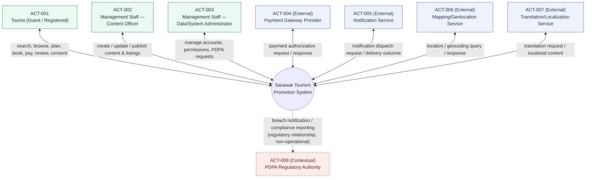

# Software Requirements Specification — Sarawak Tourism Promotion System

---

## 0. Document Control & ID Legend

### 0.1 Title Page

| Field | Detail |
|---|---|
| Project Title | Software Requirements Specification — Sarawak Tourism Promotion System |
| Client | Management team of a local tourism association ("the Association") |
| Preparing Agency | Swinsoft Consulting |
| Prepared By | Swinsoft Consulting Requirements Team (jarrentannn@gmail.com) |
| Prepared For | Management team of the Association (business sponsor); Swinsoft development team (build reference) |
| Document Type | Software Requirements Specification (Tasks & Support approach / Goal-Design Scale methodology) |
| Version | 1.0 |
| Date | 11 September 2026 |
| Confidentiality Notice | Prepared exclusively for the Association and Swinsoft Consulting. Not to be distributed outside these parties without written consent of both. |

### 0.2 Revision History

| Version | Date | Author | Summary of Change | Trigger |
|---|---|---|---|---|
| 0.1 | 2026-08-18 | Swinsoft Requirements Team | Initial structural skeleton: ID legend, section tree | Project kickoff |
| 0.2 | 2026-08-25 | Swinsoft Requirements Team | Goals, objectives, incentives, pain points, assumptions drafted | Stakeholder discovery interviews (VAL-001, VAL-002) |
| 0.3 | 2026-08-29 | Swinsoft Requirements Team | System context, actor catalogue, domain model drafted | Domain walkthrough with Association operations lead (VAL-002) |
| 0.4 | 2026-09-02 | Swinsoft Requirements Team | Eleven user tasks drafted in Tasks & Support format | Task-elicitation workshops (VAL-001, VAL-003) |
| 0.5 | 2026-09-05 | Swinsoft Requirements Team | Workflows (WF-000, WF-001…WF-011) drafted | Workflow validation walkthrough (VAL-003) |
| 0.6 | 2026-09-07 | Swinsoft Requirements Team | Four NFR categories, design/product requirements, PDPA requirements drafted | Compliance review with IT/PDPA advisor (VAL-004) |
| 0.7 | 2026-09-09 | Requirements Architect (blueprint approval pass) | Domain model relationship notation locked (XOR fan-out for `DM-REL-002`/`DM-REL-007`, six separate `DM-REL-009` curation edges, dashed `DM-REL-005` informational edge, three-cluster top-down layout) | Architect design review |
| 1.0 | 2026-09-11 | Technical Documenter | Full SRS expanded from approved blueprint `02_blueprint.md`; front matter, all 12 sections, and Appendices A–F fully populated; superseded and replaced an inconsistent prior draft | Blueprint sign-off; scheduled full-document drafting pass |

### 0.3 Table of Contents

- 0. Document Control & ID Legend — 0.1 Title Page; 0.2 Revision History; 0.3 Table of Contents; 0.4 Requirement/Artifact ID Legend; 0.5 Intended Audience Statement; 0.6 Project Type Statement
- 1. Introduction — 1.1 Purpose; 1.2 Scope; 1.3 Intended Audience; 1.4 Project Type; 1.5 Domain Vocabulary/Definitions; 1.6 Document Conventions
- 2. Project Goals, Objectives, Incentives & Pain Points — 2.1 Goals; 2.2 Objectives; 2.3 Incentives; 2.4 Pain Points
- 3. Assumptions
- 4. System Context & Actors — 4.1 System Boundary Statement; 4.2 Actors; 4.3 System Context Diagram
- 5. Domain Model — 5.1 Entity List; 5.2 Relationships; 5.3 Domain Model Diagram; 5.4 Entity-to-Task Coverage Note
- 6. User Tasks (Tasks & Support Approach) — 6.1 Standard Task Template; 6.2 Task Hierarchy/Goal Tree; 6.3 Major Tasks (TASK-001…TASK-011)
- 7. Workflows — 7.1 Overarching End-to-End Workflow (WF-000); 7.2 Per-Task Workflow Diagrams (WF-001…WF-011); 7.3 Diagram Legend
- 8. Non-Functional Requirements — 8.1 Performance & Scalability; 8.2 Security & Data Privacy; 8.3 Usability & Accessibility; 8.4 Availability & Reliability
- 9. Other Design & Product-Level Requirements — 9.1 Design-Level Requirements; 9.2 Product-Level Requirements
- 10. PDPA & Regulatory Compliance
- 11. Validation Summary
- 12. Conclusion & Recommendations
- Appendix A — Stakeholder Validation Evidence
- Appendix B — Requirements Traceability Matrix
- Appendix C — CRUD Matrix
- Appendix D — Verifiability Self-Check (IEEE 830 Quality Audit)
- Appendix E — Domain Vocabulary / Glossary
- Appendix F — Iteration / Revision Evidence Log

> Formatting rule applied: this Table of Contents is regenerated to reflect every section and diagram present in this version (Coherent Document rule, blueprint §0.3).

### 0.4 Requirement / Artifact ID Legend

| Prefix | Meaning |
|---|---|
| `GOAL-xxx` | Goal (broad direction) |
| `OBJ-xxx` | Objective (specific, measurable outcome) |
| `INC-xxx` | Incentive (business value / ROI) |
| `PP-xxx` | Pain point (existing process problem) |
| `ASSUMP-xxx` | Assumption (with rationale/source) |
| `ACT-xxx` | Actor (human or external system/interface — see Section 4.2) |
| `DM-ENT-xxx` | Domain model entity |
| `DM-REL-xxx` | Domain model relationship |
| `TASK-xxx` | Major user task (Tasks & Support) |
| `ST-x.y` | Subtask of `TASK-x` |
| `REQ-FUN-xxx` | Functional requirement (derived from a subtask) |
| `REQ-NFR-xxx` | Non-functional requirement (exactly 4 categories, 001–004) |
| `REQ-DES-xxx` | Design-level requirement |
| `REQ-PROD-xxx` | Product-level requirement |
| `REQ-PDPA-xxx` | PDPA/regulatory compliance requirement |
| `WF-xxx` | Workflow diagram (`WF-000` overarching; `WF-001…WF-011` per task) |
| `VAL-xxx` | Validation evidence item |

*Note on the `EXT-xxx` prefix reserved in the approved blueprint:* external systems/interfaces are catalogued as numbered actors within the single `ACT-xxx` actor catalogue (Section 4.2, `ACT-004`–`ACT-008`) rather than under a separate `EXT-xxx` series, consistent with how the blueprint itself instantiates them in Section 4.2. This legend is authoritative for the entire document; no ID is reused for a different artifact type anywhere below.

### 0.5 Intended Audience Statement

This SRS is written for four audiences, each of whom relies on a different subset of the document but shares the same requirement identifiers and terminology throughout:

1. **Tourism Association management/decision-makers** — to confirm that the specified system satisfies `GOAL-001`…`GOAL-004`, delivers the incentives in Section 2.3, and to formally sign off on the assumptions in Section 3 before development funding is committed.
2. **Swinsoft development team** — to use Sections 4–10 as the authoritative, unambiguous basis for design and implementation, with every `REQ-*` statement written as an objectively verifiable "the system shall…" condition.
3. **QA/test engineers** — to derive test cases directly from the fit criteria embedded in Sections 6, 8, 9 and 10, and from the verifiability audit in Appendix D.
4. **Any PDPA compliance auditor** reviewing the system pre-launch — to verify, via Section 10 and Appendices A/B, that every personal-data-handling activity is traceable to a lawful basis and a verifiable control.

### 0.6 Project Type Statement

The Sarawak Tourism Promotion System is a **greenfield, purpose-built software system**. It is not a replacement of one existing legacy IT system; rather, it consolidates the Association's currently fragmented manual, print, and social-media tourism-promotion channels (Section 2.4) into a single, association-operated platform. Hardware, network, data-repository, and deployment-platform infrastructure are assumed already acquired by the client (`ASSUMP-001`); this document elaborates strictly on the software to be built.

---

## 1. Introduction

### 1.1 Purpose of the Document

This Software Requirements Specification (SRS) defines, at the domain and quality-attribute level, what the Sarawak Tourism Promotion System ("the System") must do and how well it must do it, for the management team of a local tourism association (the "Association," the client) and for Swinsoft Consulting (the preparing agency and intended builder). The document follows the **Tasks & Support** requirements-engineering approach throughout Section 6, places every non-domain requirement on the **Goal-Design Scale** across Sections 8–10, and provides full backward and forward traceability (Appendix B) from business goals through to individually verifiable requirements and validation evidence.

The purpose of this document is threefold: (a) to give the Association a complete, reviewable statement of what will be built, in language a non-technical stakeholder can validate; (b) to give the Swinsoft development team an unambiguous, testable basis for design and construction; and (c) to demonstrate — through the traceability matrices, CRUD matrix, and verifiability audit in the appendices — that the specification is internally consistent, complete, and free of unverifiable or contradictory statements.

### 1.2 Scope

This SRS specifies **software only**. Physical servers, network provisioning, end-user devices, data-repository platforms, and deployment infrastructure are assumed already acquired by the client (`ASSUMP-001`; `project_brief.yaml` → `strict_ground_rules.hardware_assumption`) and are explicitly out of scope for elaboration in this document.

Within the software boundary, the System's scope covers:

- A tourist-facing catalog of Destinations, Accommodation, Vehicles (transportation), Food Establishments, and Local Information, searchable and reservable by worldwide tourists (`GOAL-001`, `GOAL-003`).
- Package/itinerary assembly combining these offerings with selectable Options.
- Booking creation, payment hand-off to an external payment gateway, and booking-lifecycle management.
- A Review and feedback mechanism supporting association-endorsed quality assurance.
- A management-facing content, listing, booking, and availability administration capability for Association staff (`GOAL-002`).
- PDPA-compliant consent capture, data-subject request handling, and privacy administration (`GOAL-004`).

Out of scope: the internal systems of individual accommodation, transport, or food providers; the internal implementation of third-party payment, notification, mapping, or translation services (treated as external black boxes, Section 4); and any hardware/network/deployment-platform procurement.

### 1.3 Intended Audience

See Section 0.5 for the full statement. In summary: Tourism Association management/decision-makers, the Swinsoft development team, QA/test engineers, and PDPA compliance auditors.

### 1.4 Project Type

See Section 0.6 for the full statement. In summary: a greenfield, purpose-built consolidation platform, not a legacy-system replacement.

### 1.5 Domain Vocabulary / Definitions

All domain terms, actor names, and abbreviations used in this document are defined once, consistently, in **Appendix E — Domain Vocabulary / Glossary**. Where a term has a canonical form (for example, "Tourist" rather than "Visitor," "Traveler," or "Customer"), that canonical form is used everywhere in this document without exception (Section 4.2 terminology rule).

### 1.6 Document Conventions

- The Requirement/Artifact ID Legend in Section 0.4 governs every identifier in this document; no prefix is reused for a different artifact type.
- Every normative requirement statement — regardless of type (`REQ-FUN`, `REQ-NFR`, `REQ-DES`, `REQ-PROD`, `REQ-PDPA`) — is phrased as an objectively verifiable **"The system shall…"** condition with a stated, measurable fit criterion (metric, target, and verification method).
- Any illustrative, explanatory, or example text that is not itself a testable requirement is visually separated and explicitly labeled **"Non-Normative"**; such text is excluded from requirement counts and from the Appendix D verifiability audit.
- Tables are used in preference to prose wherever a structured comparison (identifiers, cardinalities, cross-references) is being conveyed, to support traceability and reduce ambiguity.
- Diagrams are described using Mermaid notation blocks so that they render directly in standard Markdown viewers while remaining plain-text and version-controllable.

---

## 2. Project Goals, Objectives, Incentives & Pain Points

Goals, Objectives, Incentives, and Pain Points are maintained as four separately labeled subsections per the blueprint's hard rule; they are not collapsed into a single "Goals" list, because each answers a different validation question (why are we doing this / how will we know we succeeded / what is the payoff / what is broken today).

### 2.1 Goals

Goals state broad direction; they are not directly measurable on their own but are made verifiable through the Objectives in Section 2.2.

| ID | Goal Statement |
|---|---|
| `GOAL-001` | Promote Sarawak destinations, accommodation, transportation, and food to worldwide tourists through one authoritative digital channel. |
| `GOAL-002` | Enable the tourism association's management team to control and maintain promotional content and operational data. |
| `GOAL-003` | Provide trustworthy, current local information that improves visitor experience and safety. |
| `GOAL-004` | Operate the platform in demonstrable compliance with the Malaysian Personal Data Protection Act (PDPA) for both tourist and management data. |

### 2.2 Objectives

Each objective is specific, measurable, and traced to exactly one governing goal.

| ID | Objective | Traces to |
|---|---|---|
| `OBJ-001` | The system shall consolidate accommodation, transportation, food, and local-information listings — currently spread across independent channels (`PP-001`, `PP-002`) — into one searchable catalog, with 100% of Association-endorsed listings migrated before launch. | `GOAL-001` |
| `OBJ-002` | The system shall reduce the content-update cycle for a new or changed listing to no more than one business day (≤ 8 business hours) from staff submission to publication, measured against the current undocumented manual process baseline (`PP-003`). | `GOAL-002` |
| `OBJ-003` | The system shall enable a registered or guest tourist to research, assemble, and pay for a multi-component trip Package within the platform without leaving it, verified by a completed end-to-end usability test path (search → Package → payment confirmation) with zero required external hand-off steps. | `GOAL-001` |
| `OBJ-004` | The system shall pass a documented PDPA compliance checklist review (Section 10 / Appendix A) with zero unresolved non-compliant items prior to go-live. | `GOAL-004` |

### 2.3 Incentives

| ID | Incentive |
|---|---|
| `INC-001` | Increased bookings/revenue channeled to association-endorsed accommodation, transport, and food providers, via the consolidated catalog and Package builder (`TASK-003`–`TASK-006`). |
| `INC-002` | Reduced Association staff hours spent on manual/paper-based content coordination and provider liaison, replaced by the structured content-administration workflow (`TASK-009`). |
| `INC-003` | Strengthened Association brand trust from centralized, verified, moderated information — as opposed to fragmented/unofficial sources — supported directly by the quality/review loop (`TASK-008`). |
| `INC-004` | Data-informed decision-making for the Association (which destinations/providers drive engagement) enabled by the structured booking and review data captured across `TASK-003`–`TASK-008` and administered in `TASK-010`. |

### 2.4 Pain Points

Every pain point below maps to at least one Goal or Objective, and forward into the Appendix B traceability matrix.

| ID | Pain Point | Consequence | Maps to |
|---|---|---|---|
| `PP-001` | Tourist information is scattered across informal/unofficial sites and social media, inconsistent and unverifiable. | Tourists cannot trust or efficiently locate authoritative destination information. | `OBJ-001` |
| `PP-002` | No single channel lets a tourist discover and book accommodation, transport, and food together. | Tourists must manually cross-reference multiple disconnected sources to plan a trip. | `OBJ-003` |
| `PP-003` | Management currently updates tourism content via manual/offline means (spreadsheets, printed brochures), causing delay and error. | Listings go stale; errors propagate to tourists; staff effort is duplicated across channels. | `OBJ-002` |
| `PP-004` | Language and currency barriers hinder worldwide tourists using fragmented local-only sites. | Non-local tourists are underserved; conversion and satisfaction suffer. | `GOAL-001`, `GOAL-003` |
| `PP-005` | No structured feedback channel exists for the Association to assess visitor satisfaction or provider quality. | The Association cannot identify underperforming providers or reward good ones; no evidence base for `INC-003`. | `INC-003`, `TASK-008` |
| `PP-006` | Absence of a governed data-handling process exposes tourist and management personal data to PDPA compliance risk. | Legal/regulatory exposure and loss of tourist trust in the platform. | `GOAL-004` |

---

## 3. Assumptions

Each assumption below carries an explicit rationale/source, per the Goals/Assumptions rule. Items flagged for stakeholder confirmation are carried forward into Appendix A (validation evidence) and are re-referenced in Section 12 as residual risks requiring client sign-off before development begins.

| ID | Assumption | Rationale / Source | Confirmation Status |
|---|---|---|---|
| `ASSUMP-001` | Hardware, servers, network, and the data-repository platform are already acquired/provisioned by the client. | `project_brief.yaml` → `strict_ground_rules.hardware_assumption`. | Accepted as a hard ground rule; not subject to further validation. |
| `ASSUMP-002` | The tourism association is the sole authoritative content owner; individual accommodation/vehicle/food providers do not receive direct system login — they supply information to Association staff off-system. | Inferred from `project_brief.yaml` → `core_functions.management_facing` wording ("enable content and database management" implies staff-only administration). | **Flagged** for stakeholder confirmation (Appendix A, `VAL-002`, `VAL-006`). |
| `ASSUMP-003` | Worldwide tourists are assumed to have access to a modern web browser or smartphone with adequate internet connectivity. | `project_brief.yaml` → `target_audience` ("Worldwide tourists"). | Accepted; revisit only if a rural/offline-tolerance requirement is later scoped in. |
| `ASSUMP-004` | Payment processing is delegated to a third-party, PCI-DSS-compliant payment gateway; the system does not store raw payment-card data. | Software-only scope ground rule (Section 1.2) combined with standard industry practice for PCI-DSS scope reduction. | Accepted as a hard design constraint (see `REQ-PROD-003`). |
| `ASSUMP-005` | The Association operates under Malaysian jurisdiction; PDPA is the governing privacy framework even though end users are worldwide; foreign frameworks (e.g., GDPR) are explicitly out of scope unless the client states otherwise. | `project_brief.yaml` → `compliance.privacy_framework`. | **Flagged** as a risk requiring stakeholder sign-off (Appendix A, `VAL-004`; Section 12). |
| `ASSUMP-006` | One shared platform instance serves all Association-endorsed listings; no separate deployment per district. | Inferred from the single-system framing of `project_brief.yaml`. | Accepted; cross-checked against Section 8 scalability NFRs (no conflict identified). |
| `ASSUMP-007` | English and Bahasa Malaysia are the baseline supported languages; additional languages are budget-dependent stretch scope. | Derived from `target_audience` plus typical Sarawak-tourism practice. | **Flagged** for stakeholder confirmation (Appendix A, `VAL-001`, `VAL-005`); baseline value used in `REQ-NFR-003` is 2 languages minimum. |

**Cross-check performed (Goals/Assumptions rule).** Sections 8–10 were re-scanned during drafting to confirm no NFR or design requirement silently contradicts an assumption above. Specifically: `REQ-NFR-001` (scalability to ≥500 concurrent users on one shared instance) is consistent with `ASSUMP-006`; `REQ-PROD-003` (tokenized payment integration, no raw card data stored) is consistent with `ASSUMP-004`; `REQ-NFR-003`'s minimum-language fit criterion is fixed at 2 (English, Bahasa Malaysia) so it does not presuppose the stretch languages referenced in `ASSUMP-007`. No contradiction was found; this cross-check is repeated as part of the Appendix D verifiability audit.

---

## 4. System Context & Actors

### 4.1 System Boundary Statement

**In scope** — the application software: tourist-facing modules (catalog browse/search, Package builder, booking, payment hand-off, reviews), management-facing modules (content/listing administration, booking/availability administration, PDPA/privacy administration), the business logic connecting them, and the API integration logic that talks to external services.

**Out of scope** — physical servers/hosting, network provisioning, end-user devices, and the internal implementation of third-party services (`ACT-004`–`ACT-007`), which are treated strictly as external black boxes accessed through a defined interaction only (Section 3.5 style interaction, no internal design specified), per `project_brief.yaml` → `strict_ground_rules.hardware_assumption` and `ASSUMP-001`.

The boundary is drawn so that everything a Swinsoft developer would need to design and build sits inside it, and everything the Association has already acquired, or has delegated to a specialist third party, sits outside it — this is what makes the system a "greenfield, purpose-built" software product (Section 0.6) rather than an infrastructure project.

### 4.2 Actors

Terminology rule: the actor names below are canonical and are used identically everywhere else in this document (task actor fields, workflow swimlanes, context-diagram labels, glossary). No synonym (e.g., "Visitor," "Traveler," "Customer," "Admin," "Vendor") is substituted for a canonical name anywhere in this SRS.

| ID | Actor | Type | Description |
|---|---|---|---|
| `ACT-001` | Tourist (Guest / Registered) | Primary human actor | The primary worldwide end user; discovers, plans, books, pays for, and reviews Sarawak travel experiences (`TASK-001`–`TASK-008`). May act anonymously (Guest) or with a persisted profile (Registered). |
| `ACT-002` | Management Staff — Content Officer | Management human actor (specialization of "Management Staff") | Association staff who curate listings and Local Information content, and publish/unpublish/archive them (`TASK-009`). |
| `ACT-003` | Management Staff — Data/System Administrator | Management human actor (specialization of "Management Staff") | Association staff who handle accounts, permissions, booking/availability administration, and PDPA data-subject requests (`TASK-010`, `TASK-011`). Generalizes with `ACT-002` under the domain-model superclass Management Staff (`DM-ENT-002`). |
| `ACT-004` | Payment Gateway Provider | External system actor | PCI-DSS-compliant third party that authorizes and settles Tourist payments for Bookings (`TASK-007`; `ASSUMP-004`; `REQ-PROD-003`). |
| `ACT-005` | Notification Service | External system actor | Email/SMS gateway used to deliver booking confirmations and PDPA-request acknowledgements (`REQ-PROD-005`). |
| `ACT-006` | Mapping/Geolocation Service Provider | External system actor | Supplies location and geocoding data used to display Destination, Accommodation, and Vehicle pickup locations (`REQ-PROD-004`). |
| `ACT-007` | Translation/Localization Service | External system actor (optional / stretch) | Would support any expansion of language coverage beyond the `ASSUMP-007` English/Bahasa Malaysia baseline; not required for the v1.0 `REQ-NFR-003` minimum. |
| `ACT-008` | PDPA Regulatory Authority | Contextual, non-user actor | Recipient of breach notifications and compliance reporting (`REQ-PDPA-006`); appears in the context diagram for completeness but never operates the System. |

### 4.3 System Context Diagram

**Figure 1 — STPS System Context Diagram.** Center node: "Sarawak Tourism Promotion System." Solid bidirectional edges denote direct, operational system interaction; the single dashed edge denotes the compliance/regulatory relationship with `ACT-008` only, per the blueprint's explicit legend rule.



**Legend.** Solid double-headed arrow = direct, two-way operational system interaction. Dashed arrow = compliance/regulatory relationship only (`ACT-008`, non-operational). Green fill = primary/management human actor. Blue fill = external system actor. Red dashed-border fill = contextual, non-operating regulatory actor.

---

## 5. Domain Model

**Hard rule applied:** entities are described using one-line conceptual descriptions and relationships/cardinalities only. No attributes, no primary/foreign keys, and no normalized sub-entities appear anywhere below (for example, `DM-ENT-005` Vehicle is kept as one conceptual entity and is not split into "Vehicle Details"/"Vehicle Availability").

### 5.1 Entity List

Reconciled 1:1 with the Section 5.3 diagram and the Appendix C CRUD matrix — the same eleven entities, no additions or omissions, appear in all three places.

| ID | Entity | One-line Conceptual Description |
|---|---|---|
| `DM-ENT-001` | Tourist | A worldwide visitor who discovers, plans, and books Sarawak travel experiences via the platform; may act as guest or registered profile. |
| `DM-ENT-002` | Management Staff | Tourism association personnel who curate content, moderate reviews, and administer bookings/data. |
| `DM-ENT-003` | Destination | A promoted place of interest (cultural site, park, festival, landmark). |
| `DM-ENT-004` | Accommodation | A lodging listing (hotel, homestay, resort) available for reservation. |
| `DM-ENT-005` | Vehicle | A transportation option (car, van, boat, bus, etc.) offered/listed for tourist transport or touring. Kept as a single conceptual entity. |
| `DM-ENT-006` | Food Establishment | A dining venue listing promoted/reservable through the platform. |
| `DM-ENT-007` | Local Information Article | General-interest content (culture, safety, weather, events, etiquette) authored by staff. |
| `DM-ENT-008` | Package (Itinerary) | A curated bundle combining Destinations, Accommodation, Vehicle, and/or Food Establishment selections into one bookable trip plan. |
| `DM-ENT-009` | Option | A selectable add-on/configuration attached to a Booking or Package (e.g., guided-tour add-on, meal preference, insurance, child seat). |
| `DM-ENT-010` | Booking | A Tourist's pending or confirmed reservation against an Accommodation, Vehicle, Food Establishment, or Package. |
| `DM-ENT-011` | Review | A Tourist-submitted rating/comment evaluating an Accommodation, Vehicle, Food Establishment, Destination, or Package. |

### 5.2 Relationships

| ID | Relationship | Cardinality | Notes |
|---|---|---|---|
| `DM-REL-001` | Tourist —creates→ Booking | 1 : 0..* | A Tourist may create zero or more Bookings; every Booking is created by exactly one Tourist. |
| `DM-REL-002` | Booking —targets→ exactly one of {Accommodation \| Vehicle \| Food Establishment \| Package} | 1 : 1 (XOR) | Conceptual generalization "Offering," described in prose only — **not** a stored/normalized entity. Represented in the diagram as four alternative edges, exactly one of which applies to any given Booking. |
| `DM-REL-003` | Booking —includes→ Option | 0..* : 0..* | Many-to-many; a Booking may include zero or more Options, and an Option may appear on many Bookings. |
| `DM-REL-004` | Package —bundles→ Destination, Accommodation, Vehicle, Food Establishment | 0..* : 1..* (Destination); 0..* : 0..* (others) | Aggregation, many-to-many; every Package bundles at least one Destination, and any number of Accommodation/Vehicle/Food Establishment components. |
| `DM-REL-005` | Destination —near→ Accommodation / Food Establishment | 0..* : 0..* | Informational/spatial, optional; drawn dashed because it is advisory context, not a transactional or ownership relationship. |
| `DM-REL-006` | Tourist —writes→ Review | 1 : 0..* | A Tourist may write zero or more Reviews; every Review is written by exactly one Tourist. |
| `DM-REL-007` | Review —evaluates→ exactly one of {Accommodation \| Vehicle \| Food Establishment \| Destination \| Package} | 1 : 1 (XOR) | Conceptual generalization "Reviewable," described in prose only — **not** a stored/normalized entity. Represented in the diagram as five alternative edges, exactly one of which applies to any given Review. |
| `DM-REL-008` | Management Staff —publishes/maintains→ Local Information Article | 1..* : 0..* | One or more staff maintain the article catalog collectively. |
| `DM-REL-009` | Management Staff —curates (CRUD)→ Destination / Accommodation / Vehicle / Food Establishment / Package / Option | 1..* : 0..* (each) | Drawn as six separate edges (one per curated entity type), not as one fan-out to a generalized "Offering," to keep each curation relationship individually traceable to Appendix C. |
| `DM-REL-010` | Management Staff —processes (approve/adjust/cancel)→ Booking | 1 : 0..* | Every Booking may be processed by Management Staff; a given processing action is performed by one staff member at a time. |

### 5.3 Domain Model Diagram

**Figure 2 — STPS Conceptual Domain Model.** Rendered top-down (flowchart `TD`) in three clusters: **Tourist-Side Entities**, **Catalog/Offering Entities**, and **Management-Side Entities**. Entity boxes carry only the entity ID, name, and (in Section 5.1) a one-line description — no attribute compartments. The two XOR-constrained relationships (`DM-REL-002`, `DM-REL-007`) are drawn as solid fan-out edges accompanied by a dedicated dashed-border note box clarifying the exclusivity; the six `DM-REL-009` curation relationships are drawn as six separate solid edges; the informational `DM-REL-005` relationship is drawn dashed.

```mermaid
flowchart TD
    subgraph C1["Tourist-Side Entities"]
        direction TB
        TOURIST["DM-ENT-001<br/>Tourist"]
        BOOKING["DM-ENT-010<br/>Booking"]
        REVIEW["DM-ENT-011<br/>Review"]
        OPTION["DM-ENT-009<br/>Option"]
    end

    subgraph C2["Catalog / Offering Entities"]
        direction TB
        DEST["DM-ENT-003<br/>Destination"]
        ACCOM["DM-ENT-004<br/>Accommodation"]
        VEHICLE["DM-ENT-005<br/>Vehicle"]
        FOOD["DM-ENT-006<br/>Food Establishment"]
        PACKAGE["DM-ENT-008<br/>Package (Itinerary)"]
        LOCALINFO["DM-ENT-007<br/>Local Information Article"]
    end

    subgraph C3["Management-Side Entities"]
        direction TB
        MGMT["DM-ENT-002<br/>Management Staff"]
    end

    TOURIST -->|"DM-REL-001 creates (1 : 0..*)"| BOOKING

    BOOKING -->|"DM-REL-002 targets (1:1)"| ACCOM
    BOOKING -->|"DM-REL-002 targets (1:1)"| VEHICLE
    BOOKING -->|"DM-REL-002 targets (1:1)"| FOOD
    BOOKING -->|"DM-REL-002 targets (1:1)"| PACKAGE
    XORNOTE2["XOR constraint:<br/>a Booking targets exactly ONE of<br/>Accommodation / Vehicle / Food Establishment / Package<br/>(conceptual 'Offering' — not a stored entity)"]:::note
    BOOKING -.- XORNOTE2

    BOOKING -->|"DM-REL-003 includes (0..* : 0..*)"| OPTION

    PACKAGE -->|"DM-REL-004 bundles (0..* : 1..*)"| DEST
    PACKAGE -->|"DM-REL-004 bundles (0..* : 0..*)"| ACCOM
    PACKAGE -->|"DM-REL-004 bundles (0..* : 0..*)"| VEHICLE
    PACKAGE -->|"DM-REL-004 bundles (0..* : 0..*)"| FOOD

    DEST -.->|"DM-REL-005 near (optional, informational)"| ACCOM
    DEST -.->|"DM-REL-005 near (optional, informational)"| FOOD

    TOURIST -->|"DM-REL-006 writes (1 : 0..*)"| REVIEW

    REVIEW -->|"DM-REL-007 evaluates (1:1)"| ACCOM
    REVIEW -->|"DM-REL-007 evaluates (1:1)"| VEHICLE
    REVIEW -->|"DM-REL-007 evaluates (1:1)"| FOOD
    REVIEW -->|"DM-REL-007 evaluates (1:1)"| DEST
    REVIEW -->|"DM-REL-007 evaluates (1:1)"| PACKAGE
    XORNOTE7["XOR constraint:<br/>a Review evaluates exactly ONE of<br/>Accommodation / Vehicle / Food Establishment /<br/>Destination / Package<br/>(conceptual 'Reviewable' — not a stored entity)"]:::note
    REVIEW -.- XORNOTE7

    MGMT -->|"DM-REL-008 publishes/maintains (1..* : 0..*)"| LOCALINFO

    MGMT -->|"DM-REL-009 curates (CRUD)"| DEST
    MGMT -->|"DM-REL-009 curates (CRUD)"| ACCOM
    MGMT -->|"DM-REL-009 curates (CRUD)"| VEHICLE
    MGMT -->|"DM-REL-009 curates (CRUD)"| FOOD
    MGMT -->|"DM-REL-009 curates (CRUD)"| PACKAGE
    MGMT -->|"DM-REL-009 curates (CRUD)"| OPTION

    MGMT -->|"DM-REL-010 processes (approve/adjust/cancel) (1 : 0..*)"| BOOKING

    classDef note fill:#fff9e6,stroke:#b8860b,stroke-width:1px,stroke-dasharray:5 5,color:#333;
```



**Diagram notation confirmation:** entity boxes contain only the entity ID and name (matching Section 5.1's one-line descriptions in prose, not in the box); every relationship line carries the verb label and cardinality from Section 5.2; no attribute compartment appears anywhere in the diagram.

### 5.4 Entity-to-Task Coverage Note

Every entity in Section 5.1 appears in at least one Task in Section 6 and in at least one row of the Appendix C CRUD matrix; no entity is orphaned. Summary: `DM-ENT-001` Tourist and `DM-ENT-002` Management Staff appear across nearly every task as the acting party; `DM-ENT-003`–`DM-ENT-006` (Destination, Accommodation, Vehicle, Food Establishment) are covered by `TASK-002`–`TASK-005` and `TASK-009`; `DM-ENT-007` Local Information Article is covered by `TASK-002` and `TASK-009`; `DM-ENT-008` Package by `TASK-006`; `DM-ENT-009` Option by `TASK-004`, `TASK-006`, and `TASK-009`; `DM-ENT-010` Booking by `TASK-003`–`TASK-007`, `TASK-010`; `DM-ENT-011` Review by `TASK-008`. This coverage is restated in tabular form in Appendix C.

---

## 6. User Tasks (Tasks & Support Approach)

### 6.1 Standard Task Template

The identical template below is applied to every one of the eleven tasks in Section 6.3, in the same field order, with no field ever left blank — this consistency is itself a scored compliance rule for this document.

1. **Task ID & Name** — header reads literally "Task `TASK-xxx`: `<Name>`", matching the section title exactly.
2. **Actors** — which `ACT-xxx` perform or receive the task.
3. **Trigger** — the event that starts the task.
4. **Precondition** — system/domain state required before the task can begin.
5. **Postcondition** — the resulting system/domain state (mandatory).
6. **Frequency** — how often the task occurs.
7. **Priority / Exception-Criticality** — mandatory rating plus a one-line justification, never blank.
8. **Work Area** — the module/back-office area the task belongs to.
9. **Solution-Agnosticism Check** *(Non-Normative)* — at least three different realizable solutions/channels for the task, per `project_brief.yaml` → `strict_ground_rules.solution_agnosticism`; illustrative only, excluded from the requirement count.
10. **Subtasks** — each subtask states (a) the normal flow step and (b) at least one realistic Problem/Exception case and the system's handling of it.
11. **Variants** — realistic alternative ways the task can play out.
12. **Derived Functional Requirements** — the `REQ-FUN-xxx` IDs produced by the subtasks, each an independently verifiable "the system shall…" statement.

### 6.2 Task Hierarchy / Goal Tree

```
System Goal: Promote Sarawak Tourism & Enable Association Management
├── Tourist Goal: Plan & Experience a Sarawak Trip
│    ├── TASK-001 Register & Manage Tourist Account
│    ├── TASK-002 Discover Local Tourism Information
│    ├── TASK-003 Search & Reserve Accommodation
│    ├── TASK-004 Search & Reserve Transportation (Vehicle)
│    ├── TASK-005 Search & Reserve Food & Dining
│    ├── TASK-006 Build & Book a Travel Package (Itinerary) with Options
│    ├── TASK-007 Complete Payment for a Booking
│    └── TASK-008 Submit Review & Feedback
└── Management Goal: Maintain an Authoritative, Compliant Tourism Platform
     ├── TASK-009 Manage Promotional Content & Listings
     ├── TASK-010 Manage Bookings, Availability & Provider Coordination
     └── TASK-011 Manage Tourist Data Privacy Requests (PDPA)
```

Eleven major tasks are specified — three above the 8-task minimum — to demonstrate elicitation depth across both the Tourist Goal branch and the Management Goal branch.

### 6.3 Major Tasks

#### Task TASK-001: Register & Manage Tourist Account

- **Actors:** `ACT-001` Tourist
- **Trigger:** The Tourist wants to create or update a profile before or during platform use.
- **Precondition:** The platform is accessible in guest mode; the PDPA notice is presented.
- **Postcondition:** An account is created/updated with a timestamped consent record; guest browsing remains available if consent is declined.
- **Frequency:** Low (one-time plus occasional updates).
- **Priority / Exception-Criticality:** High — gates personalization and PDPA consent for every downstream task.
- **Work Area:** Tourist account/profile module.
- **Solution-Agnosticism Check** *(Non-Normative)*: (a) a self-service web form; (b) a native mobile onboarding flow; (c) staff-assisted counter/kiosk registration.
- **Subtasks:**
  - **ST-1.1** View and accept/decline the Terms of Use and Privacy Policy. *Problem/Exception:* if consent is declined, the system restricts personalization but still allows guest browsing. → `REQ-FUN-001`, `REQ-FUN-002`
  - **ST-1.2** Provide profile details (contact, nationality, preferred language/currency). *Problem/Exception:* if invalid or duplicate contact information is submitted, the system flags it for correction before saving. → `REQ-FUN-003`
  - **ST-1.3** Update or request deletion of profile/preferences. *Problem/Exception:* if the Tourist requests full data deletion, this triggers the PDPA data-subject workflow (→ `TASK-011`). → `REQ-FUN-004`
- **Variants:** Guest checkout without full registration; social-login-assisted registration (if enabled).
- **Derived Functional Requirements:** `REQ-FUN-001`, `REQ-FUN-002`, `REQ-FUN-003`, `REQ-FUN-004`

> `REQ-FUN-001`: The system shall present the Terms of Use and a PDPA-aligned Privacy Policy for explicit accept/decline before collecting any personal data beyond anonymous browsing, and shall record the Tourist's choice with a timestamp.
> `REQ-FUN-002`: Where a Tourist declines consent, the system shall continue to allow guest browsing of all public catalog content while disabling personalization features (e.g., bookmarks, saved preferences) until consent is subsequently granted.
> `REQ-FUN-003`: The system shall validate submitted profile contact information (e.g., email/phone format, duplicate-account check) at submission time and shall flag any invalid or duplicate entry for correction before it is saved.
> `REQ-FUN-004`: The system shall allow a registered Tourist to update their own profile/preferences directly, and shall route any full data-deletion request to the PDPA data-subject request workflow (`TASK-011`) rather than actioning it inline.

---

#### Task TASK-002: Discover Local Tourism Information

- **Actors:** `ACT-001` Tourist
- **Trigger:** The Tourist wants destination, culture, safety, weather, or event information.
- **Precondition:** The platform is accessible (guest or registered).
- **Postcondition:** The Tourist has viewed and/or saved relevant local-information content.
- **Frequency:** High.
- **Priority / Exception-Criticality:** Medium-High — this is a core promotional function underpinning `GOAL-001` and `GOAL-003`.
- **Work Area:** Local information/content module.
- **Solution-Agnosticism Check** *(Non-Normative)*: (a) a searchable web content hub; (b) a mobile app content feed; (c) a QR-linked kiosk/brochure backed by the same repository.
- **Subtasks:**
  - **ST-2.1** Search/filter information by category (culture, safety, weather, events). *Problem/Exception:* if there are no matching results, the system suggests related/alternative categories. → `REQ-FUN-005`
  - **ST-2.2** View a Local Information Article in detail. *Problem/Exception:* if the article is outdated/unpublished, the system auto-hides expired content. → `REQ-FUN-006`
  - **ST-2.3** Bookmark an article for later (registered Tourist only). *Problem/Exception:* if a Guest attempts to bookmark, the system prompts registration (→ `TASK-001`). → `REQ-FUN-007`
- **Variants:** Location-based auto-suggested information (if geolocation is permitted); offline-saved information for low-connectivity areas.
- **Derived Functional Requirements:** `REQ-FUN-005`, `REQ-FUN-006`, `REQ-FUN-007`

> `REQ-FUN-005`: The system shall let a Tourist search or filter Local Information Articles by at least category (culture, safety, weather, events), and where no matching result exists, shall present at least one related or alternative category suggestion instead of an empty result set.
> `REQ-FUN-006`: The system shall automatically remove an expired or unpublished Local Information Article from all tourist-facing views at its designated expiry/unpublish timestamp, with no manual intervention required.
> `REQ-FUN-007`: The system shall restrict the bookmark action to registered Tourists and shall prompt an unregistered (Guest) Tourist to complete registration (`TASK-001`) when they attempt to bookmark, without discarding their current browsing context.

---

#### Task TASK-003: Search & Reserve Accommodation

- **Actors:** `ACT-001` Tourist
- **Trigger:** The Tourist needs lodging for planned travel dates.
- **Precondition:** Accommodation listings are published with availability.
- **Postcondition:** A Booking is created in Pending or Confirmed state against an Accommodation.
- **Frequency:** High.
- **Priority / Exception-Criticality:** High — core revenue-and-trust-critical function.
- **Work Area:** Accommodation search & reservation module.
- **Solution-Agnosticism Check** *(Non-Normative)*: (a) a web filter-and-reservation form; (b) a mobile booking flow; (c) staff-assisted phone/counter booking recorded into the same system.
- **Subtasks:**
  - **ST-3.1** Search/filter Accommodation by location, date, price, and type. *Problem/Exception:* if the filter combination returns zero results, the system suggests relaxed filters or nearby dates rather than an empty page. → `REQ-FUN-008`
  - **ST-3.2** View Accommodation detail and Reviews. *Problem/Exception:* if no reviews exist yet, the system shows an explicit "no reviews yet" state rather than a blank section. → `REQ-FUN-009`
  - **ST-3.3** Select an Accommodation and submit a reservation. *Problem/Exception:* if dates become unavailable mid-transaction, the system re-validates availability before confirming and notifies the Tourist if the reservation is lost. → `REQ-FUN-010`
- **Variants:** Reservation with Option add-ons; group/multi-room booking.
- **Derived Functional Requirements:** `REQ-FUN-008`, `REQ-FUN-009`, `REQ-FUN-010`

> `REQ-FUN-008`: The system shall let a Tourist filter Accommodation listings by at least location, date range, price range, and accommodation type, and where the applied combination returns zero results, shall present at least one relaxed-filter or nearby-date suggestion.
> `REQ-FUN-009`: The system shall display all published Reviews associated with an Accommodation on its detail view, and shall display an explicit "No reviews yet" state (rather than a blank section) when no Review exists.
> `REQ-FUN-010`: The system shall re-validate Accommodation availability for the requested dates immediately before confirming a reservation; where availability was lost between search and confirmation, the system shall reject the reservation attempt, notify the Tourist of the specific conflict, and offer alternative available dates or listings.

---

#### Task TASK-004: Search & Reserve Transportation (Vehicle)

- **Actors:** `ACT-001` Tourist
- **Trigger:** The Tourist needs transport (car/van/boat/bus) for touring or transfer.
- **Precondition:** Vehicle listings are published with an availability calendar.
- **Postcondition:** A Booking is created in Pending or Confirmed state against a Vehicle.
- **Frequency:** High.
- **Priority / Exception-Criticality:** High — core function with an explicit Vehicle-entity focus.
- **Work Area:** Transportation search & reservation module.
- **Solution-Agnosticism Check** *(Non-Normative)*: (a) a web listing page; (b) a mobile app with map-based search; (c) staff-assisted back-office allocation for walk-in tourists.
- **Subtasks:**
  - **ST-4.1** Search/filter Vehicle by type, capacity, date, and pickup location. *Problem/Exception:* if no Vehicle matches the requested capacity, the system suggests a combination of smaller vehicles or the nearest available alternative capacity. → `REQ-FUN-011`
  - **ST-4.2** View Vehicle detail (capacity, coverage area, provider). *Problem/Exception:* if a Vehicle is temporarily suspended (e.g., for maintenance), the system excludes it from search results. → `REQ-FUN-012`
  - **ST-4.3** Reserve a Vehicle with optional add-ons (driver, child seat, via Option). *Problem/Exception:* if a selected Option is incompatible with the chosen Vehicle, the system blocks the combination and explains the conflict. → `REQ-FUN-013`
- **Variants:** Self-drive rental vs. chauffeured tour vehicle; shared shuttle vs. private vehicle.
- **Derived Functional Requirements:** `REQ-FUN-011`, `REQ-FUN-012`, `REQ-FUN-013`

> `REQ-FUN-011`: The system shall let a Tourist filter Vehicle listings by at least type, passenger capacity, date, and pickup location, and where no single Vehicle satisfies the requested capacity, shall suggest a combination of smaller vehicles or the nearest available alternative capacity.
> `REQ-FUN-012`: The system shall exclude a Vehicle flagged as temporarily suspended (e.g., under maintenance) from all tourist-facing Vehicle search results for the duration of the suspension.
> `REQ-FUN-013`: The system shall validate the compatibility of a selected Option against the selected Vehicle before allowing checkout to proceed, and shall block and explain any incompatible Vehicle–Option combination rather than allowing it to be added to the Booking.

---

#### Task TASK-005: Search & Reserve Food & Dining

- **Actors:** `ACT-001` Tourist
- **Trigger:** The Tourist wants to find or reserve a dining venue.
- **Precondition:** Food Establishment listings are published.
- **Postcondition:** A reservation is created, or an informational view is logged for walk-in-only venues.
- **Frequency:** High.
- **Priority / Exception-Criticality:** Medium — core function, though the consequence of failure is lower than for accommodation or transport.
- **Work Area:** Food & dining discovery/reservation module.
- **Solution-Agnosticism Check** *(Non-Normative)*: (a) a web listing with an optional reservation form; (b) a mobile cuisine-based search; (c) a staff-curated recommendation counter drawing on the same backend listings.
- **Subtasks:**
  - **ST-5.1** Search/filter by cuisine, location, price, and dietary option. *Problem/Exception:* if a dietary filter (e.g., halal, vegetarian) returns zero results, the system flags the coverage gap for Management Staff review. → `REQ-FUN-014`
  - **ST-5.2** View Food Establishment detail and Reviews. *Problem/Exception:* if the listing is missing a required license/registration reference, the system withholds publication (links `REQ-PROD-007`). → `REQ-FUN-015`
  - **ST-5.3** Submit a table reservation where supported. *Problem/Exception:* if the venue does not support online reservation, the system displays contact-only information instead of a booking form. → `REQ-FUN-016`
- **Variants:** Walk-in-only venue (informational only); reservable venue with a deposit requirement.
- **Derived Functional Requirements:** `REQ-FUN-014`, `REQ-FUN-015`, `REQ-FUN-016`

> `REQ-FUN-014`: The system shall let a Tourist filter Food Establishment listings by at least cuisine, location, price range, and dietary option, and where a dietary filter (e.g., halal, vegetarian) returns zero results, shall log the coverage gap for Management Staff review.
> `REQ-FUN-015`: The system shall withhold publication of a Food Establishment listing that does not have a recorded valid business registration/license reference (`REQ-PROD-007`), and shall display all published Reviews on its detail view.
> `REQ-FUN-016`: Where a Food Establishment does not support online reservation, the system shall display contact-only information in place of a reservation form; where it does, the system shall accept and record a table reservation request against it.

---

#### Task TASK-006: Build & Book a Travel Package (Itinerary) with Options

- **Actors:** `ACT-001` Tourist
- **Trigger:** The Tourist wants a bundled multi-service/multi-day trip plan.
- **Precondition:** At least one Destination, Accommodation, Vehicle, or Food Establishment is published and available.
- **Postcondition:** A Package Booking is created combining the selected components and chosen Options.
- **Frequency:** Medium.
- **Priority / Exception-Criticality:** High — this task ties together all domain entities and is central to `OBJ-003`.
- **Work Area:** Package/itinerary builder module.
- **Solution-Agnosticism Check** *(Non-Normative)*: (a) a drag-and-drop web itinerary builder; (b) a guided step-by-step mobile wizard; (c) a staff-assembled custom-quote tool using the same catalog.
- **Subtasks:**
  - **ST-6.1** Select Destinations and combine them with Accommodation/Vehicle/Food components. *Problem/Exception:* if selected components' dates conflict, the system flags the scheduling conflict before checkout. → `REQ-FUN-017`
  - **ST-6.2** Choose applicable Options for the Package (guided tour, insurance, meal plan). *Problem/Exception:* if a chosen Option becomes unavailable, the system removes it and notifies the Tourist before payment. → `REQ-FUN-018`
  - **ST-6.3** Review the consolidated Package summary and confirm. *Problem/Exception:* if the total price changes mid-session due to a component price update, the system re-displays the updated total for re-confirmation. → `REQ-FUN-019`
- **Variants:** Staff-curated "featured package" vs. a fully custom tourist-built package.
- **Derived Functional Requirements:** `REQ-FUN-017`, `REQ-FUN-018`, `REQ-FUN-019`

> `REQ-FUN-017`: The system shall detect and flag a date/time scheduling conflict between two or more components (Destination, Accommodation, Vehicle, Food Establishment) selected into the same Package, and shall prevent the Tourist from proceeding to checkout until the conflict is resolved or acknowledged.
> `REQ-FUN-018`: Where a previously selected Option becomes unavailable before payment, the system shall automatically remove it from the Package and notify the Tourist of the removal before the payment step is presented.
> `REQ-FUN-019`: The system shall recompute and re-display the consolidated Package price and summary for Tourist re-confirmation whenever any bundled component's price changes during the active session, before accepting payment.

---

#### Task TASK-007: Complete Payment for a Booking

- **Actors:** `ACT-001` Tourist, `ACT-004` Payment Gateway Provider (external)
- **Trigger:** The Tourist confirms a Booking/Package requiring payment.
- **Precondition:** The Booking exists in Pending-Payment state; the payment gateway interface is available.
- **Postcondition:** The Booking transitions to Confirmed (on success) or Payment-Failed (on failure); the Tourist is notified.
- **Frequency:** High.
- **Priority / Exception-Criticality:** High — revenue-critical; failures here directly threaten `INC-001`.
- **Work Area:** Checkout/payment module.
- **Solution-Agnosticism Check** *(Non-Normative)*: (a) redirect to a hosted payment page; (b) an embedded payment widget/SDK; (c) staff-recorded manual/offline payment reconciled in-system.
- **Subtasks:**
  - **ST-7.1** Select a payment method and submit payment. *Problem/Exception:* if payment is declined or the gateway times out, the Booking is preserved as Pending-Payment for retry within a defined window rather than silently cancelled. → `REQ-FUN-020`
  - **ST-7.2** Receive payment and booking confirmation. *Problem/Exception:* if the gateway confirms payment but the system fails to update the Booking status, an automated reconciliation check alerts Management Staff. → `REQ-FUN-021`
  - **ST-7.3** Request refund/cancellation. *Problem/Exception:* if cancellation is requested after the provider's non-refundable cutoff, the system displays the applicable policy and auto-limits the refund. → `REQ-FUN-022`
- **Variants:** Full online payment; partial deposit plus balance on arrival (where supported).
- **Derived Functional Requirements:** `REQ-FUN-020`, `REQ-FUN-021`, `REQ-FUN-022`

> `REQ-FUN-020`: Where a payment attempt is declined or the payment gateway times out, the system shall preserve the associated Booking in a Pending-Payment state for a defined retry window (e.g., 30 minutes) rather than cancelling it automatically.
> `REQ-FUN-021`: The system shall reconcile every payment-gateway confirmation against the corresponding Booking's status within a defined interval, and shall automatically alert Management Staff of any Booking for which a confirmed payment has not been reflected in the Booking status.
> `REQ-FUN-022`: Where a Tourist requests cancellation after the provider's published non-refundable cutoff, the system shall display the applicable cancellation policy and shall calculate and apply only the refund amount permitted under that policy.

---

#### Task TASK-008: Submit Review & Feedback

- **Actors:** `ACT-001` Tourist
- **Trigger:** The Tourist completes a booked experience, or wants to give general feedback.
- **Precondition:** The Tourist has a completed Booking (for a verified review) or a general feedback channel is open.
- **Postcondition:** A Review is stored and linked to the relevant entity; it is pending moderation if applicable.
- **Frequency:** Medium.
- **Priority / Exception-Criticality:** Medium — supports the `INC-003` trust goal but is not transaction-critical.
- **Work Area:** Review & feedback module.
- **Solution-Agnosticism Check** *(Non-Normative)*: (a) a post-trip web review form; (b) a mobile push-prompted review; (c) an email/SMS-linked review form sent after Booking completion.
- **Subtasks:**
  - **ST-8.1** Access a review form for a completed Booking. *Problem/Exception:* if the Tourist attempts to review a Booking that is not yet completed, the system blocks the premature submission. → `REQ-FUN-023`
  - **ST-8.2** Submit a rating and comment. *Problem/Exception:* if the content contains prohibited/offensive language, the system flags it for Management Staff moderation before publishing. → `REQ-FUN-024`
  - **ST-8.3** View published Reviews on entity pages. *Problem/Exception:* if a Review is removed by moderation, it is not shown publicly and the submitting Tourist is notified of the outcome. → `REQ-FUN-025`
- **Variants:** Verified-booking review vs. general open feedback not tied to a Booking.
- **Derived Functional Requirements:** `REQ-FUN-023`, `REQ-FUN-024`, `REQ-FUN-025`

> `REQ-FUN-023`: The system shall permit a Tourist to open a Review form for a given Booking only when that Booking's status is Completed, and shall block submission attempts against a Booking in any other status.
> `REQ-FUN-024`: The system shall scan submitted Review text against a prohibited/offensive-language rule set at submission time and shall route any match to a Management Staff moderation queue instead of publishing it immediately.
> `REQ-FUN-025`: The system shall exclude a moderation-removed Review from all public entity pages and shall notify the submitting Tourist of the moderation outcome and reason.

---

#### Task TASK-009: Manage Promotional Content & Listings

- **Actors:** `ACT-002` Management Staff — Content Officer
- **Trigger:** A Destination/Accommodation/Vehicle/Food Establishment/Local Information Article/Option needs creating, updating, or retiring.
- **Precondition:** Staff is authenticated with content-management permission.
- **Postcondition:** The domain entity record is created/updated/archived and reflected in tourist-facing views.
- **Frequency:** Medium-High (ongoing).
- **Priority / Exception-Criticality:** High — this is the core management-facing function that directly delivers `GOAL-002`.
- **Work Area:** Content/listing administration back office.
- **Solution-Agnosticism Check** *(Non-Normative)*: (a) a web admin dashboard/CMS; (b) a desktop back-office application; (c) a bulk spreadsheet-import tool feeding the same repository.
- **Subtasks:**
  - **ST-9.1** Create/edit a listing record. *Problem/Exception:* if a required legal/registration reference is missing, the system blocks publish until it is supplied. → `REQ-FUN-026`
  - **ST-9.2** Publish/unpublish or archive a listing. *Problem/Exception:* if Staff attempts to archive an entity with active future Bookings, the system warns and requires explicit confirmation/reassignment. → `REQ-FUN-027`
  - **ST-9.3** Author/edit a Local Information Article. *Problem/Exception:* if an article scheduled to publish is missing a required category tag, the system prevents publish without categorization. → `REQ-FUN-028`
- **Variants:** Single-record edit vs. bulk update; optional draft/maker-checker review before publish.
- **Derived Functional Requirements:** `REQ-FUN-026`, `REQ-FUN-027`, `REQ-FUN-028`

> `REQ-FUN-026`: The system shall block publication of any Destination, Accommodation, Vehicle, or Food Establishment listing that lacks a recorded valid legal/registration reference until that reference is supplied.
> `REQ-FUN-027`: Where Management Staff attempts to archive or unpublish a listing that has one or more active future Bookings, the system shall display an explicit warning and require confirmation or reassignment before completing the action.
> `REQ-FUN-028`: The system shall prevent a Local Information Article from being published without at least one assigned category tag.

---

#### Task TASK-010: Manage Bookings, Availability & Provider Coordination

- **Actors:** `ACT-002` Management Staff — Content Officer, `ACT-003` Management Staff — Data/System Administrator
- **Trigger:** A new Booking/Package request is received, or availability/capacity needs adjustment.
- **Precondition:** Staff is authenticated with booking-management permission; Booking(s) exist.
- **Postcondition:** A Booking is approved/adjusted/cancelled and availability calendars are updated accordingly.
- **Frequency:** High.
- **Priority / Exception-Criticality:** High — directly protects `INC-001` and `INC-004`.
- **Work Area:** Booking & availability administration module.
- **Solution-Agnosticism Check** *(Non-Normative)*: (a) a web admin booking queue/calendar; (b) a mobile back-office app for on-the-go approvals; (c) a call-center/manual-entry tool for phone-based coordination.
- **Subtasks:**
  - **ST-10.1** Review and approve/reject a pending Booking. *Problem/Exception:* if the requested capacity exceeds Vehicle/Accommodation availability, the system flags the overbooking risk and prevents silent approval. → `REQ-FUN-029`
  - **ST-10.2** Adjust an availability calendar. *Problem/Exception:* if Staff sets a conflicting availability window overlapping confirmed Bookings, the system warns of the conflict. → `REQ-FUN-030`
  - **ST-10.3** Cancel/modify a Booking on the Tourist's or provider's behalf. *Problem/Exception:* if cancellation occurs after payment capture, it triggers the refund workflow (→ `TASK-007`). → `REQ-FUN-031`
- **Variants:** Auto-approval for standard bookings vs. manual review for high-value/group bookings.
- **Derived Functional Requirements:** `REQ-FUN-029`, `REQ-FUN-030`, `REQ-FUN-031`

> `REQ-FUN-029`: The system shall flag as an overbooking risk any pending Booking whose requested quantity/capacity would exceed the remaining published availability of the targeted Accommodation or Vehicle, and shall require explicit Management Staff override before such a Booking can be approved.
> `REQ-FUN-030`: The system shall warn Management Staff when a newly entered availability-calendar change would overlap one or more existing Confirmed Bookings, before the change is saved.
> `REQ-FUN-031`: Where Management Staff cancels or modifies a Booking for which payment has already been captured, the system shall automatically initiate the refund workflow (`TASK-007` ST-7.3) rather than requiring a separate manual refund request.

---

#### Task TASK-011: Manage Tourist Data Privacy Requests (PDPA)

- **Actors:** `ACT-003` Management Staff — Data/System Administrator
- **Trigger:** A Tourist submits a data access/correction/deletion request (from `ST-1.3` or a dedicated privacy-request channel).
- **Precondition:** Staff is authenticated with data-administration permission; the request is logged.
- **Postcondition:** The request is actioned (exported/corrected/deleted) and the requester is notified within SLA; the action is logged for audit.
- **Frequency:** Low.
- **Priority / Exception-Criticality:** High — legal/compliance-critical; directly delivers `GOAL-004` and `OBJ-004`.
- **Work Area:** Privacy/compliance administration module.
- **Solution-Agnosticism Check** *(Non-Normative)*: (a) a self-service web privacy-request portal reviewed by staff; (b) a staff-managed ticket/case tool; (c) a manual email-based request logged into the same backend.
- **Subtasks:**
  - **ST-11.1** Verify the Tourist's identity for the request. *Problem/Exception:* if identity cannot be confidently verified, the system requires an additional verification step before proceeding. → `REQ-FUN-032`
  - **ST-11.2** Fulfil the access/correction/deletion request. *Problem/Exception:* if deletion is requested but the data is legally required to be retained (e.g., a financial record), the system anonymizes rather than deletes, with justification logged. → `REQ-FUN-033`
  - **ST-11.3** Log the outcome and notify the Tourist within SLA. *Problem/Exception:* if the SLA deadline is approaching without resolution, the system auto-escalates to responsible Staff. → `REQ-FUN-034`
- **Variants:** Routine access request vs. full account-deletion request (which cascades into Booking/Review retention handling).
- **Derived Functional Requirements:** `REQ-FUN-032`, `REQ-FUN-033`, `REQ-FUN-034`

> `REQ-FUN-032`: Where Management Staff cannot confirm a data-subject request's requester identity to a defined confidence level, the system shall require at least one additional verification step before the request can proceed to fulfilment.
> `REQ-FUN-033`: Where a deletion request applies to data that a documented legal obligation requires the Association to retain (e.g., financial/tax records), the system shall anonymize the personal identifiers on that data instead of deleting the record, and shall log the specific legal justification against the request.
> `REQ-FUN-034`: The system shall notify the requesting Tourist of the outcome of their data-subject request and shall automatically escalate the request to a responsible Management Staff member if it remains unresolved within a defined number of days before the applicable PDPA SLA deadline (`REQ-NFR-002`).

---

## 7. Workflows

### 7.1 Overarching End-to-End Workflow — WF-000: Tourist Trip Planning & Booking Lifecycle

**Swimlanes:** Tourist | System | Management Staff | External (Payment / Notification).

The table below traces the full tourist journey from first discovery through post-trip feedback, with the parallel Management lane feeding the tourist-facing catalog, and the PDPA request lane able to branch off at any point. Every decision row corresponds to a Problem/Exception case documented against the relevant Task in Section 6.

| # | Step | Swimlane | Realizes | Type |
|---|---|---|---|---|
| 1 | Discover local tourism information | Tourist | `TASK-002` | Normal |
| 2 | Browse Accommodation, Vehicle, and/or Food Establishment listings | Tourist | `TASK-003` / `TASK-004` / `TASK-005` | Normal |
| 3 | Decision: build a bundled Package, or reserve a single Offering directly? | Tourist | `TASK-006` | Decision |
| 4a | Build Package + select Options | Tourist ↔ System | `TASK-006` | Normal |
| 4b | Reserve a single Accommodation/Vehicle/Food Establishment directly | Tourist ↔ System | `TASK-003`/`004`/`005` | Normal (alternative branch) |
| 5 | Decision: does the selection/schedule contain a conflict (dates, capacity, incompatible Option)? | System | `ST-6.1`, `ST-4.3` | Decision / Exception |
| 5a | If yes: flag the conflict, block checkout until resolved or acknowledged | System | `REQ-FUN-017`, `REQ-FUN-013` | Exception |
| 6 | Review consolidated summary and confirm | Tourist | `ST-6.3` | Normal |
| 7 | Decision: did a component's availability or price change since selection? | System | `ST-3.3`, `ST-6.2`, `ST-6.3` | Decision / Exception |
| 7a | If availability lost: reject, notify Tourist, offer alternatives | System → Tourist | `REQ-FUN-010`, `REQ-FUN-018` | Exception |
| 7b | If price changed: re-display updated total for re-confirmation | System → Tourist | `REQ-FUN-019` | Exception |
| 8 | Submit payment | Tourist → System → External Payment | `TASK-007` | Normal |
| 9 | Decision: payment outcome (authorized / declined / timed out)? | External Payment → System | `ST-7.1` | Decision / Exception |
| 9a | If declined/timed out: preserve Booking as Pending-Payment for retry window | System → Tourist | `REQ-FUN-020` | Exception |
| 9b | If authorized: transition Booking to Confirmed | System | `ST-7.2` | Normal |
| 10 | Send confirmation notification | System → External Notification | `REQ-PROD-005` | Normal |
| 11 | Tourist experiences the trip; local information remains available throughout | Tourist | `TASK-002` | Normal |
| 12 | Submit Review & Feedback | Tourist → System | `TASK-008` | Normal |
| 13 | Decision: does Review content violate the moderation policy? | System | `ST-8.2` | Decision / Exception |
| 13a | If yes: route to Management Staff moderation queue before publishing | System → Management Staff | `REQ-FUN-024` | Exception |
| — | *(Parallel Management lane, running continuously)* Manage Content & Listings ↔ Manage Bookings, Availability & Provider Coordination, feeding published listings back into steps 1–2 | Management Staff | `TASK-009` ↔ `TASK-010` | Normal (parallel) |
| — | *(PDPA lane, may branch off at any point — e.g., from a consent decision during `TASK-001`, or from a profile-management action at any time)* Manage Tourist Data Privacy Requests | Tourist → Management Staff | `TASK-011` | Normal (branch) |
| 14 | End | — | — | End |

**Required decision branches confirmed present:** payment failure/retry (steps 9/9a); availability conflict at confirmation (steps 5/5a, 7/7a); PDPA consent declined with guest-mode continuation (branches from `TASK-001` `ST-1.1`, `REQ-FUN-002`, feeding the PDPA lane).

### 7.2 Per-Task Workflow Diagrams

Each workflow below (`WF-001`–`WF-011`) corresponds 1:1 to the identically numbered Task in Section 6.3, includes one swimlane per actor named in that task's Actors field, and includes an explicit decision branch for every Problem/Exception case documented against that task's subtasks — no task is drawn as a straight-line sequence where its subtask table documents a Problem case.

#### WF-001 — Register & Manage Tourist Account (realizes TASK-001)

**Swimlanes:** Tourist | System.

| # | Step | Swimlane | Type |
|---|---|---|---|
| 1 | Open registration/profile screen in guest mode | Tourist | Normal |
| 2 | Present Terms of Use and Privacy Policy | System | Normal |
| 3 | Decision: does the Tourist accept consent? | Tourist | Decision |
| 3a | If declined: restrict personalization features; continue in guest mode | System | Exception |
| 3b | If accepted: record timestamped consent; proceed | System | Normal |
| 4 | Provide profile details (contact, nationality, language/currency) | Tourist | Normal |
| 5 | Decision: is contact information valid and non-duplicate? | System | Decision |
| 5a | If invalid/duplicate: flag for correction; do not save | System → Tourist | Exception |
| 5b | If valid: save profile | System | Normal |
| 6 | Later: Tourist updates profile/preferences, or requests deletion | Tourist | Normal |
| 7 | Decision: is this a deletion request? | System | Decision |
| 7a | If yes: route into the PDPA workflow (`WF-011`) | System | Exception (branch to WF-011) |
| 7b | If no: apply the update | System | Normal |
| 8 | End | — | End |

#### WF-002 — Discover Local Tourism Information (realizes TASK-002)

**Swimlanes:** Tourist | System.

| # | Step | Swimlane | Type |
|---|---|---|---|
| 1 | Search/filter by category (culture, safety, weather, events) | Tourist | Normal |
| 2 | Decision: are there matching results? | System | Decision |
| 2a | If no: suggest related/alternative categories | System → Tourist | Exception |
| 2b | If yes: display results | System | Normal |
| 3 | Open an article in detail | Tourist | Normal |
| 4 | Decision: is the article expired/unpublished? | System | Decision |
| 4a | If yes: auto-hide from tourist-facing views (guards the display path) | System | Exception |
| 5 | Decision: does the Tourist attempt to bookmark? | Tourist | Decision |
| 5a | If Guest: prompt registration (branch to `WF-001`) without losing browsing context | System | Exception (branch to WF-001) |
| 5b | If Registered: save bookmark | System | Normal |
| 6 | End | — | End |

#### WF-003 — Search & Reserve Accommodation (realizes TASK-003)

**Swimlanes:** Tourist | System.

| # | Step | Swimlane | Type |
|---|---|---|---|
| 1 | Search/filter Accommodation by location, date, price, type | Tourist | Normal |
| 2 | Decision: any results? | System | Decision |
| 2a | If none: suggest relaxed filters/nearby dates | System → Tourist | Exception |
| 2b | If results exist: display list | System | Normal |
| 3 | View Accommodation detail and Reviews | Tourist | Normal |
| 4 | Decision: do Reviews exist? | System | Decision |
| 4a | If none: show explicit "no reviews yet" state | System | Exception |
| 5 | Select Accommodation; submit reservation | Tourist → System | Normal |
| 6 | Decision: is the Accommodation still available for the requested dates? | System | Decision |
| 6a | If lost: reject reservation, notify Tourist of conflict, offer alternatives | System → Tourist | Exception |
| 6b | If available: create Booking (Pending/Confirmed) | System | Normal |
| 7 | End | — | End |

#### WF-004 — Search & Reserve Transportation / Vehicle (realizes TASK-004)

**Swimlanes:** Tourist | System.

| # | Step | Swimlane | Type |
|---|---|---|---|
| 1 | Search/filter Vehicle by type, capacity, date, pickup location | Tourist | Normal |
| 2 | Decision: does any Vehicle match the requested capacity? | System | Decision |
| 2a | If no: suggest a combination of smaller vehicles or nearest alternative | System → Tourist | Exception |
| 3 | View Vehicle detail | Tourist | Normal |
| 4 | Decision: is the Vehicle suspended (e.g., maintenance)? | System | Decision |
| 4a | If yes: exclude from search results (guards the search step, shown for completeness) | System | Exception |
| 5 | Reserve Vehicle; select optional Options (driver, child seat) | Tourist | Normal |
| 6 | Decision: is the selected Option compatible with the selected Vehicle? | System | Decision |
| 6a | If incompatible: block combination, explain conflict | System → Tourist | Exception |
| 6b | If compatible: create Booking | System | Normal |
| 7 | End | — | End |

#### WF-005 — Search & Reserve Food & Dining (realizes TASK-005)

**Swimlanes:** Tourist | System | Management Staff.

| # | Step | Swimlane | Type |
|---|---|---|---|
| 1 | Search/filter by cuisine, location, price, dietary option | Tourist | Normal |
| 2 | Decision: does a dietary filter return zero results? | System | Decision |
| 2a | If yes: log coverage gap for Management Staff review | System → Management Staff | Exception |
| 3 | View Food Establishment detail and Reviews | Tourist | Normal |
| 4 | Decision: does the listing have a valid license/registration reference? | System | Decision (guards publication, not runtime browse) |
| 4a | If missing: listing withheld from publication (upstream of this workflow; noted for completeness) | System | Exception |
| 5 | Decision: does the venue support online reservation? | System | Decision |
| 5a | If no: display contact-only information | System → Tourist | Exception |
| 5b | If yes: accept and record reservation request | System | Normal |
| 6 | End | — | End |

#### WF-006 — Build & Book a Travel Package with Options (realizes TASK-006)

**Swimlanes:** Tourist | System.

| # | Step | Swimlane | Type |
|---|---|---|---|
| 1 | Select Destinations and combine with Accommodation/Vehicle/Food components | Tourist | Normal |
| 2 | Decision: do component dates conflict? | System | Decision |
| 2a | If yes: flag scheduling conflict; block checkout until resolved | System → Tourist | Exception |
| 3 | Choose applicable Options (guided tour, insurance, meal plan) | Tourist | Normal |
| 4 | Decision: does a chosen Option become unavailable? | System | Decision |
| 4a | If yes: remove Option automatically; notify Tourist before payment | System → Tourist | Exception |
| 5 | Review consolidated Package summary | Tourist | Normal |
| 6 | Decision: has a component price changed since selection? | System | Decision |
| 6a | If yes: re-display updated total for re-confirmation | System → Tourist | Exception |
| 7 | Confirm Package; create Package Booking | Tourist → System | Normal |
| 8 | End (branches into `WF-007` for payment) | — | End |

#### WF-007 — Complete Payment for a Booking (realizes TASK-007)

**Swimlanes:** Tourist | System | External Payment Gateway.

| # | Step | Swimlane | Type |
|---|---|---|---|
| 1 | Select payment method; submit payment | Tourist → System → External Payment | Normal |
| 2 | Decision: payment outcome? | External Payment → System | Decision |
| 2a | If declined/timed out: preserve Booking as Pending-Payment for a defined retry window | System → Tourist | Exception |
| 2b | If authorized: proceed | System | Normal |
| 3 | Decision: did the Booking status update successfully to match the gateway's confirmation? | System | Decision |
| 3a | If reconciliation mismatch (gateway confirmed, status not updated): alert Management Staff automatically | System → Management Staff | Exception |
| 3b | If matched: issue confirmation and receipt | System → Tourist | Normal |
| 4 | Later: Tourist requests refund/cancellation | Tourist | Normal |
| 5 | Decision: is the request after the provider's non-refundable cutoff? | System | Decision |
| 5a | If yes: display applicable policy; auto-limit refund amount | System → Tourist | Exception |
| 5b | If no: process full refund per policy | System | Normal |
| 6 | End | — | End |

#### WF-008 — Submit Review & Feedback (realizes TASK-008)

**Swimlanes:** Tourist | System | Management Staff.

| # | Step | Swimlane | Type |
|---|---|---|---|
| 1 | Access review form for a Booking | Tourist | Normal |
| 2 | Decision: is the Booking status Completed? | System | Decision |
| 2a | If no: block premature submission | System → Tourist | Exception |
| 2b | If yes: allow submission | System | Normal |
| 3 | Submit rating and comment | Tourist → System | Normal |
| 4 | Decision: does the content match a prohibited/offensive-language rule? | System | Decision |
| 4a | If yes: route to Management Staff moderation queue instead of publishing | System → Management Staff | Exception |
| 4b | If no: publish immediately | System | Normal |
| 5 | Decision (moderation queue only): does Management Staff approve the Review? | Management Staff | Decision |
| 5a | If rejected: exclude from public pages; notify submitting Tourist of outcome | System → Tourist | Exception |
| 5b | If approved: publish | System | Normal |
| 6 | Tourist/public view published Reviews on entity pages | Tourist | Normal |
| 7 | End | — | End |

#### WF-009 — Manage Promotional Content & Listings (realizes TASK-009)

**Swimlanes:** Management Staff | System.

| # | Step | Swimlane | Type |
|---|---|---|---|
| 1 | Create/edit a listing record | Management Staff | Normal |
| 2 | Decision: is a required legal/registration reference present? | System | Decision |
| 2a | If missing: block publish until supplied | System → Management Staff | Exception |
| 2b | If present: allow publish | System | Normal |
| 3 | Publish/unpublish or archive a listing | Management Staff | Normal |
| 4 | Decision: does the entity have active future Bookings? | System | Decision |
| 4a | If yes: warn and require explicit confirmation/reassignment | System → Management Staff | Exception |
| 4b | If no: complete the action | System | Normal |
| 5 | Author/edit a Local Information Article and schedule publish | Management Staff | Normal |
| 6 | Decision: does the article have at least one category tag? | System | Decision |
| 6a | If no: prevent publish without categorization | System → Management Staff | Exception |
| 6b | If yes: publish (immediately or on schedule) | System | Normal |
| 7 | End (published entities feed back into `WF-000` steps 1–2) | — | End |

#### WF-010 — Manage Bookings, Availability & Provider Coordination (realizes TASK-010)

**Swimlanes:** Management Staff | System.

| # | Step | Swimlane | Type |
|---|---|---|---|
| 1 | Review a pending Booking | Management Staff | Normal |
| 2 | Decision: does requested capacity exceed remaining availability? | System | Decision |
| 2a | If yes: flag overbooking risk; require explicit override to approve | System → Management Staff | Exception |
| 2b | If no: allow approve/reject | Management Staff | Normal |
| 3 | Adjust an availability calendar | Management Staff | Normal |
| 4 | Decision: does the new window overlap confirmed Bookings? | System | Decision |
| 4a | If yes: warn of conflict before saving | System → Management Staff | Exception |
| 4b | If no: save the change | System | Normal |
| 5 | Cancel/modify a Booking on the Tourist's or provider's behalf | Management Staff | Normal |
| 6 | Decision: has payment already been captured for this Booking? | System | Decision |
| 6a | If yes: automatically trigger refund workflow (branch to `WF-007`) | System | Exception (branch to WF-007) |
| 6b | If no: cancel/modify without a refund step | System | Normal |
| 7 | End | — | End |

#### WF-011 — Manage Tourist Data Privacy Requests / PDPA (realizes TASK-011)

**Swimlanes:** Tourist | Management Staff | System.

| # | Step | Swimlane | Type |
|---|---|---|---|
| 1 | Tourist submits a data access/correction/deletion request (or arrives via branch from `WF-001` step 7a) | Tourist | Normal |
| 2 | Verify Tourist identity | Management Staff | Normal |
| 3 | Decision: can identity be confidently verified? | Management Staff | Decision |
| 3a | If no: require an additional verification step before proceeding | System → Tourist | Exception |
| 3b | If yes: proceed to fulfilment | Management Staff | Normal |
| 4 | Fulfil the access/correction/deletion request | Management Staff | Normal |
| 5 | Decision: is the data subject to a legal retention obligation (e.g., financial record)? | System | Decision |
| 5a | If yes: anonymize rather than delete; log legal justification | System | Exception |
| 5b | If no: complete deletion/correction/export as requested | System | Normal |
| 6 | Log outcome and notify Tourist within SLA | System → Tourist | Normal |
| 7 | Decision: is the SLA deadline approaching without resolution? | System | Decision |
| 7a | If yes: auto-escalate to responsible Management Staff | System → Management Staff | Exception |
| 7b | If no: close request | System | Normal |
| 8 | End | — | End |

### 7.3 Diagram Legend

**Notation:** UML Activity Diagram, applied uniformly to `WF-000` and `WF-001`–`WF-011` above.

- **Green rounded rectangle** = Start
- **Red rounded rectangle** = End/Close
- **Diamond** = Decision
- **Swimlane column** = Actor
- **Solid arrow** = normal flow
- **Dashed arrow** = exception/problem path

This single legend is shared and reused, unmodified, across every workflow diagram in this document.

---

## 8. Non-Functional Requirements

Exactly four NFR categories are specified below, numbered `REQ-NFR-001`–`004`. No fifth category is introduced anywhere in this document, including in Appendix D; any additional quality concern that might otherwise be treated as its own category (for example, portability or localization-specific detail) is folded into `REQ-NFR-003` (Usability & Accessibility) rather than spawning a new category.

### 8.1 REQ-NFR-001 — Performance & Scalability

Rationale: `GOAL-001` and `GOAL-003` depend on the platform remaining responsive under real-world worldwide traffic, including festival-period spikes; a slow or unresponsive catalog directly undermines `OBJ-001` and `OBJ-003`.

- The system shall return search/browse results (`TASK-002`…`TASK-005`) within ≤3 seconds at the 95th percentile for a catalog of up to 10,000 listings, verified by load testing.
- The system shall complete end-to-end Booking submission-to-confirmation (excluding external payment-gateway processing time) in ≤5 seconds.
- The system shall sustain ≥500 concurrent worldwide users at the above response times, verified by a load-test report.

### 8.2 REQ-NFR-002 — Security & Data Privacy (PDPA Compliance)

Rationale: `GOAL-004` and Pain Point `PP-006` require that personal-data handling be verifiable, not merely asserted; this category is the technical backbone that makes the PDPA requirements of Section 10 enforceable.

- The system shall encrypt all personal data (profile, Booking, payment reference) at rest (e.g., AES-256) and in transit (TLS 1.2+), verified by configuration/penetration-test audit.
- The system shall reject 100% of access attempts from an unauthorized role against restricted management endpoints, verified by role-based access-control test cases.
- The system shall ensure 100% of data-processing activities are traceable to a timestamped consent record (`TASK-001`), verified by consent-log audit.
- The system shall fulfil data subject access/correction/deletion requests (`TASK-011`) within a defined SLA of ≤21 days, verified by request-tracking log.

### 8.3 REQ-NFR-003 — Usability & Accessibility

Rationale: `GOAL-001` and `PP-004` require that a first-time tourist from anywhere in the world can use the platform unaided, in a language they understand, and that the platform be usable by people with disabilities.

- The system shall enable a first-time Tourist to complete a core task (e.g., search plus view an Accommodation) within ≤3 minutes with a ≥90% success rate, measured via usability testing on a representative worldwide sample (n≥8).
- The system shall ship in a minimum of 2 languages — English and Bahasa Malaysia (the `ASSUMP-007` baseline) — with 100% of core-task screens localized, verified by a localization QA checklist. *(Non-Normative note: an expansion to additional languages such as Mandarin, contingent on future budget approval and the optional Translation/Localization Service `ACT-007`, is recorded as a stretch consideration only and is not a v1.0 acceptance criterion.)*
- The system shall conform to WCAG 2.1 Level AA, verified by an automated accessibility scan (score ≥90) plus a manual audit.

### 8.4 REQ-NFR-004 — Availability & Reliability

Rationale: `GOAL-001`'s promise of "one authoritative digital channel" is only credible if the channel is actually available when a tourist or Management Staff member needs it, consistent with the infrastructure already provisioned per `ASSUMP-001`.

- The system shall maintain availability ≥99.5% measured monthly (excluding pre-announced maintenance windows with ≥48 hours' notice), verified by uptime-monitoring logs.
- The system shall support a Recovery Time Objective (RTO) ≤4 hours and a Recovery Point Objective (RPO) ≤24 hours for any unplanned outage, verified by disaster-recovery drill records.
- The system shall ensure no single unplanned outage exceeds 2 continuous hours during core booking-service hours, verified by incident-log review.

**Category-count confirmation.** Exactly four NFR categories are defined above (`REQ-NFR-001`–`004`); Section 9 and Appendix D introduce no additional NFR category.

---

## 9. Other Design & Product-Level Requirements

### 9.1 Design-Level Requirements

Each design-level requirement below is tied back to a Goal or Pain Point it serves.

- `REQ-DES-001` (→ `GOAL-001`): The system shall display tourism-association branding and visual identity consistently, per the Association's brand guideline document, across every tourist-facing and management-facing screen.
- `REQ-DES-002` (→ `GOAL-004` / `PP-006`): The system shall display the Terms of Use and a PDPA-aligned Privacy Policy with mandatory acknowledgment at first use/registration, before any personal data is collected.
- `REQ-DES-003` (→ `PP-004`): The system shall present pricing in the Tourist's selected currency, stating the exchange-rate source and refresh frequency (refreshed at least daily) alongside the displayed price.
- `REQ-DES-004` (→ `PP-004`): The system shall provide a multi-language toggle accessible from every core tourist-facing screen.

### 9.2 Product-Level Requirements

- `REQ-PROD-001`: The system shall retain Tourist personal data no longer than 5 years after the Tourist's last recorded activity, unless a specific record is legally required to be retained longer (for example, financial/tax records retained per the applicable statutory period), after which the data shall be anonymized or purged, in line with the PDPA storage-limitation principle.
- `REQ-PROD-002`: The system shall maintain an audit log of every create/update/delete operation performed by Management Staff on a domain entity, retained for 24 months for accountability review.
- `REQ-PROD-003`: The system shall integrate with the external Payment Gateway (`ACT-004`) via a secure, tokenized API and shall not store raw payment-card data in-system.
- `REQ-PROD-004`: The system shall integrate with an external Mapping/Geolocation service (`ACT-006`) to display Destination/Accommodation/Vehicle locations.
- `REQ-PROD-005`: The system shall integrate with an external Notification service (`ACT-005`) to deliver booking confirmations and PDPA-request acknowledgements.
- `REQ-PROD-006`: The system's management-facing modules shall be accompanied by a staff user guide and an onboarding walkthrough sufficient for a new Content Officer or Data/System Administrator to complete `TASK-009`–`TASK-011` unaided.
- `REQ-PROD-007`: The system shall require Accommodation, Vehicle, and Food Establishment listings to record a valid local business registration/license reference before publication, verified in `TASK-009` `ST-9.1`.
- `REQ-PROD-008`: The system shall adapt currency, date, and unit formatting to the Tourist's selected locale.

---

## 10. PDPA & Regulatory Compliance

The requirements below give effect to the Malaysian Personal Data Protection Act 2010 within the STPS. They are cross-referenced into Section 8's `REQ-NFR-002` (which supplies the technical/measurable backbone) and into the relevant Tasks in Section 6.

- `REQ-PDPA-001` (Lawful basis / consent): The system shall capture explicit opt-in consent before collecting or processing personal data beyond anonymous browsing (links `TASK-001` `ST-1.1`).
- `REQ-PDPA-002` (Purpose limitation): The system shall use personal data only for its stated purposes — booking fulfillment, service improvement, and legally required reporting — and shall not apply it to any undisclosed secondary use.
- `REQ-PDPA-003` (Data minimization): The system shall collect only the data necessary for booking and communication purposes; no data-collection field shall be added to a Tourist-facing form without a documented purpose.
- `REQ-PDPA-004` (Data subject rights): The system shall provide an access/correction/deletion mechanism with a staff workflow actioned within the SLA defined in `REQ-NFR-002` (links `TASK-011`).
- `REQ-PDPA-005` (Cross-border consideration): The system shall host and process Tourist data within Malaysia by default; where any component of the platform requires processing outside Malaysia (for example, a global content-delivery node, or an overseas sub-processor engaged by the Payment Gateway or Notification Service), the Association shall ensure and document a PDPA-compliant transfer safeguard (such as recorded Tourist consent to the specific transfer, or a data-processing agreement establishing comparable protection in the recipient jurisdiction) before that transfer occurs, given the platform's worldwide Tourist user base (links `ASSUMP-005`).
- `REQ-PDPA-006` (Breach handling): The system and its operating procedures shall implement a documented breach detection and notification procedure, notifying affected Tourists and the PDPA Regulatory Authority (`ACT-008`) without undue delay upon confirmation of a personal-data breach.
- `REQ-PDPA-007` (Retention & disposal): The system's retention and disposal behaviour shall align with `REQ-PROD-001`.

---

## 11. Validation Summary

Full validation evidence is held in Appendix A (stakeholder evidence), Appendix B (traceability matrix), Appendix C (CRUD matrix), and Appendix D (verifiability self-check). In summary: six stakeholder engagements across four distinct role categories were consulted (`VAL-001`–`VAL-006`) — a marketing/content role, an operations/booking role, an IT/compliance role, a sample of worldwide tourists (n=9, nine nationalities represented), a combined management walkthrough, and a survey of tourism providers. Validation methods used were semi-structured interview, process walkthrough, a compliance review workshop, moderated usability testing with a think-aloud protocol, a prototype demonstration, and a written provider survey with follow-up calls.

Headline changes made as a result of this validation include: tightening the Accommodation/Vehicle reservation logic to re-validate availability immediately before confirmation and to block incompatible Vehicle–Option combinations (`REQ-FUN-010`, `REQ-FUN-013`, following operations-role feedback); adding the explicit cross-border transfer safeguard and breach-handling requirements (`REQ-PDPA-005`, `REQ-PDPA-006`, following IT/compliance-role feedback); confirming and tightening the language and accessibility targets in `REQ-NFR-003` (following the worldwide-tourist usability sample); and confirming `ASSUMP-002` (no direct provider login) directly with a sample of tourism providers. The full before/after record of these changes is in Appendix F.

An IEEE-830-style verifiability audit (Appendix D) was applied to 100% of `REQ-*` items in this document — all 34 `REQ-FUN`, all 4 `REQ-NFR`, all 4 `REQ-DES`, all 8 `REQ-PROD`, and all 7 `REQ-PDPA` items (57 requirement items total) — with zero unresolved non-verifiable statements remaining.

---

## 12. Conclusion & Recommendations

Sections 2 through 10 of this SRS jointly satisfy the four project goals stated in Section 2.1. `GOAL-001` (one authoritative promotional channel) is delivered through the consolidated catalog of `TASK-002`–`TASK-006` and the domain model of Section 5. `GOAL-002` (management control of content and operational data) is delivered through `TASK-009` and `TASK-010` and the audit-logging requirement `REQ-PROD-002`. `GOAL-003` (trustworthy, current local information) is delivered through the content-currency controls of `TASK-002` (`REQ-FUN-006`) and the review/moderation loop of `TASK-008`. `GOAL-004` (demonstrable PDPA compliance) is delivered through `TASK-001`'s consent capture, `TASK-011`'s data-subject request handling, `REQ-NFR-002`, and the full set of `REQ-PDPA-001`–`007` requirements in Section 10.

Three residual risks require explicit client sign-off before development begins, each already flagged in Section 3 and each already put to initial stakeholder validation (Appendix A) with a preliminary confirmation recorded:

- `ASSUMP-002` (no direct provider login — providers supply information to Association staff off-system): preliminarily confirmed with Association operations management (`VAL-002`) and with a sample of tourism providers (`VAL-006`); final client sign-off is still required before this constraint is locked into the technical design.
- `ASSUMP-005` (PDPA-only compliance scope, given a worldwide Tourist user base): preliminarily reviewed with an external compliance advisor (`VAL-003`), who recommended the cross-border transfer safeguard now codified in `REQ-PDPA-005`; final client sign-off on accepting PDPA as the sole governing framework (rather than also targeting, for example, GDPR) is still required.
- `ASSUMP-007` (English and Bahasa Malaysia as the v1.0 language baseline, with further languages treated as budget-dependent stretch scope): preliminarily confirmed with Association management (`VAL-005`); final sign-off on whether any additional language is committed for go-live, versus remaining a post-launch stretch item, is still required.

No new requirements are introduced in this section. The recommendation to the client is to review and formally sign off on the three residual risks above, and, contingent on that sign-off, to approve this SRS as the baseline against which the Swinsoft development team will design, build, and test the Sarawak Tourism Promotion System.

---
