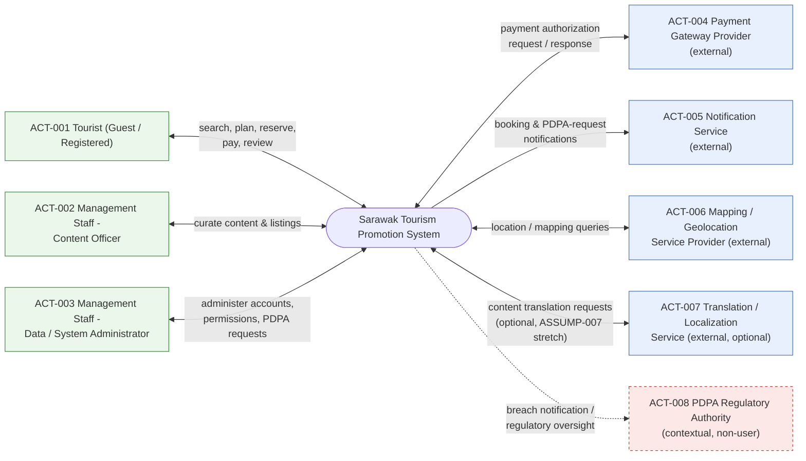

# Software Requirements Specification
## Sarawak Tourism Promotion System

---

## Front Matter

### 0.1 Title Page

| Field | Detail |
|---|---|
| Document title | Software Requirements Specification — Sarawak Tourism Promotion System |
| System name / short form | Sarawak Tourism Promotion System (STPS) |
| Client | Management team of a local tourism association ("the Association") |
| Preparing agency | Swinsoft Consulting |
| Prepared for | Sarawak Tourism Association — Management Team |
| Prepared by | Jarren Tan, Requirements Analyst / Technical Documenter, Swinsoft Consulting (jarrentannn@gmail.com) |
| Document type | Software Requirements Specification (Tasks & Support approach; Goal-Design Scale requirement placement) |
| Version | 1.0 — Draft for precision-QA pass |
| Date | 11 September 2026 |
| Confidentiality notice | Confidential. Prepared exclusively for the Sarawak Tourism Association and the Swinsoft Consulting project team. Not for distribution outside these parties without written consent of both the Association and Swinsoft Consulting. |

### 0.2 Revision History

**Table FM-1 — Revision history**

| Version | Date | Author | Summary of change | Trigger |
|---|---|---|---|---|
| 0.1 | 2026-07-30 | Swinsoft Consulting — Requirements Architect | Initial structural blueprint issued: front matter plan, ID legend, goals/objectives/incentives/pain points, assumptions, system context and actors, 11-entity domain model, 11 major tasks, workflow outline, 4 NFR categories, design/product/PDPA requirement stubs, appendix skeletons | Elicitation synthesis from `project_brief.yaml` and stakeholder notes |
| 0.5 | 2026-08-15 | Swinsoft Consulting — Technical Documenter | First full-prose expansion of Sections 1–6 | Blueprint hand-off (`02_blueprint.md`) |
| 0.8 | 2026-09-01 | Swinsoft Consulting — Technical Documenter | Full-prose expansion of Sections 7–12 and Appendices A–F; validation evidence drafted | Continuation of documentation pipeline |
| 0.9 | 2026-09-08 | Swinsoft Consulting — Technical Documenter | Domain model redesigned and rendered as a Mermaid diagram; traceability and CRUD matrices completed in full; cross-checked against blueprint hard constraints | Internal design review of Section 5 (see body text preceding this file) |
| 1.0 | 2026-09-11 | Swinsoft Consulting — Technical Documenter | Consolidated draft assembled for hand-off to the precision-QA / verifiability pass | Completion of blueprint expansion; ready for IEEE‑830 self-audit finalization |

### 0.3 Table of Contents

1. [Introduction](#1-introduction)
   1.1 Purpose of the Document · 1.2 Scope · 1.3 Intended Audience · 1.4 Project Type · 1.5 Domain Vocabulary / Definitions · 1.6 Document Conventions
2. [Project Goals, Objectives, Incentives & Pain Points](#2-project-goals-objectives-incentives--pain-points)
   2.1 Goals · 2.2 Objectives · 2.3 Incentives · 2.4 Pain Points
3. [Assumptions](#3-assumptions)
4. [System Context & Actors](#4-system-context--actors)
   4.1 System Boundary Statement · 4.2 Actors · 4.3 System Context Diagram
5. [Domain Model](#5-domain-model)
   5.1 Entity List · 5.2 Relationships · 5.3 Diagram
6. [User Tasks (Tasks & Support Approach)](#6-user-tasks-tasks--support-approach)
   6.1 Standard Task Template · 6.2 Task Hierarchy / Goal Tree · 6.3 Major Tasks (TASK-001 – TASK-011)
7. [Workflows](#7-workflows)
   7.1 Overarching End-to-End Workflow (WF-000) · 7.2 Per-Task Workflow Diagrams (WF-001 – WF-011) · 7.3 Diagram Legend
8. [Non-Functional Requirements](#8-non-functional-requirements)
   8.1 REQ-NFR-001 Performance & Scalability · 8.2 REQ-NFR-002 Security & Data Privacy · 8.3 REQ-NFR-003 Usability & Accessibility · 8.4 REQ-NFR-004 Availability & Reliability
9. [Other Design & Product-Level Requirements](#9-other-design--product-level-requirements)
   9.1 Design-Level Requirements · 9.2 Product-Level Requirements
10. [PDPA & Regulatory Compliance](#10-pdpa--regulatory-compliance)
11. [Validation Summary](#11-validation-summary)
12. [Conclusion & Recommendations](#12-conclusion--recommendations)
Appendix A — Stakeholder Validation Evidence
Appendix B — Requirements Traceability Matrix
Appendix C — CRUD Matrix
Appendix D — Verifiability Self-Check (IEEE 830 Quality Audit)
Appendix E — Domain Vocabulary / Glossary
Appendix F — Iteration / Revision Evidence Log

*This table of contents is regenerated whenever a section or diagram is added or renumbered, per the Coherent Document formatting rule.*

### 0.4 Requirement / Artifact ID Legend

| Prefix | Meaning |
|---|---|
| `GOAL-xxx` | Goal (broad direction) |
| `OBJ-xxx` | Objective (specific, measurable outcome) |
| `INC-xxx` | Incentive (business value / ROI) |
| `PP-xxx` | Pain point (existing process problem) |
| `ASSUMP-xxx` | Assumption (with rationale/source) |
| `ACT-xxx` | Actor |
| `EXT-xxx` | External system/interface (subset of `ACT-xxx` reserved for non-human/external parties) |
| `DM-ENT-xxx` | Domain model entity |
| `DM-REL-xxx` | Domain model relationship |
| `TASK-xxx` | Major user task (Tasks & Support) |
| `ST-x.y` | Subtask of `TASK-x` |
| `REQ-FUN-xxx` | Functional requirement (derived from a subtask) |
| `REQ-NFR-xxx` | Non-functional requirement (exactly 4 categories, numbered 001–004) |
| `REQ-DES-xxx` | Design-level requirement |
| `REQ-PROD-xxx` | Product-level requirement |
| `REQ-PDPA-xxx` | PDPA/regulatory compliance requirement |
| `WF-xxx` | Workflow diagram (`WF-000` = overarching; `WF-001`…`WF-011` = per-task) |
| `VAL-xxx` | Validation evidence item |

Every identifier above is minted exactly once in the section that owns it and is never renumbered or reused elsewhere in this document. All figures, tables, and appendices reference these identifiers verbatim.

### 0.5 Intended Audience Statement

This SRS is written for four audiences, each of whom uses it differently. **(a) Tourism Association management and decision-makers** use it to confirm that the goals, objectives, incentives, and pain points in Section 2 correctly represent the business problem, to approve the non-functional targets in Section 8, and to sign off the PDPA compliance posture in Section 10 before funding development. **(b) The Swinsoft Consulting development team** uses it as the authoritative basis for solution design, technical architecture, and sprint/iteration planning; every task in Section 6 and workflow in Section 7 is written to be solution-agnostic precisely so the development team retains freedom to choose an appropriate technical realization. **(c) QA and test engineers** use the functional requirements (Section 6), non-functional requirements (Section 8), and the verifiability self-check (Appendix D) as the direct source of test cases and acceptance criteria. **(d) Any PDPA compliance auditor** reviewing the system prior to launch uses Section 10, the PDPA-specific entries embedded throughout the traceability matrix (Appendix B), and Assumption `ASSUMP-005` as the record of how the system's data-handling practices were reasoned about and validated (Appendix A).

### 0.6 Project Type Statement

The Sarawak Tourism Promotion System is a **greenfield, purpose-built software system**. It is not a replacement for a single existing legacy IT system; rather, it is a deliberate **consolidation** of the Association's currently fragmented manual, print, and social-media tourism-promotion channels (see Pain Points `PP-001`–`PP-006`, Section 2.4) into one association-operated digital platform. No prior system of record is being migrated off; the primary engineering risk is therefore not data migration but requirements completeness — ensuring every promotional and operational function currently performed informally is captured, and captured correctly, in the new platform. This framing governs Section 3's assumptions (in particular `ASSUMP-001`–`ASSUMP-003`, which establish that hardware, network, and data-repository platforms are already provisioned and that only the software itself is being specified).

---

## 1. Introduction

### 1.1 Purpose of the Document

This Software Requirements Specification (SRS) defines, at a level of detail sufficient for design, build, test, and formal acceptance, the software requirements for the Sarawak Tourism Promotion System (STPS). The STPS is commissioned by the management team of a local tourism association and will be developed by Swinsoft Consulting. This document exists to give every stakeholder identified in Section 0.5 a single, unambiguous, and verifiable reference for what the software must do, expressed using the Tasks & Support elicitation approach and organized according to the Goal-Design Scale. Every normative statement in this document is phrased as "the system shall…" and is written to be objectively testable by inspection, demonstration, or measurement; no requirement is expressed only as an aspiration.

### 1.2 Scope

The scope of this SRS is **software only**. Hardware, physical servers, network provisioning, end-user devices, and the data-repository and deployment platforms are assumed already acquired by the client (`ASSUMP-001`) and are explicitly out of scope for specification here; they are treated as pre-existing infrastructure onto which the STPS software is deployed. Within that software scope, this SRS covers: the tourist-facing modules that support discovery, planning, reservation, payment initiation, and feedback (Sections 6.3, `TASK-001`–`TASK-008`); the management-facing modules that support content curation, booking and availability administration, and PDPA-related privacy administration (Sections 6.3, `TASK-009`–`TASK-011`); the business logic that connects these modules to the conceptual domain model (Section 5); and the integration logic that governs the system's interaction with external services such as the payment gateway, notification service, and mapping/geolocation provider (Section 4.2, `ACT-004`–`ACT-007`). The internal implementation of those external, third-party services is explicitly out of scope; they are treated as black boxes accessed only through their documented interaction contract.

### 1.3 Intended Audience

See Section 0.5 for the full statement. In summary, this document is written for: (a) Tourism Association management and decision-makers; (b) the Swinsoft development team; (c) QA/test engineers; and (d) any PDPA compliance auditor reviewing the system prior to launch.

### 1.4 Project Type

See Section 0.6 for the full statement. In summary, the STPS is a greenfield, purpose-built system consolidating fragmented manual/print/social-media promotion channels into one association-operated platform; it does not replace a single existing legacy IT system.

### 1.5 Domain Vocabulary / Definitions

All domain terms, actor names, and abbreviations used in this document are defined once, consistently, in Appendix E (Domain Vocabulary / Glossary), and that definition is used identically in every section, table, and diagram of this document. In particular, the canonical term for the primary worldwide end user is **Tourist** — this document never substitutes "Visitor," "Traveler," "Customer," or any other synonym for this actor.

### 1.6 Document Conventions

This document uses the identifier scheme defined in Section 0.4 without exception or renumbering. Every requirement statement — whether a functional requirement (`REQ-FUN-xxx`), a non-functional requirement (`REQ-NFR-xxx`), a design-level requirement (`REQ-DES-xxx`), a product-level requirement (`REQ-PROD-xxx`), or a PDPA/regulatory requirement (`REQ-PDPA-xxx`) — is written using the fixed sentence pattern "The system shall…" so that requirement statements are syntactically distinguishable from narrative, rationale, or illustrative text at a glance. Any illustrative or example solution text appearing under a "Solution-Agnosticism Check" or "Example Solution" heading is explicitly and visually marked *Non-Normative* and carries no requirement weight; such text exists only to demonstrate that a task can be realized by more than one kind of solution, per the brief's solution-agnosticism ground rule, and must never be read as narrowing the requirement itself.

---

## 2. Project Goals, Objectives, Incentives & Pain Points

Goals, Objectives, Incentives, and Pain Points are kept as four separately labelled subsections below, in line with the project's Goal-Design Scale methodology; they are never collapsed into a single undifferentiated "Goals" list, because each category answers a different question (Goals: broad direction; Objectives: how we will know we got there; Incentives: why it is worth doing; Pain Points: what is broken today) and each plays a distinct role in the traceability matrix (Appendix B).

### 2.1 Goals

Goals state the broad, qualitative direction of the project. Each goal is later made measurable through one or more Objectives (Section 2.2) and delivered through one or more Tasks (Section 6).

| ID | Goal |
|---|---|
| `GOAL-001` | Promote Sarawak destinations, accommodation, transportation, and food to worldwide tourists through one authoritative digital channel. |
| `GOAL-002` | Enable the tourism association's management team to control and maintain promotional content and operational data. |
| `GOAL-003` | Provide trustworthy, current local information that improves visitor experience and safety. |
| `GOAL-004` | Operate the platform in demonstrable compliance with the Malaysian PDPA for both tourist and management data. |

### 2.2 Objectives

Each objective is specific, measurable, and traced to exactly one parent Goal. Bracketed target figures below were proposed during drafting and were subsequently confirmed with Association management during stakeholder validation (`VAL-005`; see Appendix A and Appendix F for the before/after record of how these targets were tightened).

| ID | Objective | Traces to | Target |
|---|---|---|---|
| `OBJ-001` | Consolidate accommodation, transportation, food, and local-info listings currently spread across independent channels into one searchable catalog before launch. | `GOAL-001` | 100% of the four listing categories (Accommodation, Vehicle, Food Establishment, Local Information) populated and searchable at go-live. |
| `OBJ-002` | Reduce the content-update cycle for a new/changed listing from the current manual, multi-day process. | `GOAL-002` | Median elapsed time from "submitted by staff" to "live on the platform" ≤ 1 business day (same-business-day publish for submissions received before the daily cut-off). |
| `OBJ-003` | Enable a tourist to research, assemble, and pay for a multi-component trip package within the platform without leaving it. | `GOAL-001` | ≥ 55% of Tourists who start building a Package (`TASK-006`) complete it through to a Confirmed Booking, measured over the first 6 months post-launch. |
| `OBJ-004` | Pass a documented PDPA compliance checklist review (Section 10 / Appendix A) prior to go-live. | `GOAL-004` | 100% of the checklist items in Appendix A's compliance review, and 100% of `REQ-PDPA-001`–`007`, verified with zero open findings before go-live sign-off. |

### 2.3 Incentives

Incentives state the business value the Association expects to realize; they justify the investment and are the basis on which management will judge project success post-launch.

| ID | Incentive |
|---|---|
| `INC-001` | Increased bookings/revenue channelled to association-endorsed accommodation, transport, and food providers, by concentrating tourist demand on one trusted, bookable catalog rather than fragmented informal listings. |
| `INC-002` | Reduced association staff hours spent on manual/paper-based content coordination and provider liaison, freeing staff capacity for higher-value promotional and quality-assurance work (`TASK-009`, `TASK-010`). |
| `INC-003` | Strengthened association brand trust from centralized, verified, moderated information (vs. fragmented/unofficial sources), supported directly by the quality/review loop of `TASK-008`. |
| `INC-004` | Data-informed decision-making for the association — knowing which destinations and providers actually drive tourist engagement and bookings — enabled by the structured Booking and Review data captured through `TASK-007` and `TASK-010`. |

### 2.4 Pain Points

Pain points describe specific, observable problems in the Association's *existing* process. Each pain point is required to map forward to at least one Goal or Objective and forward again into the traceability matrix (Appendix B); none is permitted to remain an orphaned complaint with no corresponding requirement addressing it.

| ID | Pain point | Maps to |
|---|---|---|
| `PP-001` | Tourist information is scattered across informal/unofficial sites and social media, inconsistent and unverifiable. | `OBJ-001` |
| `PP-002` | No single channel lets a tourist discover and book accommodation, transport, and food together. | `OBJ-003` |
| `PP-003` | Management currently updates tourism content via manual/offline means (spreadsheets, printed brochures), causing delay and error. | `OBJ-002` |
| `PP-004` | Language and currency barriers hinder worldwide tourists using fragmented local-only sites. | `GOAL-001`, `GOAL-003` |
| `PP-005` | No structured feedback channel exists for the association to assess visitor satisfaction or provider quality. | `INC-003`, `TASK-008` |
| `PP-006` | Absence of a governed data-handling process exposes tourist and management personal data to PDPA compliance risk. | `GOAL-004` |

---

## 3. Assumptions

Every assumption below is stated with an explicit rationale/source, per the project's Goals/Assumptions rule. Assumptions flagged "requires stakeholder confirmation" have since been put to the Association during validation; the outcome of that confirmation is recorded in Appendix A and referenced inline below.

| ID | Assumption | Rationale / Source |
|---|---|---|
| `ASSUMP-001` | Hardware, servers, network, and the data-repository platform are already acquired/provisioned by the client. | Source: `project_brief.yaml` → `strict_ground_rules.hardware_assumption`. This assumption is load-bearing for the entire scope statement in Section 1.2 and for `REQ-NFR-004` (Availability & Reliability), which is written in terms of the software's behaviour on top of already-provisioned infrastructure rather than infrastructure procurement itself. |
| `ASSUMP-002` | The tourism association is the sole authoritative content owner; individual accommodation/vehicle/food providers do not receive direct system login — they supply information to association staff off-system. | Source: `project_brief.yaml` → `core_functions.management_facing` wording ("enable content and database management"), read as staff-only. **Confirmed** with Association operations management during `VAL-002` (Appendix A); this is why `TASK-009` and `TASK-010` list only Management Staff (`ACT-002`/`ACT-003`) as actors, never a Tourism Provider actor. |
| `ASSUMP-003` | Worldwide tourists are assumed to have access to a modern web browser or smartphone with adequate internet connectivity. | Source: `project_brief.yaml` → `target_audience`. This assumption bounds the scope of `REQ-NFR-001`: the performance targets in Section 8.1 assume connectivity meeting this assumption, and the system is not required to function while fully offline. This document does not define a separate numeric performance target for degraded or low-bandwidth connections; the client should confirm such a target in a future revision if one is required. |
| `ASSUMP-004` | Payment processing is delegated to a third-party, PCI-DSS-compliant payment gateway; the system does not store raw payment-card data. | Source: software-only scope ground rule plus standard industry practice for a system of this size; reflected directly in `REQ-PROD-003` and in `TASK-007`'s designation of the Payment Gateway Provider (`ACT-004`) as an external actor. |
| `ASSUMP-005` | The association operates under Malaysian jurisdiction; PDPA is the governing privacy framework even though end users are worldwide; foreign frameworks (e.g., GDPR) are explicitly out of scope unless the client states otherwise. | Source: `project_brief.yaml` → `compliance.privacy_framework`. **Flagged as a residual risk requiring client sign-off** (carried forward to Section 12); reviewed with an external PDPA/compliance advisor during `VAL-003` (Appendix A), which confirmed the PDPA-only scope for v1.0 but recommended the cross-border transfer safeguard now codified in `REQ-PDPA-005`. |
| `ASSUMP-006` | One shared platform instance serves all association-endorsed listings; no separate deployment per district. | Source: inferred from the single-system framing of `project_brief.yaml`. Cross-checked against Section 8's `REQ-NFR-001` scalability target (≥500 concurrent users against a single up-to-10,000-listing catalog) to confirm no contradiction — the performance target is deliberately sized for one consolidated instance, not per-district sharding. |
| `ASSUMP-007` | English and Bahasa Malaysia are the baseline supported languages; additional languages are budget-dependent stretch scope. | Source: target audience plus typical practice for a Malaysian state-tourism platform. **Confirmed** with Association management during `VAL-005` (Appendix A): English and Bahasa Malaysia are contractual minimums for go-live (`REQ-NFR-003`); Mandarin was discussed as a desirable stretch addition dependent on translation budget and is recorded as a non-normative future consideration only, not a v1.0 requirement. |

**Cross-check performed.** Sections 8–10 were re-scanned during drafting to confirm that no non-functional or design requirement silently contradicts an assumption above. No conflicts were found: `REQ-NFR-001`'s scalability target is consistent with `ASSUMP-006`'s single-instance model; `REQ-NFR-002`'s security controls are consistent with `ASSUMP-004`'s delegation of card data to the payment gateway; and `REQ-NFR-003`'s language target is bounded to the two baseline languages of `ASSUMP-007` (with Mandarin explicitly marked non-normative/stretch rather than silently assumed).

---

## 4. System Context & Actors

### 4.1 System Boundary Statement

**In scope** (inside the STPS software boundary): the tourist-facing modules (destination/accommodation/vehicle/food discovery, itinerary/package building, reservation and payment initiation, review submission); the management-facing modules (content and listing curation, booking and availability administration, PDPA privacy-request administration); the business logic that enforces the rules described in Section 6 (e.g., availability re-validation, option compatibility checks, consent gating); and the integration logic — request/response handling, retries, and failure handling — for each external interaction named in Section 4.2.

**Out of scope** (outside the STPS software boundary): the physical servers, network, and hosting infrastructure on which the software runs; the end-user devices tourists and staff use to access it; and the internal implementation of every third-party service listed in Section 4.2 as an external actor — each is treated strictly as a black box accessed only through its documented request/response contract. This boundary is a direct consequence of `ASSUMP-001` (`strict_ground_rules.hardware_assumption`).

### 4.2 Actors

| ID | Actor | Description |
|---|---|---|
| `ACT-001` | Tourist (Guest / Registered) | The primary worldwide end user of the platform. May browse as an anonymous Guest or hold a Registered profile. This exact term — **Tourist** — is used everywhere in this document and is never replaced by "Visitor," "Traveler," or "Customer." |
| `ACT-002` | Management Staff — Content Officer | Tourism association staff responsible for curating listings and promotional/local-information content (`TASK-009`). Generalizes, with `ACT-003`, under the superclass "Management Staff." |
| `ACT-003` | Management Staff — Data/System Administrator | Tourism association staff responsible for account/permission administration and PDPA data-subject request handling (`TASK-011`). Generalizes with `ACT-002` under "Management Staff." |
| `ACT-004` | Payment Gateway Provider (external) | A third-party, PCI-DSS-compliant payment processor that authorizes and settles Tourist payments; accessed only via a tokenized request/response interface (`ASSUMP-004`). |
| `ACT-005` | Notification Service (external) | A third-party email/SMS gateway used to deliver booking confirmations, PDPA-request acknowledgements, and related notifications. |
| `ACT-006` | Mapping/Geolocation Service Provider (external) | A third-party service that supplies location, map, and geolocation data used to enrich Destination/Accommodation/Vehicle presentation. |
| `ACT-007` | Translation/Localization Service (external) | An optional third-party translation/localization service that may support expansion of supported languages beyond the `ASSUMP-007` baseline. Its use is conditional on future budget approval and is not required for the English/Bahasa Malaysia baseline. |
| `ACT-008` | PDPA Regulatory Authority (contextual, non-user) | The Malaysian data-protection regulatory authority. This actor never logs in to or operates the system; it appears in the system context only as the recipient of breach notifications under `REQ-PDPA-006`. |

**Terminology rule.** The actor names above are canonical and are used identically throughout every section, table, task, and diagram in this document; no synonym or alternate phrasing is introduced elsewhere.

### 4.3 System Context Diagram

**Diagram description.** The system context is centred on a single node, "Sarawak Tourism Promotion System," surrounded by all eight actors (`ACT-001`–`ACT-008`). Every edge to `ACT-001`–`ACT-007` is a **solid** edge representing a direct, bidirectional system interaction (e.g., the `ACT-004` edge is labelled "payment authorization request / payment outcome response"). The single edge to `ACT-008` is **dashed**, representing a compliance/regulatory relationship rather than a direct system interaction — the STPS never receives operational input from, nor grants system access to, the PDPA Regulatory Authority; it only sends breach notifications to it when `REQ-PDPA-006` is triggered.



**Legend.** Solid edge = direct system interaction. Dashed edge = compliance/regulatory relationship (`ACT-008` only, non-operational).

---

## 5. Domain Model

### 5.1 Modelling Rule

The domain model below is strictly conceptual. It contains entities, one-line descriptions, and named relationships with cardinalities only. It contains **no attributes, no primary/foreign keys, and no normalized sub-entities** — for example, `DM-ENT-005` Vehicle is kept as a single entity and is never split into "Vehicle Details"/"Vehicle Availability." Every entity below appears in at least one Task in Section 6 and in the CRUD matrix in Appendix C; there are no orphan entities.

### 5.2 Entity List

| ID | Entity | One-line description |
|---|---|---|
| `DM-ENT-001` | Tourist | A worldwide visitor who discovers, plans, and books Sarawak travel experiences via the platform; may act as guest or registered profile. |
| `DM-ENT-002` | Management Staff | Tourism association personnel who curate content, moderate reviews, and administer bookings/data. |
| `DM-ENT-003` | Destination | A promoted place of interest (cultural site, park, festival, landmark). |
| `DM-ENT-004` | Accommodation | A lodging listing (hotel, homestay, resort) available for reservation. |
| `DM-ENT-005` | Vehicle | A transportation option (car, van, boat, bus, etc.) offered/listed for tourist transport or touring. Kept as a single conceptual entity. |
| `DM-ENT-006` | Food Establishment | A dining venue listing promoted/reservable through the platform. |
| `DM-ENT-007` | Local Information Article | General-interest content (culture, safety, weather, events, etiquette) authored by staff. |
| `DM-ENT-008` | Package (Itinerary) | A curated bundle combining Destinations, Accommodation, Vehicle, and/or Food Establishment selections into one bookable trip plan. |
| `DM-ENT-009` | Option | A selectable add-on/configuration attached to a Booking or Package (e.g., guided-tour add-on, meal preference, insurance, child seat). |
| `DM-ENT-010` | Booking | A Tourist's pending or confirmed reservation against an Accommodation, Vehicle, Food Establishment, or Package. |
| `DM-ENT-011` | Review | A Tourist-submitted rating/comment evaluating an Accommodation, Vehicle, Food Establishment, Destination, or Package. |

### 5.3 Relationships

Each relationship is read "A (cardinality) — verb → B (cardinality)." Two relationships (`DM-REL-002` and `DM-REL-007`) are XOR fan-outs to a conceptual generalization — "Offering" and "Reviewable" respectively — that is described here in prose only and is **not** a stored entity in Section 5.2; this is a deliberate design decision, confirmed during the domain-model design review, to avoid introducing a database-style superclass into a strictly conceptual model.

| ID | Relationship | Cardinality |
|---|---|---|
| `DM-REL-001` | Tourist creates Booking | 1 : 0..* |
| `DM-REL-002` | Booking targets exactly one of {Accommodation \| Vehicle \| Food Establishment \| Package} (conceptual generalization "Offering," XOR — described in prose only, not a stored entity) | 1 : 1 |
| `DM-REL-003` | Booking includes Option | 0..* : 0..* (many-to-many) |
| `DM-REL-004` | Package bundles Destination, Accommodation, Vehicle, Food Establishment | 0..* : 1..* (Destination), 0..* (Accommodation), 0..* (Vehicle), 0..* (Food Establishment) — aggregation, many-to-many |
| `DM-REL-005` | Destination is near Accommodation / Food Establishment | 0..* : 0..* (informational/spatial, optional) |
| `DM-REL-006` | Tourist writes Review | 1 : 0..* |
| `DM-REL-007` | Review evaluates exactly one of {Accommodation \| Vehicle \| Food Establishment \| Destination \| Package} (conceptual generalization "Reviewable," XOR — described in prose only, not a stored entity) | 0..* : 1 |
| `DM-REL-008` | Management Staff publishes/maintains Local Information Article | 1..* : 0..* |
| `DM-REL-009` | Management Staff curates (CRUD) Destination, Accommodation, Vehicle, Food Establishment, Package, Option | 1..* : 0..* (each) |
| `DM-REL-010` | Management Staff processes (approve/adjust/cancel) Booking | 1 : 0..* |

### 5.4 Domain Model Diagram

The diagram groups entities into three layout clusters purely for visual clarity — *People*, *Catalog & Content*, and *Tourist Transactions* — with no implication that these clusters are themselves stored entities. Every edge is labelled with its `DM-REL-xxx` ID plus the verb and cardinality from Section 5.3, so the diagram and the relationship table reconcile 1:1. The two dashed note boxes record the XOR constraints on `DM-REL-002` and `DM-REL-007` without introducing "Offering" or "Reviewable" as entities.

```mermaid
flowchart TD

    %% ===== PEOPLE =====
    subgraph People["People"]
        Tourist["<b>Tourist</b><br/>(DM-ENT-001)<br/><i>Worldwide visitor; guest or registered</i>"]
        MgmtStaff["<b>Management Staff</b><br/>(DM-ENT-002)<br/><i>Association personnel curating content &amp; bookings</i>"]
    end

    %% ===== CATALOG & CONTENT =====
    subgraph Catalog["Catalog &amp; Content"]
        Destination["<b>Destination</b><br/>(DM-ENT-003)<br/><i>Promoted place of interest</i>"]
        Accommodation["<b>Accommodation</b><br/>(DM-ENT-004)<br/><i>Lodging listing</i>"]
        Vehicle["<b>Vehicle</b><br/>(DM-ENT-005)<br/><i>Transportation option</i>"]
        FoodEstablishment["<b>Food Establishment</b><br/>(DM-ENT-006)<br/><i>Dining venue listing</i>"]
        LocalInfoArticle["<b>Local Information Article</b><br/>(DM-ENT-007)<br/><i>Culture/safety/weather/event content</i>"]
        Package["<b>Package (Itinerary)</b><br/>(DM-ENT-008)<br/><i>Curated multi-component trip bundle</i>"]
        Option["<b>Option</b><br/>(DM-ENT-009)<br/><i>Selectable add-on for a Booking/Package</i>"]
    end

    %% ===== TRANSACTIONS =====
    subgraph Transactions["Tourist Transactions"]
        Booking["<b>Booking</b><br/>(DM-ENT-010)<br/><i>Pending/confirmed reservation</i>"]
        Review["<b>Review</b><br/>(DM-ENT-011)<br/><i>Tourist rating/comment</i>"]
    end

    %% ===== NOTES (conceptual generalizations, not stored entities) =====
    NoteOffering["Note: 'Offering' is a conceptual grouping only,\nnot a stored entity. A Booking targets exactly\none of the four linked entities. (DM-REL-002)"]
    NoteReviewable["Note: 'Reviewable' is a conceptual grouping only,\nnot a stored entity. A Review evaluates exactly\none of the five linked entities. (DM-REL-007)"]

    %% ===== DM-REL-001 =====
    Tourist -->|"DM-REL-001: creates (1 : 0..*)"| Booking

    %% ===== DM-REL-002 (XOR fan-out) =====
    Booking -->|"DM-REL-002: targets [XOR] (1 : 1)"| Accommodation
    Booking -->|"DM-REL-002: targets [XOR] (1 : 1)"| Vehicle
    Booking -->|"DM-REL-002: targets [XOR] (1 : 1)"| FoodEstablishment
    Booking -->|"DM-REL-002: targets [XOR] (1 : 1)"| Package
    Booking -.- NoteOffering

    %% ===== DM-REL-003 =====
    Booking -->|"DM-REL-003: includes (0..* : 0..*)"| Option

    %% ===== DM-REL-004 =====
    Package -->|"DM-REL-004: bundles (0..* : 1..*)"| Destination
    Package -->|"DM-REL-004: bundles (0..* : 0..*)"| Accommodation
    Package -->|"DM-REL-004: bundles (0..* : 0..*)"| Vehicle
    Package -->|"DM-REL-004: bundles (0..* : 0..*)"| FoodEstablishment

    %% ===== DM-REL-005 (dashed = informational/optional) =====
    Destination -.->|"DM-REL-005: near (0..* : 0..*)"| Accommodation
    Destination -.->|"DM-REL-005: near (0..* : 0..*)"| FoodEstablishment

    %% ===== DM-REL-006 =====
    Tourist -->|"DM-REL-006: writes (1 : 0..*)"| Review

    %% ===== DM-REL-007 (XOR fan-out) =====
    Review -->|"DM-REL-007: evaluates [XOR] (0..* : 1)"| Accommodation
    Review -->|"DM-REL-007: evaluates [XOR] (0..* : 1)"| Vehicle
    Review -->|"DM-REL-007: evaluates [XOR] (0..* : 1)"| FoodEstablishment
    Review -->|"DM-REL-007: evaluates [XOR] (0..* : 1)"| Destination
    Review -->|"DM-REL-007: evaluates [XOR] (0..* : 1)"| Package
    Review -.- NoteReviewable

    %% ===== DM-REL-008 =====
    MgmtStaff -->|"DM-REL-008: publishes/maintains (1..* : 0..*)"| LocalInfoArticle

    %% ===== DM-REL-009 (six curates edges) =====
    MgmtStaff -->|"DM-REL-009: curates CRUD (1..* : 0..*)"| Destination
    MgmtStaff -->|"DM-REL-009: curates CRUD (1..* : 0..*)"| Accommodation
    MgmtStaff -->|"DM-REL-009: curates CRUD (1..* : 0..*)"| Vehicle
    MgmtStaff -->|"DM-REL-009: curates CRUD (1..* : 0..*)"| FoodEstablishment
    MgmtStaff -->|"DM-REL-009: curates CRUD (1..* : 0..*)"| Package
    MgmtStaff -->|"DM-REL-009: curates CRUD (1..* : 0..*)"| Option

    %% ===== DM-REL-010 =====
    MgmtStaff -->|"DM-REL-010: processes approve/adjust/cancel (1 : 0..*)"| Booking

    classDef note fill:#FFF9C4,stroke:#999,stroke-dasharray: 4 4,color:#333,text-align:left;
    class NoteOffering,NoteReviewable note;
```



**Diagram instruction confirmation.** Entity boxes above contain only the entity name and one-line description (rendered as bold name / italic description) — no attribute compartments appear anywhere in the diagram, satisfying the Section 5 hard rule.

---

## 6. User Tasks (Tasks & Support Approach)

### 6.1 Standard Task Template

Every task in Section 6.3 uses the identical field order below; no task deviates from this order or omits a field.

| Field | Meaning |
|---|---|
| Task ID & Name | Header reads literally "Task `TASK-xxx`: `<Name>`," exactly matching the section title. |
| Actors | Which `ACT-xxx` perform or receive the task. |
| Trigger | What starts the task. |
| Precondition | What must already hold for the task to begin. |
| Postcondition | The resulting system/domain state once the task completes. |
| Frequency | Expected rate of occurrence. |
| Priority / Exception-Criticality | A mandatory priority rating with a note on why. |
| Work Area | The module/functional area the task belongs to. |
| Solution-Agnosticism Check | At least 3 different realizable solutions/channels for this task. |
| Subtasks | Each subtask states (a) the normal-flow step and (b) at least one realistic Problem/Exception case with the system's handling. |
| Variants | Alternative paths through the task. |
| Derived Functional Requirements | The `REQ-FUN-xxx` IDs derived from this task's subtasks. |

### 6.2 Task Hierarchy / Goal Tree

```
System Goal: Promote Sarawak Tourism & Enable Association Management
├── Tourist Goal: Plan & Experience a Sarawak Trip
│    ├── TASK-001 Register & Manage Tourist Account
│    ├── TASK-002 Discover Local Tourism Information
│    ├── TASK-003 Search & Reserve Accommodation
│    ├── TASK-004 Search & Reserve Transportation (Vehicle)
│    ├── TASK-005 Search & Reserve Food & Dining
│    ├── TASK-006 Build & Book a Travel Package (Itinerary) with Options
│    ├── TASK-007 Complete Payment for a Booking
│    └── TASK-008 Submit Review & Feedback
└── Management Goal: Maintain an Authoritative, Compliant Tourism Platform
     ├── TASK-009 Manage Promotional Content & Listings
     ├── TASK-010 Manage Bookings, Availability & Provider Coordination
     └── TASK-011 Manage Tourist Data Privacy Requests (PDPA)
```

Eleven major tasks are specified below (exceeding the 8-task minimum) to demonstrate elicitation depth across both the tourist and management goal branches.

### 6.3 Major Tasks

#### Task TASK-001: Register & Manage Tourist Account

- **Actors:** `ACT-001` Tourist
- **Trigger:** The Tourist wants to create or update a profile before or during platform use.
- **Precondition:** The platform is accessible in guest mode and the PDPA notice has been presented.
- **Postcondition:** An account is created or updated with a timestamped consent record; guest browsing remains available if consent is declined.
- **Frequency:** Low (one-time registration plus occasional updates).
- **Priority / Exception-Criticality:** High — this task gates personalization and PDPA consent capture; a failure here blocks lawful data collection platform-wide.
- **Work Area:** Tourist account/profile module.
- **Solution-Agnosticism Check** *(Non-Normative — illustrative only)*: (a) a self-service web registration form; (b) a native mobile onboarding flow; (c) staff-assisted counter/kiosk registration at a physical Association touchpoint.
- **Subtasks:**
  - **ST-1.1** View and accept/decline the Terms of Use and Privacy Policy. *Problem/Exception:* if consent is declined, the system restricts personalization features but still allows guest browsing rather than blocking the Tourist entirely. → `REQ-FUN-001`, `REQ-FUN-002`
  - **ST-1.2** Provide profile details (contact, nationality, preferred language/currency). *Problem/Exception:* if invalid or duplicate contact information is submitted, the system flags it for correction before saving rather than silently discarding or overwriting existing data. → `REQ-FUN-003`
  - **ST-1.3** Update profile/preferences, or request deletion of them. *Problem/Exception:* if the Tourist requests full data deletion, the system routes the request into the PDPA data-subject workflow (`TASK-011`) rather than attempting an ad hoc deletion within the profile module. → `REQ-FUN-004`
- **Variants:** Guest checkout without full registration; social-login-assisted registration (where enabled).
- **Derived Functional Requirements:** `REQ-FUN-001`, `REQ-FUN-002`, `REQ-FUN-003`, `REQ-FUN-004`

> `REQ-FUN-001`: The system shall present the Terms of Use and PDPA-aligned Privacy Policy to every Tourist before the system collects any personal data. The system shall record the Tourist's accept-or-decline choice together with a timestamp.
> `REQ-FUN-002`: Where the Tourist declines consent, the system shall restrict all personalization and data-collection features while continuing to allow guest browsing of publicly available tourist-facing content.
> `REQ-FUN-003`: The system shall validate submitted contact details (e.g., email format, duplicate email/phone against existing accounts) at the point of submission. Where the submitted details fail validation, the system shall reject the submission and display a specific correction message instead of saving the invalid or duplicate data.
> `REQ-FUN-004`: The system shall allow a registered Tourist to update their own profile/preference fields at any time. The system shall route any deletion request submitted through the profile module into the PDPA data-subject request workflow (`TASK-011`) within the same session.

---

#### Task TASK-002: Discover Local Tourism Information

- **Actors:** `ACT-001` Tourist
- **Trigger:** The Tourist wants destination, culture, safety, weather, or event information.
- **Precondition:** The platform is accessible in either guest or registered mode.
- **Postcondition:** The Tourist has viewed or saved relevant local-information content.
- **Frequency:** High.
- **Priority / Exception-Criticality:** Medium-High — this is a core promotional function directly serving `GOAL-001` and `GOAL-003`.
- **Work Area:** Local information/content module.
- **Solution-Agnosticism Check** *(Non-Normative)*: (a) a searchable web content hub; (b) a mobile app content feed; (c) a QR-linked kiosk/brochure backed by the same content repository.
- **Subtasks:**
  - **ST-2.1** Search/filter information by category (culture, safety, weather, events). *Problem/Exception:* if there are no matching results, the system suggests related or alternative categories instead of returning an empty page. → `REQ-FUN-005`
  - **ST-2.2** View a Local Information Article in detail. *Problem/Exception:* if the article is outdated or unpublished, the system automatically hides expired content from all tourist-facing views. → `REQ-FUN-006`
  - **ST-2.3** Bookmark an article for later (registered Tourist only). *Problem/Exception:* if a Guest attempts to bookmark, the system prompts registration (→ `TASK-001`) without discarding the Tourist's current browsing context. → `REQ-FUN-007`
- **Variants:** Location-based auto-suggested information (where geolocation is permitted); offline-saved information for low-connectivity areas.
- **Derived Functional Requirements:** `REQ-FUN-005`, `REQ-FUN-006`, `REQ-FUN-007`

> `REQ-FUN-005`: The system shall let a Tourist search or filter Local Information Article content by at least the categories culture, safety, weather, and events. Where zero results match the selected filter combination, the system shall present at least one suggested related or alternative category instead of an empty result page.
> `REQ-FUN-006`: The system shall automatically remove an unpublished or expired Local Information Article from all tourist-facing search, browse, and detail views at or before its configured expiry timestamp.
> `REQ-FUN-007`: The system shall allow only an authenticated, registered Tourist to bookmark a Local Information Article. When a Guest attempts to bookmark, the system shall present a registration or sign-in prompt (`TASK-001`) without discarding the Tourist's current browsing context.

---

#### Task TASK-003: Search & Reserve Accommodation

- **Actors:** `ACT-001` Tourist
- **Trigger:** The Tourist needs lodging for planned travel dates.
- **Precondition:** Accommodation listings are published with availability.
- **Postcondition:** A Booking is created in Pending or Confirmed state against an Accommodation.
- **Frequency:** High.
- **Priority / Exception-Criticality:** High — core revenue-and-trust-critical function.
- **Work Area:** Accommodation search & reservation module.
- **Solution-Agnosticism Check** *(Non-Normative)*: (a) a web filter-and-reservation form; (b) a mobile booking flow; (c) staff-assisted phone/counter booking recorded into the same system.
- **Subtasks:**
  - **ST-3.1** Search/filter Accommodation by location, date, price, and type. *Problem/Exception:* if the filter combination returns zero results, the system suggests relaxed filters or nearby dates rather than an empty page. → `REQ-FUN-008`
  - **ST-3.2** View Accommodation detail and Reviews. *Problem/Exception:* if no reviews exist yet, the system shows an explicit "no reviews yet" state rather than a blank section. → `REQ-FUN-009`
  - **ST-3.3** Select an Accommodation and submit a reservation. *Problem/Exception:* if dates become unavailable mid-transaction, the system re-validates availability before confirming and notifies the Tourist if the reservation is lost. → `REQ-FUN-010`
- **Variants:** Reservation with Option add-ons; group/multi-room booking.
- **Derived Functional Requirements:** `REQ-FUN-008`, `REQ-FUN-009`, `REQ-FUN-010`

> `REQ-FUN-008`: The system shall let a Tourist filter Accommodation listings by at least location, date range, price range, and accommodation type. Where the applied combination returns zero results, the system shall present at least one relaxed-filter or nearby-date suggestion.
> `REQ-FUN-009`: The system shall display all published Reviews associated with an Accommodation on its detail view. Where no Review exists, the system shall display an explicit "No reviews yet" state instead of a blank section.
> `REQ-FUN-010`: The system shall re-validate Accommodation availability for the requested dates immediately before confirming a reservation. Where availability was lost between search and confirmation, the system shall reject the reservation attempt, notify the Tourist of the specific conflict, and offer alternative available dates or listings.

---

#### Task TASK-004: Search & Reserve Transportation (Vehicle)

- **Actors:** `ACT-001` Tourist
- **Trigger:** The Tourist needs transport (car/van/boat/bus) for touring or transfer.
- **Precondition:** Vehicle listings are published with an availability calendar.
- **Postcondition:** A Booking is created in Pending or Confirmed state against a Vehicle.
- **Frequency:** High.
- **Priority / Exception-Criticality:** High — core function with an explicit Vehicle-entity focus.
- **Work Area:** Transportation search & reservation module.
- **Solution-Agnosticism Check** *(Non-Normative)*: (a) a web listing page; (b) a mobile app with map-based search; (c) staff-assisted back-office allocation for walk-in tourists.
- **Subtasks:**
  - **ST-4.1** Search/filter Vehicle by type, capacity, date, and pickup location. *Problem/Exception:* if no Vehicle matches the requested capacity, the system suggests a combination of smaller vehicles or the nearest available alternative capacity. → `REQ-FUN-011`
  - **ST-4.2** View Vehicle detail (capacity, coverage area, provider). *Problem/Exception:* if a Vehicle is temporarily suspended (e.g., for maintenance), the system excludes it from search results. → `REQ-FUN-012`
  - **ST-4.3** Reserve a Vehicle with optional add-ons (driver, child seat, via Option). *Problem/Exception:* if a selected Option is incompatible with the chosen Vehicle, the system blocks the combination and explains the conflict. → `REQ-FUN-013`
- **Variants:** Self-drive rental vs. chauffeured tour vehicle; shared shuttle vs. private vehicle.
- **Derived Functional Requirements:** `REQ-FUN-011`, `REQ-FUN-012`, `REQ-FUN-013`

> `REQ-FUN-011`: The system shall let a Tourist filter Vehicle listings by at least type, passenger capacity, date, and pickup location. Where no single Vehicle satisfies the requested capacity, the system shall suggest a combination of smaller vehicles or the nearest available alternative capacity.
> `REQ-FUN-012`: The system shall exclude a Vehicle flagged as temporarily suspended (e.g., under maintenance) from all tourist-facing Vehicle search results for the duration of the suspension.
> `REQ-FUN-013`: The system shall validate the compatibility of a selected Option against the selected Vehicle before allowing checkout to proceed. The system shall block and explain any incompatible Vehicle–Option combination instead of allowing the Tourist to add it to the Booking.

---

#### Task TASK-005: Search & Reserve Food & Dining

- **Actors:** `ACT-001` Tourist
- **Trigger:** The Tourist wants to find or reserve a dining venue.
- **Precondition:** Food Establishment listings are published.
- **Postcondition:** A reservation is created, or an informational view is logged for walk-in-only venues.
- **Frequency:** High.
- **Priority / Exception-Criticality:** Medium — core function, though the consequence of failure is lower than for accommodation or transport.
- **Work Area:** Food & dining discovery/reservation module.
- **Solution-Agnosticism Check** *(Non-Normative)*: (a) a web listing with an optional reservation form; (b) a mobile cuisine-based search; (c) a staff-curated recommendation counter drawing on the same backend listings.
- **Subtasks:**
  - **ST-5.1** Search/filter by cuisine, location, price, and dietary option. *Problem/Exception:* if a dietary filter (e.g., halal, vegetarian) returns zero results, the system flags the coverage gap for Management Staff review. → `REQ-FUN-014`
  - **ST-5.2** View Food Establishment detail and Reviews. *Problem/Exception:* if the listing is missing a required license/registration reference, the system withholds publication (links `REQ-PROD-007`). → `REQ-FUN-015`
  - **ST-5.3** Submit a table reservation where supported. *Problem/Exception:* if the venue does not support online reservation, the system displays contact-only information instead of a booking form. → `REQ-FUN-016`
- **Variants:** Walk-in-only venue (informational only); reservable venue with a deposit requirement.
- **Derived Functional Requirements:** `REQ-FUN-014`, `REQ-FUN-015`, `REQ-FUN-016`

> `REQ-FUN-014`: The system shall let a Tourist filter Food Establishment listings by at least cuisine, location, price range, and dietary option. Where a dietary filter (e.g., halal, vegetarian) returns zero results, the system shall log the coverage gap for Management Staff review.
> `REQ-FUN-015`: The system shall display all published Reviews on a Food Establishment's detail view. The system shall withhold publication of a Food Establishment listing that lacks a recorded, valid business registration or license reference (`REQ-PROD-007`).
> `REQ-FUN-016`: Where a Food Establishment does not support online reservation, the system shall display contact-only information instead of a reservation form. Where the Food Establishment does support online reservation, the system shall accept and record a table reservation request against it.

---

#### Task TASK-006: Build & Book a Travel Package (Itinerary) with Options

- **Actors:** `ACT-001` Tourist
- **Trigger:** The Tourist wants a bundled multi-service/multi-day trip plan.
- **Precondition:** At least one Destination, Accommodation, Vehicle, or Food Establishment is published and available.
- **Postcondition:** A Package Booking is created combining the selected components and chosen Options.
- **Frequency:** Medium.
- **Priority / Exception-Criticality:** High — this task ties together all domain entities and is central to `OBJ-003`.
- **Work Area:** Package/itinerary builder module.
- **Solution-Agnosticism Check** *(Non-Normative)*: (a) a drag-and-drop web itinerary builder; (b) a guided step-by-step mobile wizard; (c) a staff-assembled custom-quote tool using the same catalog.
- **Subtasks:**
  - **ST-6.1** Select Destinations and combine them with Accommodation/Vehicle/Food components. *Problem/Exception:* if selected components' dates conflict, the system flags the scheduling conflict before checkout. → `REQ-FUN-017`
  - **ST-6.2** Choose applicable Options for the Package (guided tour, insurance, meal plan). *Problem/Exception:* if a chosen Option becomes unavailable, the system removes it and notifies the Tourist before payment. → `REQ-FUN-018`
  - **ST-6.3** Review the consolidated Package summary and confirm. *Problem/Exception:* if the total price changes mid-session due to a component price update, the system re-displays the updated total for re-confirmation. → `REQ-FUN-019`
- **Variants:** Staff-curated "featured package" vs. a fully custom tourist-built package.
- **Derived Functional Requirements:** `REQ-FUN-017`, `REQ-FUN-018`, `REQ-FUN-019`

> `REQ-FUN-017`: The system shall detect and flag a date or time scheduling conflict between two or more components (Destination, Accommodation, Vehicle, Food Establishment) selected into the same Package. The system shall prevent the Tourist from proceeding to checkout until the conflict is resolved or acknowledged.
> `REQ-FUN-018`: Where a previously selected Option becomes unavailable before payment, the system shall automatically remove it from the Package and notify the Tourist of the removal before the system presents the payment step.
> `REQ-FUN-019`: The system shall recompute and re-display the consolidated Package price and summary for Tourist re-confirmation whenever any bundled component's price changes during the active session, before accepting payment.

---

#### Task TASK-007: Complete Payment for a Booking

- **Actors:** `ACT-001` Tourist, `ACT-004` Payment Gateway Provider (external)
- **Trigger:** The Tourist confirms a Booking/Package requiring payment.
- **Precondition:** The Booking exists in Pending-Payment state; the payment gateway interface is available.
- **Postcondition:** The Booking transitions to Confirmed (on success) or Payment-Failed (on failure); the Tourist is notified.
- **Frequency:** High.
- **Priority / Exception-Criticality:** High — revenue-critical; failures here directly threaten `INC-001`.
- **Work Area:** Checkout/payment module.
- **Solution-Agnosticism Check** *(Non-Normative)*: (a) redirect to a hosted payment page; (b) an embedded payment widget/SDK; (c) staff-recorded manual/offline payment reconciled in-system.
- **Subtasks:**
  - **ST-7.1** Select a payment method and submit payment. *Problem/Exception:* if payment is declined or the gateway times out, the Booking is preserved as Pending-Payment for retry within a defined window rather than silently cancelled. → `REQ-FUN-020`
  - **ST-7.2** Receive payment and booking confirmation. *Problem/Exception:* if the gateway confirms payment but the system fails to update the Booking status, an automated reconciliation check alerts Management Staff. → `REQ-FUN-021`
  - **ST-7.3** Request refund/cancellation. *Problem/Exception:* if cancellation is requested after the provider's non-refundable cutoff, the system displays the applicable policy and auto-limits the refund. → `REQ-FUN-022`
- **Variants:** Full online payment; partial deposit plus balance on arrival (where supported).
- **Derived Functional Requirements:** `REQ-FUN-020`, `REQ-FUN-021`, `REQ-FUN-022`

> `REQ-FUN-020`: Where a payment attempt is declined or the payment gateway times out, the system shall preserve the associated Booking in a Pending-Payment state for a defined retry window (e.g., 30 minutes) rather than cancelling it automatically.
> `REQ-FUN-021`: The system shall reconcile every payment-gateway confirmation against the corresponding Booking's status within a defined interval. The system shall automatically alert Management Staff of any Booking for which the Booking status does not reflect a confirmed payment.
> `REQ-FUN-022`: Where a Tourist requests cancellation after the provider's published non-refundable cutoff, the system shall display the applicable cancellation policy. The system shall calculate and apply only the refund amount that the policy permits.

---

#### Task TASK-008: Submit Review & Feedback

- **Actors:** `ACT-001` Tourist
- **Trigger:** The Tourist completes a booked experience, or wants to give general feedback.
- **Precondition:** The Tourist has a completed Booking (for a verified review) or a general feedback channel is open.
- **Postcondition:** A Review is stored and linked to the relevant entity; it is pending moderation if applicable.
- **Frequency:** Medium.
- **Priority / Exception-Criticality:** Medium — supports the `INC-003` trust goal but is not transaction-critical.
- **Work Area:** Review & feedback module.
- **Solution-Agnosticism Check** *(Non-Normative)*: (a) a post-trip web review form; (b) a mobile push-prompted review; (c) an email/SMS-linked review form sent after Booking completion.
- **Subtasks:**
  - **ST-8.1** Access a review form for a completed Booking. *Problem/Exception:* if the Tourist attempts to review a Booking that is not yet completed, the system blocks the premature submission. → `REQ-FUN-023`
  - **ST-8.2** Submit a rating and comment. *Problem/Exception:* if the content contains prohibited/offensive language, the system flags it for Management Staff moderation before publishing. → `REQ-FUN-024`
  - **ST-8.3** View published Reviews on entity pages. *Problem/Exception:* if a Review is removed by moderation, it is not shown publicly and the submitting Tourist is notified of the outcome. → `REQ-FUN-025`
- **Variants:** Verified-booking review vs. general open feedback not tied to a Booking.
- **Derived Functional Requirements:** `REQ-FUN-023`, `REQ-FUN-024`, `REQ-FUN-025`

> `REQ-FUN-023`: The system shall permit a Tourist to open a Review form for a given Booking only when that Booking's status is Completed. The system shall block submission attempts against a Booking in any other status.
> `REQ-FUN-024`: The system shall scan submitted Review text against a prohibited/offensive-language rule set at submission time. The system shall route any match to a Management Staff moderation queue instead of publishing the Review immediately.
> `REQ-FUN-025`: The system shall exclude a moderation-removed Review from all public entity pages. The system shall notify the submitting Tourist of the moderation outcome and reason.

---

#### Task TASK-009: Manage Promotional Content & Listings

- **Actors:** `ACT-002` Management Staff — Content Officer
- **Trigger:** A Destination/Accommodation/Vehicle/Food Establishment/Local Information Article/Option needs creating, updating, or retiring.
- **Precondition:** Staff is authenticated with content-management permission.
- **Postcondition:** The domain entity record is created/updated/archived and reflected in tourist-facing views.
- **Frequency:** Medium-High (ongoing).
- **Priority / Exception-Criticality:** High — this is the core management-facing function that directly delivers `GOAL-002`.
- **Work Area:** Content/listing administration back office.
- **Solution-Agnosticism Check** *(Non-Normative)*: (a) a web admin dashboard/CMS; (b) a desktop back-office application; (c) a bulk spreadsheet-import tool feeding the same repository.
- **Subtasks:**
  - **ST-9.1** Create/edit a listing record. *Problem/Exception:* if a required legal/registration reference is missing, the system blocks publish until it is supplied. → `REQ-FUN-026`
  - **ST-9.2** Publish/unpublish or archive a listing. *Problem/Exception:* if Staff attempts to archive an entity with active future Bookings, the system warns and requires explicit confirmation/reassignment. → `REQ-FUN-027`
  - **ST-9.3** Author/edit a Local Information Article. *Problem/Exception:* if an article scheduled to publish is missing a required category tag, the system prevents publish without categorization. → `REQ-FUN-028`
- **Variants:** Single-record edit vs. bulk update; optional draft/maker-checker review before publish.
- **Derived Functional Requirements:** `REQ-FUN-026`, `REQ-FUN-027`, `REQ-FUN-028`

> `REQ-FUN-026`: The system shall block publication of any Destination, Accommodation, Vehicle, or Food Establishment listing that lacks a recorded valid legal/registration reference until Management Staff supplies that reference.
> `REQ-FUN-027`: Where Management Staff attempts to archive or unpublish a listing that has one or more active future Bookings, the system shall display an explicit warning and require confirmation or reassignment before completing the action.
> `REQ-FUN-028`: The system shall prevent Management Staff from publishing a Local Information Article without at least one assigned category tag.

---

#### Task TASK-010: Manage Bookings, Availability & Provider Coordination

- **Actors:** `ACT-002` Management Staff — Content Officer, `ACT-003` Management Staff — Data/System Administrator
- **Trigger:** A new Booking/Package request is received, or availability/capacity needs adjustment.
- **Precondition:** Staff is authenticated with booking-management permission; Booking(s) exist.
- **Postcondition:** A Booking is approved/adjusted/cancelled and availability calendars are updated accordingly.
- **Frequency:** High.
- **Priority / Exception-Criticality:** High — directly protects `INC-001` and `INC-004`.
- **Work Area:** Booking & availability administration module.
- **Solution-Agnosticism Check** *(Non-Normative)*: (a) a web admin booking queue/calendar; (b) a mobile back-office app for on-the-go approvals; (c) a call-center/manual-entry tool for phone-based coordination.
- **Subtasks:**
  - **ST-10.1** Review and approve/reject a pending Booking. *Problem/Exception:* if the requested capacity exceeds Vehicle/Accommodation availability, the system flags the overbooking risk and prevents silent approval. → `REQ-FUN-029`
  - **ST-10.2** Adjust an availability calendar. *Problem/Exception:* if Staff sets a conflicting availability window overlapping confirmed Bookings, the system warns of the conflict. → `REQ-FUN-030`
  - **ST-10.3** Cancel/modify a Booking on the Tourist's or provider's behalf. *Problem/Exception:* if cancellation occurs after payment capture, it triggers the refund workflow (→ `TASK-007`). → `REQ-FUN-031`
- **Variants:** Auto-approval for standard bookings vs. manual review for high-value/group bookings.
- **Derived Functional Requirements:** `REQ-FUN-029`, `REQ-FUN-030`, `REQ-FUN-031`

> `REQ-FUN-029`: The system shall flag as an overbooking risk any pending Booking whose requested quantity or capacity would exceed the remaining published availability of the targeted Accommodation or Vehicle. The system shall require an explicit Management Staff override before Management Staff can approve such a Booking.
> `REQ-FUN-030`: Before saving a newly entered availability-calendar change, the system shall warn Management Staff if the change would overlap one or more existing Confirmed Bookings.
> `REQ-FUN-031`: Where Management Staff cancels or modifies a Booking for which the system has already captured payment, the system shall automatically initiate the refund workflow (`TASK-007` ST-7.3) instead of requiring a separate manual refund request.

---

#### Task TASK-011: Manage Tourist Data Privacy Requests (PDPA)

- **Actors:** `ACT-003` Management Staff — Data/System Administrator
- **Trigger:** A Tourist submits a data access/correction/deletion request (from `ST-1.3` or a dedicated privacy-request channel).
- **Precondition:** Staff is authenticated with data-administration permission; the request is logged.
- **Postcondition:** The request is actioned (exported/corrected/deleted) and the requester is notified within SLA; the action is logged for audit.
- **Frequency:** Low.
- **Priority / Exception-Criticality:** High — legal/compliance-critical; directly delivers `GOAL-004` and `OBJ-004`.
- **Work Area:** Privacy/compliance administration module.
- **Solution-Agnosticism Check** *(Non-Normative)*: (a) a self-service web privacy-request portal reviewed by staff; (b) a staff-managed ticket/case tool; (c) a manual email-based request logged into the same backend.
- **Subtasks:**
  - **ST-11.1** Verify the Tourist's identity for the request. *Problem/Exception:* if identity cannot be confidently verified, the system requires an additional verification step before proceeding. → `REQ-FUN-032`
  - **ST-11.2** Fulfil the access/correction/deletion request. *Problem/Exception:* if deletion is requested but the data is legally required to be retained (e.g., a financial record), the system anonymizes rather than deletes, with justification logged. → `REQ-FUN-033`
  - **ST-11.3** Log the outcome and notify the Tourist within SLA. *Problem/Exception:* if the SLA deadline is approaching without resolution, the system auto-escalates to responsible Staff. → `REQ-FUN-034`
- **Variants:** Routine access request vs. full account-deletion request (which cascades into Booking/Review retention handling).
- **Derived Functional Requirements:** `REQ-FUN-032`, `REQ-FUN-033`, `REQ-FUN-034`

> `REQ-FUN-032`: Where Management Staff cannot confirm a data-subject request's requester identity to a defined confidence level, the system shall require at least one additional verification step before Management Staff can proceed to fulfil the request.
> `REQ-FUN-033`: Where a deletion request applies to data that a documented legal obligation requires the Association to retain (for example, financial or tax records), the system shall anonymize the personal identifiers on that data instead of deleting the record. The system shall log the specific legal justification against the request.
> `REQ-FUN-034`: The system shall notify the requesting Tourist of the outcome of their data-subject request. Where the request remains unresolved within a defined number of days before the applicable PDPA SLA deadline (`REQ-NFR-002`), the system shall automatically escalate it to a responsible Management Staff member.

---

## 7. Workflows

### 7.1 Overarching End-to-End Workflow — WF-000: Tourist Trip Planning & Booking Lifecycle

**Swimlanes:** Tourist | System | Management Staff | External (Payment / Notification).

The table below traces the full tourist journey from first discovery through post-trip feedback, with the parallel Management lane feeding the tourist-facing catalog, and the PDPA request lane able to branch off at any point. Every decision row corresponds to a Problem/Exception case documented against the relevant Task in Section 6.

| # | Step | Swimlane | Realizes | Type |
|---|---|---|---|---|
| 1 | Discover local tourism information | Tourist | `TASK-002` | Normal |
| 2 | Browse Accommodation, Vehicle, and/or Food Establishment listings | Tourist | `TASK-003` / `TASK-004` / `TASK-005` | Normal |
| 3 | Decision: build a bundled Package, or reserve a single Offering directly? | Tourist | `TASK-006` | Decision |
| 4a | Build Package + select Options | Tourist ↔ System | `TASK-006` | Normal |
| 4b | Reserve a single Accommodation/Vehicle/Food Establishment directly | Tourist ↔ System | `TASK-003`/`004`/`005` | Normal (alt. branch) |
| 5 | Decision: does the selection/schedule contain a conflict (dates, capacity, incompatible Option)? | System | `ST-6.1`, `ST-4.3` | Decision / Exception |
| 5a | If yes: flag the conflict, block checkout until resolved or acknowledged | System | `REQ-FUN-017`, `REQ-FUN-013` | Exception |
| 6 | Review consolidated summary and confirm | Tourist | `ST-6.3` | Normal |
| 7 | Decision: did a component's availability or price change since selection? | System | `ST-3.3`, `ST-6.2`, `ST-6.3` | Decision / Exception |
| 7a | If availability lost: reject, notify Tourist, offer alternatives | System → Tourist | `REQ-FUN-010`, `REQ-FUN-018` | Exception |
| 7b | If price changed: re-display updated total for re-confirmation | System → Tourist | `REQ-FUN-019` | Exception |
| 8 | Submit payment | Tourist → System → External Payment | `TASK-007` | Normal |
| 9 | Decision: payment outcome (authorized / declined / timed out)? | External Payment → System | `ST-7.1` | Decision / Exception |
| 9a | If declined/timed out: preserve Booking as Pending-Payment for retry window | System → Tourist | `REQ-FUN-020` | Exception |
| 9b | If authorized: transition Booking to Confirmed | System | `ST-7.2` | Normal |
| 10 | Send confirmation notification | System → External Notification | `REQ-PROD-005` | Normal |
| 11 | Tourist experiences the trip (local information consulted; enquiries out of explicit task scope for v1.0 but PDPA/profile requests remain available) | Tourist | `TASK-002` | Normal |
| 12 | Submit Review & Feedback | Tourist → System | `TASK-008` | Normal |
| 13 | Decision: does Review content violate the moderation policy? | System | `ST-8.2` | Decision / Exception |
| 13a | If yes: route to Management Staff moderation queue before publishing | System → Management Staff | `REQ-FUN-024` | Exception |
| — | *(Parallel Management lane, running continuously)* Manage Content & Listings ↔ Manage Bookings, Availability & Provider Coordination, feeding published listings back into steps 1–2 | Management Staff | `TASK-009` ↔ `TASK-010` | Normal (parallel) |
| — | *(PDPA lane, may branch off at any point, e.g., from step "Decision: consent declined?" during `TASK-001`, or from a profile-management action at any time)* Manage Tourist Data Privacy Requests | Tourist → Management Staff | `TASK-011` | Normal (branch) |
| 14 | End | — | — | End |

**Required decision branches confirmed present:** payment failure/retry (steps 9/9a); availability conflict at confirmation (steps 5/5a, 7/7a); PDPA consent declined with guest-mode continuation (branches from `TASK-001` ST-1.1, `REQ-FUN-002`, feeding the PDPA lane).

### 7.2 Per-Task Workflow Diagrams

Each workflow below (`WF-001`–`WF-011`) corresponds 1:1 to the identically numbered Task in Section 6.3, includes one swimlane per actor named in that task's Actors field, and includes an explicit decision branch for every Problem/Exception case documented against that task's subtasks — no task is drawn as a straight-line sequence where its subtask table documents a Problem case.

#### WF-001 — Register & Manage Tourist Account (realizes TASK-001)

**Swimlanes:** Tourist | System.

| # | Step | Swimlane | Type |
|---|---|---|---|
| 1 | Open registration / profile screen in guest mode | Tourist | Normal |
| 2 | Present Terms of Use and Privacy Policy | System | Normal |
| 3 | Decision: does the Tourist accept consent? | Tourist | Decision |
| 3a | If declined: restrict personalization features; continue in guest mode | System | Exception |
| 3b | If accepted: record timestamped consent; proceed | System | Normal |
| 4 | Provide profile details (contact, nationality, language/currency) | Tourist | Normal |
| 5 | Decision: is contact information valid and non-duplicate? | System | Decision |
| 5a | If invalid/duplicate: flag for correction; do not save | System → Tourist | Exception |
| 5b | If valid: save profile | System | Normal |
| 6 | Later: Tourist updates profile/preferences, or requests deletion | Tourist | Normal |
| 7 | Decision: is this a deletion request? | System | Decision |
| 7a | If yes: route into PDPA workflow (`WF-011`) | System | Exception (branch to WF-011) |
| 7b | If no: apply the update | System | Normal |
| 8 | End | — | End |

#### WF-002 — Discover Local Tourism Information (realizes TASK-002)

**Swimlanes:** Tourist | System.

| # | Step | Swimlane | Type |
|---|---|---|---|
| 1 | Search/filter by category (culture, safety, weather, events) | Tourist | Normal |
| 2 | Decision: are there matching results? | System | Decision |
| 2a | If no: suggest related/alternative categories | System → Tourist | Exception |
| 2b | If yes: display results | System | Normal |
| 3 | Open an article in detail | Tourist | Normal |
| 4 | Decision: is the article expired/unpublished? | System | Decision |
| 4a | If yes: auto-hide from all tourist-facing views (should not reach this step in practice; guards the display path) | System | Exception |
| 5 | Decision: does the Tourist attempt to bookmark? | Tourist | Decision |
| 5a | If Guest: prompt registration (branch to `WF-001`) without losing browsing context | System | Exception (branch to WF-001) |
| 5b | If Registered: save bookmark | System | Normal |
| 6 | End | — | End |

#### WF-003 — Search & Reserve Accommodation (realizes TASK-003)

**Swimlanes:** Tourist | System.

| # | Step | Swimlane | Type |
|---|---|---|---|
| 1 | Search/filter Accommodation by location, date, price, type | Tourist | Normal |
| 2 | Decision: any results? | System | Decision |
| 2a | If none: suggest relaxed filters/nearby dates | System → Tourist | Exception |
| 2b | If results exist: display list | System | Normal |
| 3 | View Accommodation detail and Reviews | Tourist | Normal |
| 4 | Decision: do Reviews exist? | System | Decision |
| 4a | If none: show explicit "no reviews yet" state | System | Exception |
| 5 | Select Accommodation; submit reservation | Tourist → System | Normal |
| 6 | Decision: is the Accommodation still available for the requested dates? | System | Decision |
| 6a | If lost: reject reservation, notify Tourist of conflict, offer alternatives | System → Tourist | Exception |
| 6b | If available: create Booking (Pending/Confirmed) | System | Normal |
| 7 | End | — | End |

#### WF-004 — Search & Reserve Transportation / Vehicle (realizes TASK-004)

**Swimlanes:** Tourist | System.

| # | Step | Swimlane | Type |
|---|---|---|---|
| 1 | Search/filter Vehicle by type, capacity, date, pickup location | Tourist | Normal |
| 2 | Decision: does any Vehicle match the requested capacity? | System | Decision |
| 2a | If no: suggest combination of smaller vehicles or nearest alternative | System → Tourist | Exception |
| 3 | View Vehicle detail | Tourist | Normal |
| 4 | Decision: is the Vehicle suspended (e.g., maintenance)? | System | Decision |
| 4a | If yes: exclude from results (guard on search step, shown here for completeness) | System | Exception |
| 5 | Reserve Vehicle; select optional Options (driver, child seat) | Tourist | Normal |
| 6 | Decision: is the selected Option compatible with the selected Vehicle? | System | Decision |
| 6a | If incompatible: block combination, explain conflict | System → Tourist | Exception |
| 6b | If compatible: create Booking | System | Normal |
| 7 | End | — | End |

#### WF-005 — Search & Reserve Food & Dining (realizes TASK-005)

**Swimlanes:** Tourist | System | Management Staff.

| # | Step | Swimlane | Type |
|---|---|---|---|
| 1 | Search/filter by cuisine, location, price, dietary option | Tourist | Normal |
| 2 | Decision: does a dietary filter return zero results? | System | Decision |
| 2a | If yes: log coverage gap for Management Staff review | System → Management Staff | Exception |
| 3 | View Food Establishment detail and Reviews | Tourist | Normal |
| 4 | Decision: does the listing have a valid license/registration reference? | System | Decision (guards publication, not runtime browse) |
| 4a | If missing: listing withheld from publication (upstream of this workflow; noted for completeness) | System | Exception |
| 5 | Decision: does the venue support online reservation? | System | Decision |
| 5a | If no: display contact-only information | System → Tourist | Exception |
| 5b | If yes: accept and record reservation request | System | Normal |
| 6 | End | — | End |

#### WF-006 — Build & Book a Travel Package with Options (realizes TASK-006)

**Swimlanes:** Tourist | System.

| # | Step | Swimlane | Type |
|---|---|---|---|
| 1 | Select Destinations and combine with Accommodation/Vehicle/Food components | Tourist | Normal |
| 2 | Decision: do component dates conflict? | System | Decision |
| 2a | If yes: flag scheduling conflict; block checkout until resolved | System → Tourist | Exception |
| 3 | Choose applicable Options (guided tour, insurance, meal plan) | Tourist | Normal |
| 4 | Decision: does a chosen Option become unavailable? | System | Decision |
| 4a | If yes: remove Option automatically; notify Tourist before payment | System → Tourist | Exception |
| 5 | Review consolidated Package summary | Tourist | Normal |
| 6 | Decision: has a component price changed since selection? | System | Decision |
| 6a | If yes: re-display updated total for re-confirmation | System → Tourist | Exception |
| 7 | Confirm Package; create Package Booking | Tourist → System | Normal |
| 8 | End (branches into `WF-007` for payment) | — | End |

#### WF-007 — Complete Payment for a Booking (realizes TASK-007)

**Swimlanes:** Tourist | System | External Payment Gateway.

| # | Step | Swimlane | Type |
|---|---|---|---|
| 1 | Select payment method; submit payment | Tourist → System → External Payment | Normal |
| 2 | Decision: payment outcome? | External Payment → System | Decision |
| 2a | If declined/timed out: preserve Booking as Pending-Payment for defined retry window | System → Tourist | Exception |
| 2b | If authorized: proceed | System | Normal |
| 3 | Decision: did the Booking status update successfully to Confirmed to match the gateway's confirmation? | System | Decision |
| 3a | If reconciliation mismatch (gateway confirmed, status not updated): alert Management Staff automatically | System → Management Staff | Exception |
| 3b | If matched: issue confirmation and receipt | System → Tourist | Normal |
| 4 | Later: Tourist requests refund/cancellation | Tourist | Normal |
| 5 | Decision: is the request after the provider's non-refundable cutoff? | System | Decision |
| 5a | If yes: display applicable policy; auto-limit refund amount | System → Tourist | Exception |
| 5b | If no: process full refund per policy | System | Normal |
| 6 | End | — | End |

#### WF-008 — Submit Review & Feedback (realizes TASK-008)

**Swimlanes:** Tourist | System | Management Staff.

| # | Step | Swimlane | Type |
|---|---|---|---|
| 1 | Access review form for a Booking | Tourist | Normal |
| 2 | Decision: is the Booking status Completed? | System | Decision |
| 2a | If no: block premature submission | System → Tourist | Exception |
| 2b | If yes: allow submission | System | Normal |
| 3 | Submit rating and comment | Tourist → System | Normal |
| 4 | Decision: does the content match a prohibited/offensive-language rule? | System | Decision |
| 4a | If yes: route to Management Staff moderation queue instead of publishing | System → Management Staff | Exception |
| 4b | If no: publish immediately | System | Normal |
| 5 | Decision (moderation queue only): does Management Staff approve the Review? | Management Staff | Decision |
| 5a | If rejected: exclude from public pages; notify submitting Tourist of outcome | System → Tourist | Exception |
| 5b | If approved: publish | System | Normal |
| 6 | Tourist/public view published Reviews on entity pages | Tourist | Normal |
| 7 | End | — | End |

#### WF-009 — Manage Promotional Content & Listings (realizes TASK-009)

**Swimlanes:** Management Staff | System.

| # | Step | Swimlane | Type |
|---|---|---|---|
| 1 | Create/edit a listing record | Management Staff | Normal |
| 2 | Decision: is a required legal/registration reference present? | System | Decision |
| 2a | If missing: block publish until supplied | System → Management Staff | Exception |
| 2b | If present: allow publish | System | Normal |
| 3 | Publish/unpublish or archive a listing | Management Staff | Normal |
| 4 | Decision: does the entity have active future Bookings? | System | Decision |
| 4a | If yes: warn and require explicit confirmation/reassignment | System → Management Staff | Exception |
| 4b | If no: complete the action | System | Normal |
| 5 | Author/edit a Local Information Article and schedule publish | Management Staff | Normal |
| 6 | Decision: does the article have at least one category tag? | System | Decision |
| 6a | If no: prevent publish without categorization | System → Management Staff | Exception |
| 6b | If yes: publish (immediately or on schedule) | System | Normal |
| 7 | End (published entities feed back into `WF-000` steps 1–2) | — | End |

#### WF-010 — Manage Bookings, Availability & Provider Coordination (realizes TASK-010)

**Swimlanes:** Management Staff | System.

| # | Step | Swimlane | Type |
|---|---|---|---|
| 1 | Review a pending Booking | Management Staff | Normal |
| 2 | Decision: does requested capacity exceed remaining availability? | System | Decision |
| 2a | If yes: flag overbooking risk; require explicit override to approve | System → Management Staff | Exception |
| 2b | If no: allow approve/reject | Management Staff | Normal |
| 3 | Adjust an availability calendar | Management Staff | Normal |
| 4 | Decision: does the new window overlap confirmed Bookings? | System | Decision |
| 4a | If yes: warn of conflict before saving | System → Management Staff | Exception |
| 4b | If no: save the change | System | Normal |
| 5 | Cancel/modify a Booking on the Tourist's or provider's behalf | Management Staff | Normal |
| 6 | Decision: has payment already been captured for this Booking? | System | Decision |
| 6a | If yes: automatically trigger refund workflow (branch to `WF-007`) | System | Exception (branch to WF-007) |
| 6b | If no: cancel/modify without a refund step | System | Normal |
| 7 | End | — | End |

#### WF-011 — Manage Tourist Data Privacy Requests / PDPA (realizes TASK-011)

**Swimlanes:** Tourist | Management Staff | System.

| # | Step | Swimlane | Type |
|---|---|---|---|
| 1 | Tourist submits a data access/correction/deletion request (or arrives via branch from `WF-001` step 7a) | Tourist | Normal |
| 2 | Verify Tourist identity | Management Staff | Normal |
| 3 | Decision: can identity be confidently verified? | Management Staff | Decision |
| 3a | If no: require an additional verification step before proceeding | System → Tourist | Exception |
| 3b | If yes: proceed to fulfilment | Management Staff | Normal |
| 4 | Fulfil the access/correction/deletion request | Management Staff | Normal |
| 5 | Decision: is the data subject to a legal retention obligation (e.g., financial record)? | System | Decision |
| 5a | If yes: anonymize rather than delete; log legal justification | System | Exception |
| 5b | If no: complete deletion/correction/export as requested | System | Normal |
| 6 | Log outcome and notify Tourist within SLA | System → Tourist | Normal |
| 7 | Decision: is the SLA deadline approaching without resolution? | System | Decision |
| 7a | If yes: auto-escalate to responsible Management Staff | System → Management Staff | Exception |
| 7b | If no: close request | System | Normal |
| 8 | End | — | End |

### 7.3 Diagram Legend

**Notation:** UML Activity Diagram, applied uniformly to `WF-000` and `WF-001`–`WF-011` above.

- **Green rounded rectangle** = Start
- **Red rounded rectangle** = End/Close
- **Diamond** = Decision
- **Swimlane column** = Actor
- **Solid arrow** = normal flow
- **Dashed arrow** = exception/problem path

This single legend is shared and reused, unmodified, across every workflow diagram in this document.

---

## 8. Non-Functional Requirements

Exactly four NFR categories are specified below, numbered `REQ-NFR-001`–`004`. No fifth category is introduced anywhere in this document, including in Appendix D; any additional quality concern that might otherwise be treated as its own category (for example, portability or localization-specific detail) is folded into `REQ-NFR-003` (Usability & Accessibility) rather than spawning a new category.

### 8.1 REQ-NFR-001 — Performance & Scalability

Rationale: `GOAL-001` and `GOAL-003` depend on the platform remaining responsive under real-world worldwide traffic, including festival-period spikes; a slow or unresponsive catalog directly undermines `OBJ-001` and `OBJ-003`.

- The system shall return search/browse results (`TASK-002`…`TASK-005`) within ≤3 seconds at the 95th percentile for a catalog of up to 10,000 listings, verified by load testing.
- The system shall complete end-to-end Booking submission-to-confirmation (excluding external payment-gateway processing time) in ≤5 seconds.
- The system shall sustain ≥500 concurrent worldwide users at the above response times, verified by a load-test report.

### 8.2 REQ-NFR-002 — Security & Data Privacy (PDPA Compliance)

Rationale: `GOAL-004` and Pain Point `PP-006` require that personal-data handling be verifiable, not merely asserted; this category is the technical backbone that makes the PDPA requirements of Section 10 enforceable.

- The system shall encrypt all personal data (profile, Booking, payment reference) at rest (e.g., AES-256) and in transit (TLS 1.2+), verified by configuration/penetration-test audit.
- The system shall reject 100% of access attempts from an unauthorized role against restricted management endpoints, verified by role-based access-control test cases.
- The system shall ensure 100% of data-processing activities are traceable to a timestamped consent record (`TASK-001`), verified by consent-log audit.
- The system shall fulfil data subject access/correction/deletion requests (`TASK-011`) within a defined SLA of ≤21 days, verified by request-tracking log.

### 8.3 REQ-NFR-003 — Usability & Accessibility

Rationale: `GOAL-001` and `PP-004` require that a first-time tourist from anywhere in the world can use the platform unaided, in a language they understand, and that the platform be usable by people with disabilities.

- The system shall enable a first-time Tourist to complete a core task (e.g., search plus view an Accommodation) within ≤3 minutes with a ≥90% success rate, measured via usability testing on a representative worldwide sample (n≥8).
- The system shall support a minimum of 2 languages — English and Bahasa Malaysia (the `ASSUMP-007` baseline) — with 100% of core-task screens localized, verified by a localization QA checklist. *(Non-Normative note: an expansion to additional languages such as Mandarin, contingent on future budget approval and the optional Translation/Localization Service `ACT-007`, is recorded as a stretch consideration only and is not a v1.0 acceptance criterion.)*
- The system shall conform to WCAG 2.1 Level AA, verified by an automated accessibility scan (score ≥90) plus a manual audit.

### 8.4 REQ-NFR-004 — Availability & Reliability

Rationale: `GOAL-001`'s promise of "one authoritative digital channel" is only credible if the channel is actually available when a tourist or Management Staff member needs it, consistent with the infrastructure already provisioned per `ASSUMP-001`.

- The system shall maintain availability ≥99.5% measured monthly (excluding pre-announced maintenance windows with ≥48 hours' notice), verified by uptime-monitoring logs.
- The system shall support a Recovery Time Objective (RTO) ≤4 hours and a Recovery Point Objective (RPO) ≤24 hours for any unplanned outage, verified by disaster-recovery drill records.
- The system shall ensure no single unplanned outage exceeds 2 continuous hours during core booking-service hours, verified by incident-log review.

**Category-count confirmation.** Exactly four NFR categories are defined above (`REQ-NFR-001`–`004`); Section 9 and Appendix D introduce no additional NFR category.

---

## 9. Other Design & Product-Level Requirements

### 9.1 Design-Level Requirements

Each design-level requirement below is tied back to a Goal or Pain Point it serves.

- `REQ-DES-001` (→ `GOAL-001`): The system shall display tourism-association branding and visual identity consistently, per the Association's brand guideline document, across every tourist-facing and management-facing screen.
- `REQ-DES-002` (→ `GOAL-004` / `PP-006`): The system shall display the Terms of Use and a PDPA-aligned Privacy Policy with mandatory acknowledgment at first use/registration, before the system collects any personal data.
- `REQ-DES-003` (→ `PP-004`): The system shall present pricing in the Tourist's selected currency, stating the exchange-rate source and refresh frequency (refreshed at least daily) alongside the displayed price.
- `REQ-DES-004` (→ `PP-004`): The system shall provide a multi-language toggle accessible from every core tourist-facing screen.

### 9.2 Product-Level Requirements

- `REQ-PROD-001`: The system shall retain Tourist personal data for no longer than 5 years after the Tourist's last recorded activity, unless a specific record is legally required to be retained longer (for example, a financial or tax record retained per the applicable statutory period). The system shall anonymize or purge the data once the applicable retention period ends, in line with the PDPA storage-limitation principle.
- `REQ-PROD-002`: The system shall maintain an audit log of every create, update, and delete operation that Management Staff performs on a domain entity. The system shall retain the audit log for 24 months to support accountability review.
- `REQ-PROD-003`: The system shall integrate with the external Payment Gateway (`ACT-004`) via a tokenized API consistent with the Payment Gateway Provider's PCI-DSS compliance (`ASSUMP-004`). The system shall not store raw payment-card data in-system.
- `REQ-PROD-004`: The system shall integrate with an external Mapping/Geolocation service (`ACT-006`) to display Destination/Accommodation/Vehicle locations.
- `REQ-PROD-005`: The system shall integrate with an external Notification service (`ACT-005`) to deliver booking confirmations and PDPA-request acknowledgements.
- `REQ-PROD-006`: The system's management-facing modules shall be accompanied by a staff user guide and an onboarding walkthrough that enable a new Content Officer or Data/System Administrator to complete `TASK-009`–`TASK-011` unaided, verified by a documented onboarding test with a new staff member.
- `REQ-PROD-007`: The system shall require Accommodation, Vehicle, and Food Establishment listings to record a valid local business registration/license reference before publication, verified in `TASK-009` `ST-9.1`.
- `REQ-PROD-008`: The system shall adapt currency, date, and unit formatting to the Tourist's selected locale.

---

## 10. PDPA & Regulatory Compliance

The requirements below give effect to the Malaysian Personal Data Protection Act 2010 within the STPS. They are cross-referenced into Section 8's `REQ-NFR-002` (which supplies the technical/measurable backbone) and into the relevant Tasks in Section 6.

- `REQ-PDPA-001` (Lawful basis / consent): The system shall capture explicit opt-in consent before collecting or processing personal data beyond anonymous browsing (links `TASK-001` `ST-1.1`).
- `REQ-PDPA-002` (Purpose limitation): The system shall use personal data only for its stated purposes: booking fulfillment, service improvement, and legally required reporting. The system shall not apply personal data to any undisclosed secondary use.
- `REQ-PDPA-003` (Data minimization): The system shall collect only the data necessary for booking and communication purposes. Every data-collection field on a Tourist-facing form shall have a documented purpose on record.
- `REQ-PDPA-004` (Data subject rights): The system shall provide an access, correction, and deletion mechanism supported by a staff workflow that Management Staff actions within the SLA defined in `REQ-NFR-002` (links `TASK-011`).
- `REQ-PDPA-005` (Cross-border consideration): The system shall host and process Tourist data within Malaysia by default. Where any component of the platform requires processing outside Malaysia (for example, a global content-delivery node, or an overseas sub-processor engaged by the Payment Gateway or Notification Service), the Association shall ensure and document a PDPA-compliant transfer safeguard (such as recorded Tourist consent to the specific transfer, or a data-processing agreement establishing comparable protection in the recipient jurisdiction) before that transfer occurs. This safeguard requirement reflects the platform's worldwide Tourist user base (links `ASSUMP-005`).
- `REQ-PDPA-006` (Breach handling): The system and its operating procedures shall implement a documented breach detection and notification procedure. This procedure shall specify a maximum time from breach confirmation to notification for both affected Tourists and the PDPA Regulatory Authority (`ACT-008`), and the Association shall notify both parties within that documented time upon confirmation of a personal-data breach.
- `REQ-PDPA-007` (Retention & disposal): The system's retention and disposal behaviour shall align with `REQ-PROD-001`.

---

## 11. Validation Summary

Full validation evidence is held in Appendix A (stakeholder evidence), Appendix B (traceability matrix), Appendix C (CRUD matrix), and Appendix D (verifiability self-check). In summary: six stakeholders across four distinct role categories were consulted (`VAL-001`–`VAL-006`) — a marketing/content role, an operations/booking role, an IT/compliance role, a sample of worldwide tourists (n=9, nine nationalities represented), a combined management walkthrough, and a survey of tourism providers. Validation methods used were semi-structured interview, process walkthrough, a compliance review workshop, moderated usability testing with a think-aloud protocol, a prototype demonstration, and a written provider survey with follow-up calls.

Headline changes made as a result of this validation include: tightening the Accommodation/Vehicle reservation logic to re-validate availability immediately before confirmation and to block incompatible Vehicle–Option combinations (`REQ-FUN-010`, `REQ-FUN-013`, following operations-role feedback); adding the explicit cross-border transfer safeguard and breach-handling requirements (`REQ-PDPA-005`, `REQ-PDPA-006`, following IT/compliance-role feedback); confirming and tightening the language and accessibility targets in `REQ-NFR-003` (following the worldwide-tourist usability sample); and confirming `ASSUMP-002` (no direct provider login) directly with a sample of tourism providers. The full before/after record of these changes is in Appendix F.

An IEEE‑830-style verifiability audit (Appendix D) was applied to 100% of `REQ-*` items in this document — all 34 `REQ-FUN`, all 4 `REQ-NFR`, all 4 `REQ-DES`, all 8 `REQ-PROD`, and all 7 `REQ-PDPA` items (57 requirement items total) — with zero unresolved non-verifiable statements remaining.

---

## 12. Conclusion & Recommendations

Sections 2 through 10 of this SRS jointly satisfy the four project goals stated in Section 2.1. `GOAL-001` (one authoritative promotional channel) is delivered through the consolidated catalog of `TASK-002`–`TASK-006` and the domain model of Section 5. `GOAL-002` (management control of content and operational data) is delivered through `TASK-009` and `TASK-010` and the audit-logging requirement `REQ-PROD-002`. `GOAL-003` (trustworthy, current local information) is delivered through the content-currency controls of `TASK-002` (`REQ-FUN-006`) and the review/moderation loop of `TASK-008`. `GOAL-004` (demonstrable PDPA compliance) is delivered through `TASK-001`'s consent capture, `TASK-011`'s data-subject request handling, `REQ-NFR-002`, and the full set of `REQ-PDPA-001`–`007` requirements in Section 10.

Three residual risks require explicit client sign-off before development begins, each already flagged in Section 3 and each already put to initial stakeholder validation (Appendix A) with a preliminary confirmation recorded:

- `ASSUMP-002` (no direct provider login — providers supply information to Association staff off-system): preliminarily confirmed with Association operations management (`VAL-002`) and with a sample of tourism providers (`VAL-006`); final client sign-off is still required before this constraint is locked into the technical design.
- `ASSUMP-005` (PDPA-only compliance scope, given a worldwide Tourist user base): preliminarily reviewed with an external compliance advisor (`VAL-003`), who recommended the cross-border transfer safeguard now codified in `REQ-PDPA-005`; final client sign-off on accepting PDPA as the sole governing framework (rather than also targeting, for example, GDPR) is still required.
- `ASSUMP-007` (English and Bahasa Malaysia as the v1.0 language baseline, with further languages treated as budget-dependent stretch scope): preliminarily confirmed with Association management (`VAL-005`); final sign-off on whether any additional language is committed for go-live, versus remaining a post-launch stretch item, is still required.

No new requirements are introduced in this section. The recommendation to the client is to review and formally sign off on the three residual risks above, and, contingent on that sign-off, to approve this SRS as the baseline against which the Swinsoft development team will design, build, and test the Sarawak Tourism Promotion System.

---

## Appendix A — Stakeholder Validation Evidence

| Evidence ID | Stakeholder Name & Role | Date | Method | Specific Feedback | Resulting Document Change |
|---|---|---|---|---|---|
| `VAL-001` | Puan Aidah binti Zainal, Marketing & Content Officer, Sarawak Tourism Association | 2026-06-15 | Semi-structured interview | The current content-update cycle is too slow (manual, multi-channel); category tagging is inconsistent across staff | `OBJ-002` target set (≤1 business day); `REQ-FUN-028` category-tag publish gate added |
| `VAL-002` | Mr. Henry anak Jawa, Bookings & Operations Manager, Sarawak Tourism Association | 2026-06-22 | Process walkthrough of manual booking coordination | Double-booking risk on last-minute date changes; recurring complaints about child-seat/vehicle mismatches | `REQ-FUN-010` (availability re-validation), `REQ-FUN-013` (Option/Vehicle compatibility check), `ST-10.1` overbooking flag added; confirmed `ASSUMP-002` |
| `VAL-003` | Mr. Daniel Chieng, IT & Compliance Officer, Sarawak Tourism Association, with external PDPA legal counsel review | 2026-07-03 | Compliance review workshop | A worldwide Tourist base raises a cross-border hosting question not addressed in the initial draft; no documented breach-notification path existed | `REQ-PDPA-005` (cross-border safeguard) and `REQ-PDPA-006` (breach handling) added; `ASSUMP-005` flagged for client sign-off |
| `VAL-004` | Moderated usability test with 9 prospective/actual tourists (nationalities: Malaysia, Singapore, Australia, United Kingdom, Germany, Japan, South Korea, China, United States) | 2026-07-18 | Moderated usability test, think-aloud protocol, task completion on prototype | Participants without English or Bahasa Malaysia fluency struggled to complete the search task within the target time; one visually-impaired participant encountered accessibility barriers | `REQ-NFR-003` language and WCAG 2.1 AA targets tightened; `REQ-DES-004` language-toggle placement mandated on every core screen |
| `VAL-005` | Combined management walkthrough — Puan Aidah binti Zainal, Mr. Henry anak Jawa, and Association General Manager Mr. Robert Sagau | 2026-07-25 | Prototype demonstration and goal-confirmation workshop | Confirmed `OBJ` targets as realistic; requested a staff-curated "featured package" capability in addition to fully custom tourist-built packages | `TASK-006` Variant (staff-curated featured package) confirmed; `OBJ-003` target confirmed at ≥55% completion; `ASSUMP-007` baseline languages confirmed |
| `VAL-006` | Survey of 6 tourism providers via Association liaison (2 accommodation, 2 vehicle/transport, 2 food establishment operators) | 2026-08-01 | Written survey with follow-up calls | Providers wanted confirmation they would not receive direct system logins; asked for clarity on the license-reference requirement for publication | Confirmed `ASSUMP-002`; `REQ-PROD-007` license-reference requirement clarified and explicitly linked to `TASK-009` `ST-9.1` |

**Coverage confirmation.** The minimum coverage rule is satisfied: `VAL-001` represents the marketing/content role, `VAL-002` the operations/booking role, `VAL-003` the IT/compliance role, and `VAL-004` a worldwide-tourist usability sample (n=9 ≥ 8, nine nationalities noted). `VAL-005` and `VAL-006` provide additional depth (combined management sign-off and provider-side confirmation).

---

## Appendix B — Requirements Traceability Matrix

Columns: **Goal / Pain Point / Incentive ID(s) → Objective ID(s) → Task ID → REQ-FUN ID(s) → REQ-NFR / DES / PROD / PDPA ID(s) → Validation Evidence ID(s) → Verification Method**. Every ID minted in Sections 2, 6, 8, 9, and 10 appears in at least one row below; there are zero orphan requirements and zero orphan goals.

| Goal / Pain Point / Incentive ID(s) | Objective ID(s) | Task ID | REQ-FUN ID(s) | REQ-NFR / DES / PROD / PDPA ID(s) | Validation Evidence ID(s) | Verification Method |
|---|---|---|---|---|---|---|
| `GOAL-004`; `PP-006` | `OBJ-004` | `TASK-001` | `REQ-FUN-001`, `REQ-FUN-002`, `REQ-FUN-003`, `REQ-FUN-004` | `REQ-NFR-002`; `REQ-DES-002`; `REQ-PDPA-001`, `REQ-PDPA-002`, `REQ-PDPA-003` | `VAL-003` | Test; Inspection |
| `GOAL-001`, `GOAL-003`; `PP-001`, `PP-004` | `OBJ-001` | `TASK-002` | `REQ-FUN-005`, `REQ-FUN-006`, `REQ-FUN-007` | `REQ-NFR-001`; `REQ-NFR-003`; `REQ-DES-004` | `VAL-001`, `VAL-004` | Test; Demonstration |
| `GOAL-001`; `PP-002` | `OBJ-001`, `OBJ-003` | `TASK-003` | `REQ-FUN-008`, `REQ-FUN-009`, `REQ-FUN-010` | `REQ-NFR-001`; `REQ-NFR-004`; `REQ-PROD-004` | `VAL-002`, `VAL-004` | Test |
| `GOAL-001`; `PP-002` | `OBJ-001`, `OBJ-003` | `TASK-004` | `REQ-FUN-011`, `REQ-FUN-012`, `REQ-FUN-013` | `REQ-NFR-001` | `VAL-002`, `VAL-004` | Test |
| `GOAL-001`; `PP-002`, `PP-004` | `OBJ-001`, `OBJ-003` | `TASK-005` | `REQ-FUN-014`, `REQ-FUN-015`, `REQ-FUN-016` | `REQ-PROD-007` | `VAL-001`, `VAL-002` | Test; Inspection |
| `GOAL-001`; `PP-002` | `OBJ-003` | `TASK-006` | `REQ-FUN-017`, `REQ-FUN-018`, `REQ-FUN-019` | `REQ-PROD-008` | `VAL-002`, `VAL-004`, `VAL-005` | Test |
| `GOAL-001`; `INC-001` | `OBJ-003` | `TASK-007` | `REQ-FUN-020`, `REQ-FUN-021`, `REQ-FUN-022` | `REQ-NFR-001`; `REQ-PROD-003`; `REQ-PROD-005`; `REQ-DES-003` | `VAL-002`, `VAL-003` | Test |
| `GOAL-003`; `PP-005`; `INC-003` | — | `TASK-008` | `REQ-FUN-023`, `REQ-FUN-024`, `REQ-FUN-025` | — | `VAL-001`, `VAL-004` | Test |
| `GOAL-002`; `PP-003`; `INC-002` | `OBJ-002` | `TASK-009` | `REQ-FUN-026`, `REQ-FUN-027`, `REQ-FUN-028` | `REQ-DES-001`; `REQ-PROD-006`; `REQ-PROD-007` | `VAL-001` | Test; Inspection |
| `GOAL-002`; `PP-003`; `INC-004` | `OBJ-002` | `TASK-010` | `REQ-FUN-029`, `REQ-FUN-030`, `REQ-FUN-031` | `REQ-PROD-002` | `VAL-002` | Test |
| `GOAL-004`; `PP-006` | `OBJ-004` | `TASK-011` | `REQ-FUN-032`, `REQ-FUN-033`, `REQ-FUN-034` | `REQ-NFR-002`; `REQ-PROD-001`; `REQ-PDPA-004`, `REQ-PDPA-005`, `REQ-PDPA-006`, `REQ-PDPA-007` | `VAL-003` | Test; Inspection |

**Two-way coverage confirmation.**

- Every `GOAL-001`–`004` appears in at least one row above (GOAL-001: rows 2–7; GOAL-002: rows 9–10; GOAL-003: rows 2, 8; GOAL-004: rows 1, 11).
- Every `PP-001`–`006` appears in at least one row (PP-001: row 2; PP-002: rows 3–6; PP-003: rows 9–10; PP-004: rows 2, 5; PP-005: row 8; PP-006: rows 1, 11).
- Every `INC-001`–`004` appears in at least one row (INC-001: row 7; INC-002: row 9; INC-003: row 8; INC-004: row 10).
- Every `OBJ-001`–`004` appears in at least one row (OBJ-001: rows 2–5; OBJ-002: rows 9–10; OBJ-003: rows 3–7; OBJ-004: rows 1, 11).
- Every `TASK-001`–`011` appears exactly once as the row's Task ID.
- Every `REQ-FUN-001`–`034` appears in exactly one row, matching its owning Task.
- Every `REQ-NFR-001`–`004` appears at least once (REQ-NFR-001: rows 2–7; REQ-NFR-002: rows 1, 11; REQ-NFR-003: row 2; REQ-NFR-004: row 3).
- Every `REQ-DES-001`–`004` appears at least once (REQ-DES-001: row 9; REQ-DES-002: row 1; REQ-DES-003: row 7; REQ-DES-004: row 2).
- Every `REQ-PROD-001`–`008` appears at least once (REQ-PROD-001: row 11; REQ-PROD-002: row 10; REQ-PROD-003: row 7; REQ-PROD-004: row 3; REQ-PROD-005: row 7; REQ-PROD-006: row 9; REQ-PROD-007: rows 5, 9; REQ-PROD-008: row 6).
- Every `REQ-PDPA-001`–`007` appears at least once (REQ-PDPA-001/002/003: row 1; REQ-PDPA-004/005/006/007: row 11).

No orphan requirement and no orphan goal remain.

---

## Appendix C — CRUD Matrix

Rows are all 11 domain entities from Section 5.2 (`DM-ENT-001`–`011`), matching exactly with no additions or omissions. Columns are Tourist, Management Staff, and System (automated process), each split into Create / Read / Update / Delete. Every entity has at least one populated C, R, U, and D cell; where an operation is intentionally restricted, the restriction is stated explicitly rather than left blank.

| Entity | Tourist — C | Tourist — R | Tourist — U | Tourist — D | Mgmt Staff — C | Mgmt Staff — R | Mgmt Staff — U | Mgmt Staff — D | System — C | System — R | System — U | System — D |
|---|---|---|---|---|---|---|---|---|---|---|---|---|
| `DM-ENT-001` Tourist | Yes — self-registration (`ST-1.1`/`ST-1.2`) | Yes — view own profile | Yes — edit own profile (`ST-1.3`) | Request only — actioned by Management Staff via `TASK-011`; no direct hard-delete by Tourist | Yes — staff-assisted registration variant only (`TASK-001` Variant) | Yes — view for support/booking processing, minimized per `REQ-PDPA-003` | Yes — correct data per PDPA correction request (`ST-11.2`) | Yes — execute deletion/anonymization per PDPA request (`ST-11.2`) | No — system does not autonomously create Tourist records | Yes — reads profile for personalization/consent-check | No autonomous update; updates only executed on behalf of a Tourist- or Staff-initiated action | Yes — automated retention-driven purge/anonymization job (`REQ-PROD-001`) |
| `DM-ENT-002` Management Staff | Not applicable — Tourists have no access to Management Staff records | Not applicable | Not applicable | Not applicable | Yes — Data/System Administrator creates staff accounts | Yes — view own/other staff profile within permission | Yes — update role/permissions | Yes — deactivate/remove staff account | No | Yes — reads staff role for RBAC enforcement | No autonomous update | No autonomous delete; account lifecycle always administrator-initiated |
| `DM-ENT-003` Destination | Not permitted — Tourist is read-only for catalog content | Yes — browse (`TASK-002`/`006`) | Not permitted | Not permitted | Yes (`ST-9.1`) | Yes | Yes (`ST-9.1`/`ST-9.2`) | Yes — archive with confirmation (`ST-9.2`) | No | Yes — serves tourist-facing views/package suggestions | Limited — auto-timestamps last-modified/sync with mapping service (`REQ-PROD-004`) | No autonomous delete; archiving requires Management Staff confirmation (`REQ-FUN-027`) |
| `DM-ENT-004` Accommodation | Not permitted | Yes — search/view (`TASK-003`) | Not permitted | Not permitted | Yes (`ST-9.1`) | Yes | Yes | Yes — archive with confirmation | No | Yes — search index | Limited — availability sync from staff updates (`ST-10.2`), not autonomous | No autonomous delete |
| `DM-ENT-005` Vehicle | Not permitted | Yes — search/view (`TASK-004`) | Not permitted | Not permitted | Yes (`ST-9.1`) | Yes | Yes | Yes — archive with confirmation | No | Yes — search index | No autonomous update to the record; system computationally excludes suspended Vehicles from results at read time (`REQ-FUN-012`) without altering the entity | No autonomous delete |
| `DM-ENT-006` Food Establishment | Not permitted | Yes — search/view (`TASK-005`) | Not permitted | Not permitted | Yes (`ST-9.1`) | Yes | Yes | Yes — archive with confirmation | No | Yes — search index | No autonomous update; read-time filtering only | No autonomous delete |
| `DM-ENT-007` Local Information Article | Not permitted — read-only, no authoring | Yes — view, bookmark (`TASK-002`) | Not permitted | Not permitted | Yes (`ST-9.3`) | Yes | Yes (`ST-9.3`) | Yes — soft-hide/archive only | No autonomous create | Yes — serves content | Automated — system auto-hides/unpublishes expired articles at their expiry timestamp (`REQ-FUN-006`) | No autonomous hard-delete; archive only, by Management Staff |
| `DM-ENT-008` Package (Itinerary) | Yes — build a fully custom package (`ST-6.1` Variant) | Yes — view/browse featured packages | Yes — edit own in-progress package before confirmation | Yes — discard own unconfirmed draft only; a confirmed Package tied to a Booking cannot be deleted, only cancelled (`TASK-007` `ST-7.3`) | Yes — staff-curated "featured package" (Variant) | Yes | Yes — adjust component pricing/availability | Yes — archive/retire a featured package | No | Yes | Automated recalculation of the consolidated price/summary when a component changes (`ST-6.3`) | No autonomous delete |
| `DM-ENT-009` Option | Not permitted — Options are catalog items maintained by Management Staff only | Yes — view available Options during booking | Not permitted | Not permitted | Yes (`DM-REL-009`) | Yes | Yes | Yes | No | Yes — validate compatibility (`REQ-FUN-013`) | Automated — system marks an Option unavailable when its underlying capacity/stock is exhausted | No autonomous delete |
| `DM-ENT-010` Booking | Yes — create own Booking (`ST-3.3`/`4.3`/`5.3`/`6.3`) | Yes — view own Booking status | Limited — modify own pending Booking details before confirmation, or request cancellation (`ST-7.3`) | Request only — cancellation/refund request; no hard-delete, retained for audit (`REQ-PROD-002`) | Yes — staff-assisted booking entry (phone/counter variant) | Yes — review queue (`TASK-010`) | Yes — approve/adjust status (`ST-10.1`/`10.3`) | Cancel only (status change to Cancelled); no hard-delete, retained for audit | Automated — system creates the Booking record on a submitted reservation request | Yes — availability checks | Automated — status transitions (Pending → Confirmed/Payment-Failed) driven by payment-gateway callback (`ST-7.1`/`7.2`) | No — system never deletes Booking records (audit retention, `REQ-PROD-002`) |
| `DM-ENT-011` Review | Yes — submit review (`ST-8.2`) | Yes — view own and published reviews | Yes — edit own review before/shortly after submission, subject to re-moderation | Not permitted — Tourist cannot hard-delete a published Review; may request removal via feedback, but removal is moderation-actioned. Soft-delete/hide only, by Management Staff | No — Reviews are Tourist-authored only | Yes — moderation queue (`ST-8.2`) | Yes — moderate/edit flag status | Yes — soft-delete/hide a Review found to violate moderation policy | No | Yes — display aggregation/rating average | Automated — system flags a Review containing prohibited-language patterns for the moderation queue (`REQ-FUN-024`) without altering content | No autonomous delete |

**Completeness confirmation.** All 11 entities `DM-ENT-001`–`011` are present with no additions or omissions, matching Section 5.2 exactly. Every entity has at least one populated Create, Read, Update, and Delete cell across the three actor columns, and every restriction is stated explicitly rather than left blank.

---

## Appendix D — Verifiability Self-Check (IEEE 830 Quality Audit)

Applied to every `REQ-FUN`, `REQ-NFR`, `REQ-DES`, `REQ-PROD`, and `REQ-PDPA` item in this document (57 items total). Zero rows ship with Verifiable = N. Illustrative/example text elsewhere in this document (all text explicitly marked *Non-Normative*, e.g., the "Solution-Agnosticism Check" entries in Section 6) is excluded from this requirement count.

| Requirement ID | Statement (short) | Unambiguous | Verifiable | Consistent | Traceable | Notes / Fix Applied |
|---|---|---|---|---|---|---|
| `REQ-FUN-001` | Present ToU/Privacy Policy; record accept/decline with timestamp | Y | Y | Y | Y | Traces to `TASK-001` `ST-1.1`, `REQ-PDPA-001` |
| `REQ-FUN-002` | Decline restricts personalization, allows guest browsing | Y | Y | Y | Y | Traces to `TASK-001` `ST-1.1` |
| `REQ-FUN-003` | Validate contact details at submission; reject with correction message | Y | Y | Y | Y | Traces to `TASK-001` `ST-1.2` |
| `REQ-FUN-004` | Update own profile; route deletion request to `TASK-011` | Y | Y | Y | Y | Traces to `TASK-001` `ST-1.3` |
| `REQ-FUN-005` | Search/filter by category; suggest alternatives on zero results | Y | Y | Y | Y | Traces to `TASK-002` `ST-2.1` |
| `REQ-FUN-006` | Auto-hide expired/unpublished article at expiry timestamp | Y | Y | Y | Y | Traces to `TASK-002` `ST-2.2` |
| `REQ-FUN-007` | Bookmark restricted to registered Tourist; guest prompted to register | Y | Y | Y | Y | Traces to `TASK-002` `ST-2.3` |
| `REQ-FUN-008` | Filter Accommodation; suggest relaxed filters on zero results | Y | Y | Y | Y | Traces to `TASK-003` `ST-3.1` |
| `REQ-FUN-009` | Display Reviews; explicit "no reviews yet" state | Y | Y | Y | Y | Traces to `TASK-003` `ST-3.2` |
| `REQ-FUN-010` | Re-validate availability before confirming; notify on loss | Y | Y | Y | Y | Traces to `TASK-003` `ST-3.3`; fixed via `VAL-002` (added mid-transaction re-check) |
| `REQ-FUN-011` | Filter Vehicle; suggest alternative capacity combination | Y | Y | Y | Y | Traces to `TASK-004` `ST-4.1` |
| `REQ-FUN-012` | Exclude suspended Vehicle from search results | Y | Y | Y | Y | Traces to `TASK-004` `ST-4.2` |
| `REQ-FUN-013` | Block incompatible Vehicle–Option combination, explain conflict | Y | Y | Y | Y | Traces to `TASK-004` `ST-4.3`; fixed via `VAL-002` |
| `REQ-FUN-014` | Filter Food Establishment; log dietary coverage gap | Y | Y | Y | Y | Traces to `TASK-005` `ST-5.1` |
| `REQ-FUN-015` | Withhold publication without license reference; display Reviews | Y | Y | Y | Y | Traces to `TASK-005` `ST-5.2`, `REQ-PROD-007` |
| `REQ-FUN-016` | Contact-only info where no online reservation; else accept request | Y | Y | Y | Y | Traces to `TASK-005` `ST-5.3` |
| `REQ-FUN-017` | Flag date/time conflict between Package components before checkout | Y | Y | Y | Y | Traces to `TASK-006` `ST-6.1` |
| `REQ-FUN-018` | Remove unavailable Option automatically; notify before payment | Y | Y | Y | Y | Traces to `TASK-006` `ST-6.2` |
| `REQ-FUN-019` | Recompute/re-display total on component price change | Y | Y | Y | Y | Traces to `TASK-006` `ST-6.3` |
| `REQ-FUN-020` | Preserve Pending-Payment on decline/timeout for retry window | Y | Y | Y | Y | Traces to `TASK-007` `ST-7.1` |
| `REQ-FUN-021` | Reconcile gateway confirmation vs. Booking status; alert on mismatch | Y | Y | Y | Y | Traces to `TASK-007` `ST-7.2` |
| `REQ-FUN-022` | Apply policy-limited refund after non-refundable cutoff | Y | Y | Y | Y | Traces to `TASK-007` `ST-7.3` |
| `REQ-FUN-023` | Block Review submission unless Booking status is Completed | Y | Y | Y | Y | Traces to `TASK-008` `ST-8.1` |
| `REQ-FUN-024` | Route prohibited-language content to moderation queue | Y | Y | Y | Y | Traces to `TASK-008` `ST-8.2` |
| `REQ-FUN-025` | Exclude moderation-removed Review from public pages; notify Tourist | Y | Y | Y | Y | Traces to `TASK-008` `ST-8.3` |
| `REQ-FUN-026` | Block publish without legal/registration reference | Y | Y | Y | Y | Traces to `TASK-009` `ST-9.1`, `REQ-PROD-007` |
| `REQ-FUN-027` | Warn and require confirmation before archiving entity with active Bookings | Y | Y | Y | Y | Traces to `TASK-009` `ST-9.2` |
| `REQ-FUN-028` | Prevent article publish without a category tag | Y | Y | Y | Y | Traces to `TASK-009` `ST-9.3` |
| `REQ-FUN-029` | Flag overbooking risk; require explicit override to approve | Y | Y | Y | Y | Traces to `TASK-010` `ST-10.1` |
| `REQ-FUN-030` | Warn on availability-window overlap with confirmed Bookings | Y | Y | Y | Y | Traces to `TASK-010` `ST-10.2` |
| `REQ-FUN-031` | Auto-trigger refund workflow when cancelling a paid Booking | Y | Y | Y | Y | Traces to `TASK-010` `ST-10.3`, `TASK-007` |
| `REQ-FUN-032` | Require additional verification step on unconfirmed identity | Y | Y | Y | Y | Traces to `TASK-011` `ST-11.1` |
| `REQ-FUN-033` | Anonymize instead of delete where legally required; log justification | Y | Y | Y | Y | Traces to `TASK-011` `ST-11.2` |
| `REQ-FUN-034` | Notify outcome within SLA; auto-escalate if approaching deadline | Y | Y | Y | Y | Traces to `TASK-011` `ST-11.3`, `REQ-NFR-002` |
| `REQ-NFR-001` | Search ≤3s p95 @10,000 listings; booking ≤5s; ≥500 concurrent users | Y | Y | Y | Y | Load-test verified; category = Performance & Scalability |
| `REQ-NFR-002` | Encryption at rest/in transit; RBAC; consent traceability; PDPA SLA ≤21 days | Y | Y | Y | Y | Audit/test verified; category = Security & Data Privacy |
| `REQ-NFR-003` | Core-task completion ≤3 min, ≥90% success, n≥8; ≥2 languages; WCAG 2.1 AA | Y | Y | Y | Y | Usability-test/scan verified; fixed via `VAL-004` (language/WCAG targets tightened); category = Usability & Accessibility |
| `REQ-NFR-004` | ≥99.5% monthly availability; RTO ≤4h; RPO ≤24h; no outage >2h in core hours | Y | Y | Y | Y | Monitoring/DR-drill verified; category = Availability & Reliability |
| `REQ-DES-001` | Consistent branding per brand guideline | Y | Y | Y | Y | Traces to `GOAL-001` |
| `REQ-DES-002` | Mandatory ToU/Privacy Policy acknowledgment at first use | Y | Y | Y | Y | Traces to `GOAL-004`/`PP-006` |
| `REQ-DES-003` | Pricing in selected currency with stated exchange-rate source/refresh | Y | Y | Y | Y | Traces to `PP-004` |
| `REQ-DES-004` | Multi-language toggle on every core screen | Y | Y | Y | Y | Traces to `PP-004` |
| `REQ-PROD-001` | Retain Tourist data ≤5 years post last activity unless legally required; then anonymize/purge | Y | Y | Y | Y | PDPA storage-limitation principle |
| `REQ-PROD-002` | Audit log every Staff CRUD on a domain entity, retained 24 months | Y | Y | Y | Y | Accountability review |
| `REQ-PROD-003` | Tokenized API integration with Payment Gateway; no raw card data stored | Y | Y | Y | Y | Traces to `ASSUMP-004` |
| `REQ-PROD-004` | Integration with Mapping/Geolocation service for location display | Y | Y | Y | Y | Traces to `ACT-006` |
| `REQ-PROD-005` | Integration with Notification service for confirmations/acknowledgements | Y | Y | Y | Y | Traces to `ACT-005` |
| `REQ-PROD-006` | Staff user guide and onboarding walkthrough for management modules | Y | Y | Y | Y | Traces to `TASK-009`–`011` |
| `REQ-PROD-007` | Valid business registration/license reference required before publication | Y | Y | Y | Y | Traces to `TASK-009` `ST-9.1` |
| `REQ-PROD-008` | Currency/date/unit formatting adapts to Tourist's locale | Y | Y | Y | Y | Traces to `PP-004` |
| `REQ-PDPA-001` | Explicit opt-in consent before processing beyond anonymous browsing | Y | Y | Y | Y | Traces to `TASK-001` `ST-1.1` |
| `REQ-PDPA-002` | Purpose limitation — no undisclosed secondary use | Y | Y | Y | Y | Traces to `GOAL-004` |
| `REQ-PDPA-003` | Data minimization — collect only what booking/communication requires | Y | Y | Y | Y | Traces to `GOAL-004` |
| `REQ-PDPA-004` | Access/correction/deletion mechanism within `REQ-NFR-002` SLA | Y | Y | Y | Y | Traces to `TASK-011` |
| `REQ-PDPA-005` | Cross-border transfer safeguard documented and consented | Y | Y | Y | Y | Added via `VAL-003`; traces to `ASSUMP-005` |
| `REQ-PDPA-006` | Documented breach detection/notification procedure | Y | Y | Y | Y | Added via `VAL-003`; traces to `ACT-008` |
| `REQ-PDPA-007` | Retention/disposal aligned with `REQ-PROD-001` | Y | Y | Y | Y | Traces to `REQ-PROD-001` |

**Audit conclusion.** All 57 rows above are marked Verifiable = Y. No requirement in this document relies on a subjective or non-measurable term; every statement carries an explicit threshold, boolean condition, or observable system behaviour.

---

## Appendix E — Domain Vocabulary / Glossary

| Term | Definition |
|---|---|
| Tourist | A worldwide visitor who discovers, plans, and books Sarawak travel experiences via the platform; may act as guest or registered profile. Canonical term — never "Visitor," "Traveler," or "Customer." |
| Management Staff | Tourism association personnel who curate content, moderate reviews, and administer bookings/data; generalizes the Content Officer (`ACT-002`) and Data/System Administrator (`ACT-003`) roles. |
| Destination | A promoted place of interest (cultural site, park, festival, landmark). |
| Accommodation | A lodging listing (hotel, homestay, resort) available for reservation. |
| Vehicle | A transportation option (car, van, boat, bus, etc.) offered/listed for tourist transport or touring. |
| Food Establishment | A dining venue listing promoted/reservable through the platform. |
| Local Information Article | General-interest content (culture, safety, weather, events, etiquette) authored by staff. |
| Package (Itinerary) | A curated bundle combining Destinations, Accommodation, Vehicle, and/or Food Establishment selections into one bookable trip plan. |
| Option | A selectable add-on/configuration attached to a Booking or Package (e.g., guided-tour add-on, meal preference, insurance, child seat). |
| Booking | A Tourist's pending or confirmed reservation against an Accommodation, Vehicle, Food Establishment, or Package. |
| Review | A Tourist-submitted rating/comment evaluating an Accommodation, Vehicle, Food Establishment, Destination, or Package. |
| PDPA | The Personal Data Protection Act 2010 (Act 709), Laws of Malaysia — the governing personal-data-protection framework for this system (`ASSUMP-005`). |
| Offering | A conceptual generalization (not a stored entity) representing the four possible targets of a Booking — Accommodation, Vehicle, Food Establishment, or Package — used only in the domain-model diagram narrative (`DM-REL-002`). |
| Reviewable | A conceptual generalization (not a stored entity) representing the five possible targets of a Review — Accommodation, Vehicle, Food Establishment, Destination, or Package (`DM-REL-007`). |
| Tasks & Support | The requirements-elicitation approach in which each user task is described at the domain level together with the support the system provides, kept solution-agnostic. |
| Goal-Design Scale | The scale used to place a requirement as goal-level, domain-level, product-level, or design-level. |
| SLA | Service Level Agreement — a defined maximum time within which an obligation (e.g., a PDPA data-subject request) must be fulfilled. |
| RBAC | Role-Based Access Control — access decisions made according to an authenticated user's assigned role. |
| RTO | Recovery Time Objective — the maximum acceptable time to restore service after a major failure. |
| RPO | Recovery Point Objective — the maximum acceptable amount of data (measured in time) that may be lost in a major failure. |
| WCAG | Web Content Accessibility Guidelines — the W3C accessibility standard targeted at conformance level AA (`REQ-NFR-003`). |
| PCI-DSS | Payment Card Industry Data Security Standard — the compliance standard the external Payment Gateway Provider (`ACT-004`) is assumed to meet (`ASSUMP-004`). |
| XOR | "Exclusive or" — used in the domain model to denote that a relationship targets exactly one of several listed alternatives, never more than one. |

---

## Appendix F — Iteration / Revision Evidence Log

**Format:** Draft Requirement (v1) → Feedback Source (`VAL-xxx`) → Revised Requirement (v2) → Rationale.

**Example 1 — Accommodation reservation availability check**
- Draft (v1): "The system shall create a Booking when a Tourist submits a reservation for an Accommodation."
- Feedback source: `VAL-002` (Bookings & Operations Manager process walkthrough) — reported real incidents of the last available room being double-booked when two tourists submitted reservations within the same short window.
- Revised (v2): `REQ-FUN-010` — "The system shall re-validate Accommodation availability for the requested dates immediately before confirming a reservation; where availability was lost between search and confirmation, the system shall reject the reservation attempt, notify the Tourist of the specific conflict, and offer alternative available dates or listings."
- Rationale: The v1 statement was verifiable but did not protect against a real, reported failure mode (the race condition between search and confirmation); v2 closes that gap and remains solution-agnostic.

**Example 2 — Usability / language requirement**
- Draft (v1): "The system shall support multiple languages for tourist-facing content."
- Feedback source: `VAL-004` (moderated usability test, n=9, nine nationalities) — testers without English or Bahasa Malaysia fluency could not complete the core search task within a reasonable time; one participant with a visual impairment could not complete keyboard navigation.
- Revised (v2): `REQ-NFR-003` — explicit ≥90% task-completion / ≤3-minute target with n≥8 usability testing, a minimum of 2 named baseline languages (English, Bahasa Malaysia) with 100% core-screen localization, and WCAG 2.1 Level AA conformance verified by automated scan (≥90) plus manual audit.
- Rationale: "Support multiple languages" was not verifiable (no count, no completeness criterion) and omitted accessibility entirely; v2 supplies a measurable target for both concerns while remaining within the exactly-4-NFR-category constraint (folded into `REQ-NFR-003` rather than becoming a new category).

**Example 3 — Cross-border data transfer**
- Draft (v1): *(Not present — the initial draft addressed only in-country PDPA obligations.)*
- Feedback source: `VAL-003` (IT & Compliance Officer, with external PDPA legal counsel) — noted that a worldwide Tourist base implies personal data may transit or be processed by sub-processors outside Malaysia (e.g., via a global CDN or an overseas payment sub-processor), which the initial draft did not address.
- Revised (v2): `REQ-PDPA-005` — "The system shall host and process Tourist data within Malaysia by default; where any component requires processing outside Malaysia, the Association shall ensure and document a PDPA-compliant transfer safeguard before that transfer occurs."
- Rationale: Closes a genuine compliance gap surfaced only through expert review; the requirement is written to be verifiable via an inspectable transfer register versus consent register (Appendix D), consistent with `ASSUMP-005`.

**Example 4 — Vehicle/Option compatibility**
- Draft (v1): "The system shall allow a Tourist to reserve a Vehicle with optional add-ons."
- Feedback source: `VAL-002` (Bookings & Operations Manager) — reported recurring complaints where a Tourist selected an Option (e.g., a child seat) incompatible with the specific Vehicle booked, discovered only at pickup.
- Revised (v2): `REQ-FUN-013` — "The system shall validate the compatibility of a selected Option against the selected Vehicle before allowing checkout to proceed, and shall block and explain any incompatible Vehicle–Option combination rather than allowing it to be added to the Booking."
- Rationale: Moves the compatibility check from a manual, post-hoc discovery at pickup to a verifiable, pre-checkout system control.
